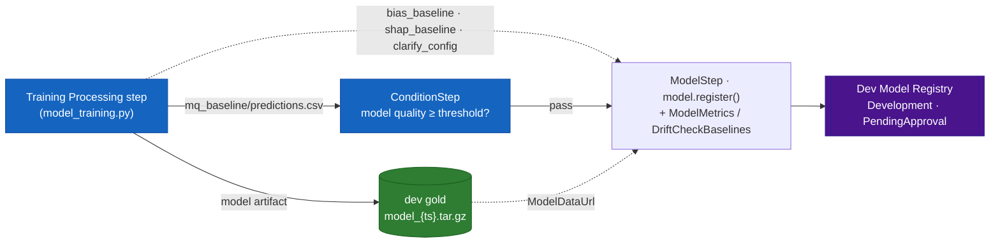
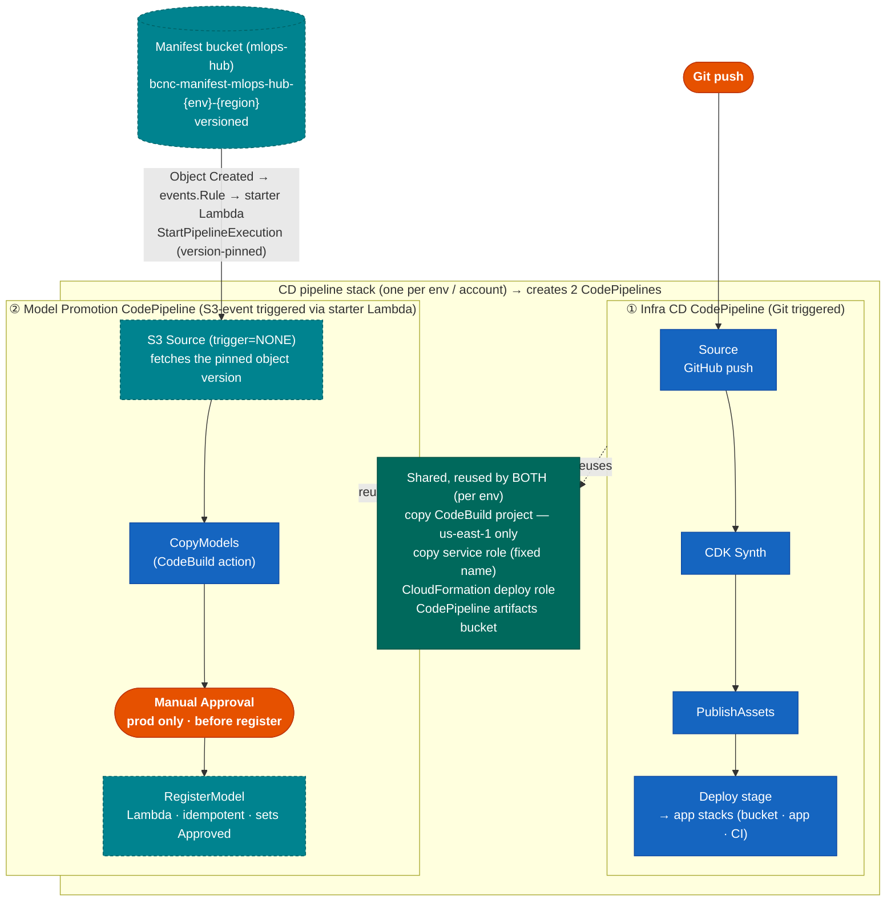
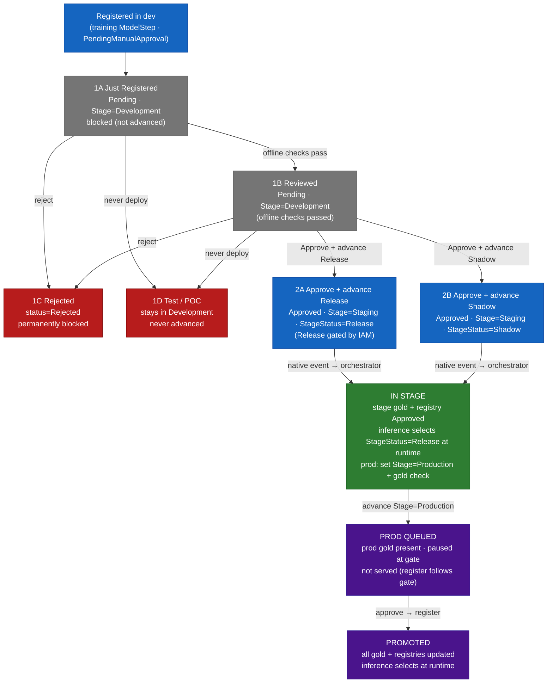
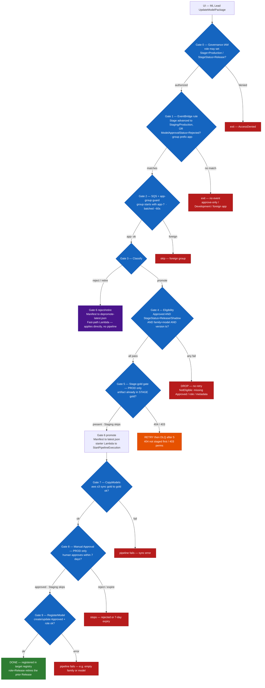
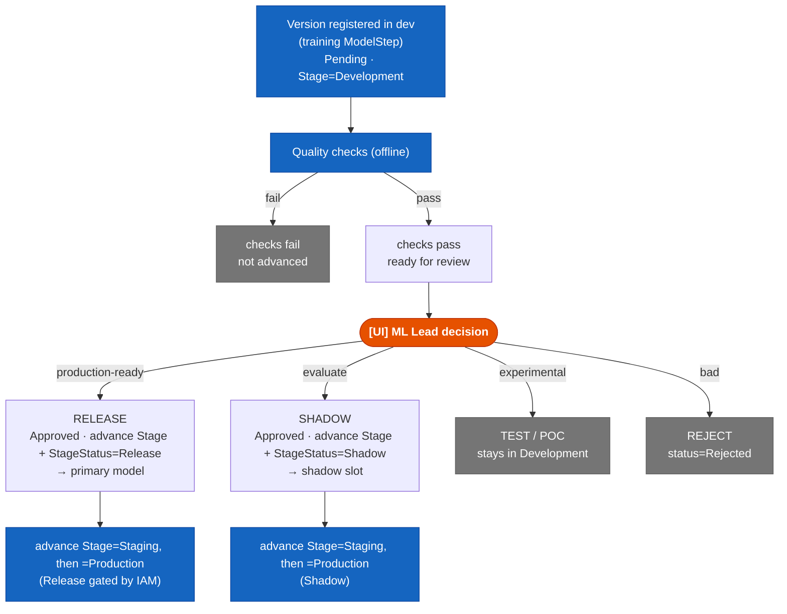
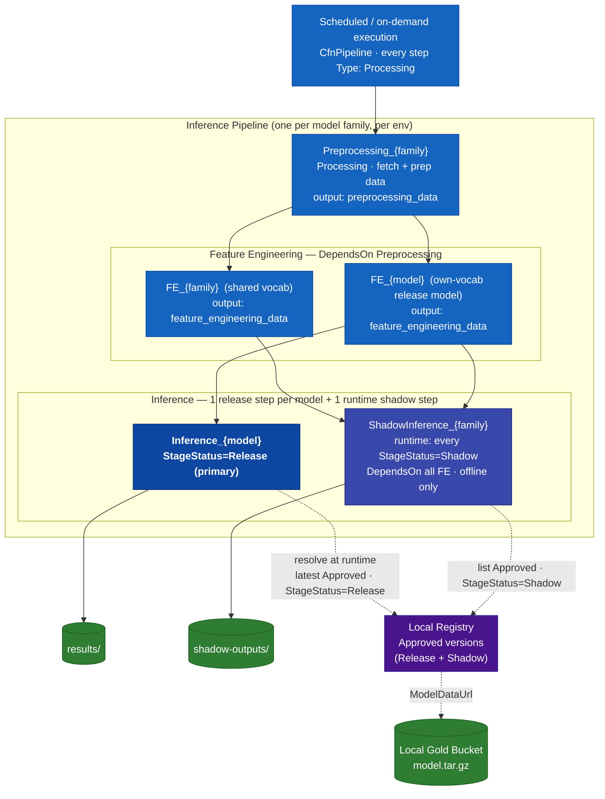

# Registry-First Model Promotion

## Overview — start here

**What this is.** Models are trained in the **dev** AWS account and have to move safely to **stage**, then **prod** — three separate, isolated AWS accounts. This document proposes how an approved model (and its artifact files) should cross those account boundaries under human control, and how inference in each account always serves the latest approved model.

**What "registry-first" means.** Today, promoting a model means editing a static catalog file and redeploying CDK. Registry-first instead makes the **SageMaker Model Registry** the source of truth: a human approves a version in dev and advances its lifecycle stage, and automation copies and re-registers it in the next account — no catalog edit, no redeploy.

**The happy path, end to end:**

1. **Train + register** — the training pipeline trains + evaluates a model and (if it clears a `ConditionStep` gate on the training step's **existing model-quality output**) a `ModelStep` registers the new version in the dev registry (`PendingManualApproval`), referencing the artifact it wrote to dev gold. The Model Registry is the source of truth — no `model_catalog.json`. *(See "How a version enters the dev registry" below.)*
2. **Bless** — the ML Lead marks it `Approved` in dev Studio. This makes it *eligible* but moves nothing.
3. **Advance to stage** — in one action the ML Lead sets `ModelLifeCycle.Stage=Staging` **and** the deployment role `StageStatus` — either **`Release`** (the primary model, served) or **`Shadow`** (registered and scored offline for comparison, never served). Automation copies the model into the stage account and registers it there *with that role*. Stage inference serves the latest `Release`; a group can hold **one `Release` plus any number of `Shadow`s**, which coexist (a new `Release` retires the prior `Release`, but never a `Shadow`).
4. **Advance to prod** — the ML Lead sets `Stage=Production`. Same flow, plus one human approval gate before it goes live.
5. **Serving** — each account's inference picks the latest approved model at its next scheduled run. No redeploy at any step.

> **The one rule to remember:** approval *blesses* a version but moves nothing; advancing its native **`ModelLifeCycle.Stage`** is what triggers promotion — because SageMaker emits an event when that field changes, but not when a tag changes.

## Glossary

| Term | Means |
|------|-------|
| **registry-first promotion** | Using the SageMaker Model Registry (not a static catalog file + redeploys) as the source of truth for what to serve. |
| **dev / stage / prod** | Three *separate, isolated* AWS accounts. Models flow dev → stage → prod; crossing accounts needs explicit grants. |
| **SageMaker Model Registry** | A per-account catalog of model versions, each with an approval status (`ModelApprovalStatus`), a lifecycle stage (`ModelLifeCycle`), and lineage tags (no governance-bearing tags). |
| **Model Package Group / version** | The container for all versions of one model (`{app}-{family}-{model}`); a *version* is one registered training run. |
| **`ModelApprovalStatus`** | Native field on a version: `Approved` / `Rejected` / `PendingManualApproval`. |
| **`ModelLifeCycle`** | Native field with a `Stage` (`Development` → `Staging` → `Production`) and a `StageStatus`. Advancing the `Stage` is the promotion trigger; `StageStatus` (`Release`/`Shadow`) carries the deployment role. |
| **bless** | The ML Lead's approval (`ModelApprovalStatus=Approved`) — makes a version eligible but moves nothing. |
| **`StageStatus` (role)** | Native `ModelLifeCycle.StageStatus`. In `Development` it is a status (`PendingApproval`); once the ML Lead advances the stage it carries the **role**: `Release` (the served model) or `Shadow` (runs in parallel, never serves). `test`/`poc` versions simply stay in `Development`. |
| **release vs shadow** | A family serves 1 **release** model plus N **shadow** models that run for comparison only, never primary traffic. Encoded natively as `StageStatus`. |
| **eligibility** | The orchestrator's promote condition: `Approved` + `Stage ∈ {Staging, Production}` + `StageStatus ∈ {Release, Shadow}`. (No `promote` tag — advancing the stage *is* the opt-in; no `quality_gate` field — that gate is operational/IAM.) |
| **projection** | A read-only stage/prod registry, written only by the promotion pipeline — never hand-edited (enforced by IAM). |
| **gold bucket** | The S3 bucket holding the served model artifacts (`model.tar.gz`). One per account. |
| **manifest** | A small JSON file the orchestrator writes telling a target account which version to copy + register. |
| **orchestrator (Lambda)** | The dev-account Lambda that receives the lifecycle event, checks eligibility, and writes the manifest. |
| **promotion pipeline** | The per-account CodePipeline that copies the artifact (**CopyModels**) and registers it locally (**RegisterModel**). |
| **`mlops-hub`** | A separate shared-infrastructure stack that owns the cross-account buckets and keys; imported by name rather than created locally. |

---

> Orange = Human / UI action · Blue = Automated · Green = Storage · Purple = Registry · Teal (dashed) = Net-new component

**Core rule:** A model stays in dev until a human sets `status=Approved` in the **dev registry** and advances its native `ModelLifeCycle.Stage`. The dev registry is the single governance source for all environments. Stage and prod registries are projections written only by the promotion pipeline; "read-only" means no human edits, enforced with IAM.

**Promotion is manual at every hop, driven by the model's native `ModelLifeCycle` stage in the dev registry.** Approval (`Approved`) only blesses a version — it does not move anything. A human then advances the version's native **`ModelLifeCycle.Stage`** (`Staging`, then later `Production`) together with **`StageStatus`** (`Release`/`Shadow`) from Studio's *Update model lifecycle* action. That transition emits a native `SageMaker Model Package State Change` EventBridge event (`UpdatedModelPackageFields=["ModelLifeCycle"]`), which a rule routes to a single orchestrator Lambda; the orchestrator reads the target stage and role from the event payload and routes the artifact to the correct account. All UI happens in dev (native Studio actions — no CLI, no hand-edited tags); the two hops are symmetric; prod adds a CodePipeline approval gate. There is no automatic dev→stage promotion.

**Selection:** The inference pipeline selects the current `Approved` model whose `ModelLifeCycle.StageStatus=Release` at execution time from the local registry. A model-version change requires no CDK redeploy and no pipeline upsert — the next scheduled run picks it up.

---

## Current vs. Proposed

| Concern | Current | Proposed |
|---------|---------|--------|
| Inference selection | The inference container queries the registry at runtime but matches a `MODEL_VERSION` pinned at synth time from a static catalog. | Select latest `Approved` with `ModelLifeCycle.StageStatus=Release` instead of a pinned version. A "latest Approved" query path typically already exists; stop baking `MODEL_VERSION` and filter by the native lifecycle in code. |
| Version source of truth | A static catalog file lists approved/pending versions per model. | Native registry fields (`ModelApprovalStatus` + `ModelLifeCycle.Stage`/`StageStatus`); the catalog holds static topology only. |
| Per-env registry authority | A registry-sync construct runs on every `cdk deploy` and rejects any registry version not listed in the catalog. | The RegisterModel step is the writer; remove the catalog enforcement (see "Reconciling the registry-sync Lambda"). |
| Artifact copy | An existing CodeBuild project (us-east-1 only) does selective per-version artifact copies. | Reused by the new Model Promotion Pipeline. |
| Shared buckets (gold/silver/ephemeral) | Gold/silver buckets are created locally today. | Owned by **`mlops-hub`** (`bcnc-{tier}-mlops-hub-{env}-{region}`, names/CMKs in SSM); imported via `from_bucket_name`. Silver eliminated; manifest bucket added in `mlops-hub`. |
| `ModelLifeCycle` stage transitions as the promotion trigger, EventBridge rule, orchestrator, manifest bucket, S3-source pipeline, RegisterModel, the runtime shadow-scoring step | None exist. | All net-new (the trigger is the native `ModelLifeCycle` event — no custom Promote Control or `PutEvents`). |

A `Type: Lambda` step is expressible in the raw SageMaker pipeline (CloudFormation) JSON, so runtime selection does not require an SDK migration; the cheapest path is container-side selection plus removing the synth-time version pin.

---

## Reconciling the registry-sync Lambda (one gotcha to avoid)

**Purpose of this note:** today, a Lambda syncs the registry from a static catalog on every deploy. Reconciling it is just part of this proposal — but there's one non-obvious way to get it *partly* right that silently breaks promotion, so it's called out here.

**Today**, the registry-sync Lambda keeps the registry in step with a static catalog, and its catalog-enforcement logic **Rejects any registry version not listed in the catalog — on every `cdk deploy`**. Registry-first promotion deliberately registers versions that are *not* in the catalog. So if that Reject behavior survives your rewrite, the **next unrelated `cdk deploy` silently flips your promoted models to `Rejected`** and inference stops finding them.

**The change to make:**

| Keep | Remove |
|------|--------|
| Model Package Group creation | The catalog version-sync (catalog `approved[]`/`pending[]` → registry) |
| | The catalog-enforcement logic — the Reject-on-not-in-catalog behavior |

After this, **RegisterModel is the sole status authority**. Do **not** retain catalog status enforcement — it would reintroduce exactly this bug.

> Clean cutover (recommended): remove it outright. If instead you migrate **family-by-family**, temporarily scope the enforcement to ignore versions tagged `promoted_by=reconciler` during the transition, then remove it once all families are migrated. (This is a **transitional** tag only — removed at cutover; it is not part of the steady-state contract.)

---

## Metadata Contract — what's set, where it lives, by whom

All governance state lives on the **model package version** in the SageMaker Model Registry — not in a static catalog file, and (as of the native refactor) **not in custom tags**. One Model Package Group per `{app}-{family}-{model}`; one version per training run.

**The contract is all-native — four fields, no custom governance tags:**

| Concept | Field | Values |
|---------|-------|--------|
| Bless / approval | `ModelApprovalStatus` | `PendingManualApproval` → `Approved` / `Rejected` |
| Target environment (the **trigger**) | `ModelLifeCycle.Stage` | `Development` (registered) → `Staging` / `Production` (advanced by the ML Lead) |
| Deployment **role** | `ModelLifeCycle.StageStatus` | `PendingApproval` in Development; `Release` \| `Shadow` once advanced |
| Lineage / notes | `CustomerMetadataProperties` (`version`, `git_sha`, `family`, `model`) + `StageDescription` | free text |

`Stage` and `StageStatus` are native, required strings (≤63 chars). The ML Lead advances **both in one `UpdateModelPackage` call** (Studio's "Update model lifecycle" action). The only custom tags are lineage conveniences — a `version` tag at registration, plus a `promoted_from` tag that RegisterModel writes in the projection registries — and neither carries governance state; the old `promote` / `candidate_type` / `quality_gate_passed` governance tags are **gone**.

**Eligibility** = `ModelApprovalStatus == Approved` **AND** `Stage ∈ {Staging, Production}` **AND** `StageStatus ∈ {Release, Shadow}`. There is no `promote` opt-in (advancing the stage *is* the opt-in) and no `quality_gate` field (that gate is operational — IAM restricts who may set `StageStatus=Release`; see Governance Enforcement).

**Who sets what:**

| Actor | Fields | Mechanism |
|-------|--------|-----------|
| Training pipeline — `ModelStep` (gated by `ConditionStep`) | `CustomerMetadataProperties` (`version`, `git_sha`, `family`, `model`), `version` tag; `ModelLifeCycle = Development / PendingApproval` | `model.register` / `CreateModelPackage` |
| ML Lead — bless | `ModelApprovalStatus=Approved` | Studio "Update status" / API |
| ML Lead — promote | `ModelLifeCycle.Stage = Staging` then `= Production`, **with** `StageStatus = Release` or `Shadow` | Studio "Update model lifecycle" (native — emits the trigger event) |

**Why `ModelLifeCycle` and not custom tags:** SageMaker emits a native EventBridge event when `ModelLifeCycle` (or `ModelApprovalStatus`) changes, but **not** when a tag changes. Encoding the "move" signal in a custom `promote_to` tag would need a bespoke control to write the tag *and* manufacture an event. `ModelLifeCycle` is the native, first-class field built for exactly this: a human advances the stage from Studio (no CLI, no `aws sagemaker add-tags`), the change emits the trigger event for free, and both sub-fields are gated natively with the `sagemaker:ModelLifeCycle:stage` and `sagemaker:ModelLifeCycle:stageStatus` IAM condition keys (see Governance Enforcement). Collapsing the old eligibility tags into `StageStatus` means one native audit trail and per-role IAM governance (who may bless `Release` vs `Shadow`).

> **Every diagram and scenario below uses this native contract** — `ModelApprovalStatus`, `ModelLifeCycle.Stage`, and `ModelLifeCycle.StageStatus`. There are no `promote` / `candidate_type` / `quality_gate_passed` tags anywhere in the flow.

---

## Diagram 1 — End-to-End Promotion Flow

```mermaid
flowchart TD
    classDef human fill:#e65100,stroke:#bf360c,color:#fff,font-weight:bold
    classDef auto  fill:#1565c0,stroke:#0d47a1,color:#fff
    classDef store fill:#2e7d32,stroke:#1b5e20,color:#fff
    classDef reg   fill:#4a148c,stroke:#311b92,color:#fff
    classDef new   fill:#00838f,stroke:#006064,color:#fff,stroke-dasharray: 4 3

    subgraph DEV["☁️  DEV ACCOUNT  (governance source)"]
        direction TB
        TRAIN["Training Pipeline (dev / altdev)\nTrain (emits mq/bias/shap baselines)\n→ ConditionStep → ModelStep"]
        DEVGOLD[("Dev Gold Bucket (mlops-hub)\nbcnc-gold-mlops-hub-dev-{region}\n{family}/{model}/versions/{ts}/")]
        DEVREG[["Dev Model Registry\nPendingManualApproval\nStage=Development"]]
        TRAIN -- "writes versioned artifact" --> DEVGOLD
        TRAIN -- "ModelStep registers (metrics pass)\nModelDataUrl → gold artifact" --> DEVREG

        QG["Quality checks (offline)\ngate = IAM on who may set StageStatus=Release"]
        DEVREG -. " " .-> QG

        APPROVE(["[UI] ML Lead — bless\nstatus=Approved"])
        DEVREG -. "review" .-> APPROVE
        QG -. "informs bless" .-> APPROVE
        APPROVE -- "UpdateModelPackage (status)" --> DEVREG

        PROMOTE(["[UI] ML Lead — Update model lifecycle\nStage=Staging → Production +\nStageStatus=Release / Shadow\n(one native Studio action)"])
        EB["EventBridge Rules (2)\nModel Package State Change\nscoped: ModelPackageGroupName prefix={app}-\n(1) UpdatedModelPackageFields=[ModelLifeCycle] → promote / retire\n(2) ModelApprovalStatus=Rejected → de-promote"]
        EVQ["SQS event queue (+ DLQ)\nbatch window coalesces a burst"]
        ORCH["Dev Orchestrator Lambda\nbatched: validate eligibility,\nwrite ONE manifest per env (items[])\nprod: HeadObject stage-gold gate"]

        APPROVE -. "after bless" .-> PROMOTE
        PROMOTE -- "UpdateModelPackage Stage + StageStatus" --> DEVREG
        DEVREG -- "native event" --> EB
        EB -- "to queue" --> EVQ
        EVQ -- "SQS batch" --> ORCH
    end

    subgraph STAGE["☁️  STAGE ACCOUNT"]
        direction TB
        STAGEMAN[("Stage Manifest Bucket (mlops-hub)\nbcnc-manifest-mlops-hub-stage-{region}\nlatest.json=promote · depromote-latest.json=reject/retire\nversioned · BucketOwnerEnforced")]
        STAGESTART["events.Rule (Object Created)\n→ starter Lambda\nStartPipelineExecution (pins object version)"]
        subgraph SP["Model Promotion Pipeline (QUEUED)"]
            direction LR
            SS1["S3 Source (trigger=NONE)\nfetches that object version"]
            SS2["CopyModels\ngold(dev)→gold(stage)"]
            SS3["RegisterModel\nlocal · sets Approved+role · idempotent\nrole=Release retires prior Release"]
            SS1 --> SS2 --> SS3
        end
        STAGEGOLD[("Stage Gold Bucket (mlops-hub)\nbcnc-gold-mlops-hub-stage-{region}")]
        STAGEREG[["Stage Registry\nprojection · IAM-locked"]]
        STAGEINF["Stage Inference\nselects Approved + StageStatus=Release\nat execution time"]
        STAGEFAST["events.Rule (depromote-latest.json)\n→ Fast-path Lambda · reject/retire\napplies directly · no pipeline"]
        STAGEMAN -- "latest.json · Object Created" --> STAGESTART -- "start (pinned)" --> SS1
        STAGEMAN -- "depromote-latest.json" --> STAGEFAST -- "apply directly" --> STAGEREG
        SS2 --> STAGEGOLD
        SS3 --> STAGEREG
        STAGEREG -. "runtime query" .-> STAGEINF
        STAGEGOLD -. "runtime read" .-> STAGEINF
    end

    subgraph PROD["☁️  PROD ACCOUNT"]
        direction TB
        PRODMAN[("Prod Manifest Bucket (mlops-hub)\nbcnc-manifest-mlops-hub-prod-{region}\nlatest.json=promote · depromote-latest.json=reject/retire\nversioned · BucketOwnerEnforced")]
        PRODSTART["events.Rule (Object Created)\n→ starter Lambda\nStartPipelineExecution (pins object version)"]
        subgraph PP["Model Promotion Pipeline (QUEUED)"]
            direction LR
            PP1["S3 Source (trigger=NONE)\nfetches that object version"]
            PP2["CopyModels\ngold(stage)→gold(prod)"]
            PP4(["[UI] Manual Approval\n7-day expiry"])
            PP3["RegisterModel\nsets Approved+role AFTER gate\nrole=Release retires prior Release"]
            PP1 --> PP2 --> PP4 --> PP3
        end
        PRODGOLD[("Prod Gold Bucket (mlops-hub)\nbcnc-gold-mlops-hub-prod-{region}\nunserved until RegisterModel")]
        PRODREG[["Prod Registry\nprojection · IAM-locked"]]
        PRODINF["Prod Inference\nselects Approved + StageStatus=Release\nat execution time"]
        PRODFAST["events.Rule (depromote-latest.json)\n→ Fast-path Lambda · reject/retire\napplies directly · no pipeline · no approval"]
        PRODMAN -- "latest.json · Object Created" --> PRODSTART -- "start (pinned)" --> PP1
        PRODMAN -- "depromote-latest.json" --> PRODFAST -- "apply directly" --> PRODREG
        PP2 --> PRODGOLD
        PP3 --> PRODREG
        PRODREG -. "runtime query" .-> PRODINF
        PRODGOLD -. "runtime read" .-> PRODINF
    end

    ORCH -- "Stage=Staging\ncross-acct PutObject" --> STAGEMAN
    ORCH -- "Stage=Production\ncross-acct PutObject" --> PRODMAN

    class APPROVE,PROMOTE,PP4 human
    class TRAIN,QG,SS2,PP2,STAGEINF,PRODINF auto
    class EB,EVQ,ORCH,STAGESTART,PRODSTART,STAGEFAST,PRODFAST,SS1,SS3,PP1,PP3,STAGEMAN,PRODMAN new
    class DEVGOLD,STAGEGOLD,PRODGOLD store
    class DEVREG,STAGEREG,PRODREG reg
```



The prod Manual Approval runs before RegisterModel writes `Approved`, so a scheduled run cannot serve an unapproved model. CopyModels may run before the gate; the artifact sits in prod gold unserved until the gated registration.

> **How a version enters the dev registry (reusing the training pipeline's existing outputs).** Following the AWS SageMaker MLOps gold standard, registration is a step in the training pipeline — and the training Processing step (`model_training.py`) **already emits the baseline outputs the checks need**, so nothing is recomputed:
> - `mq_baseline/predictions.csv` — validation predictions + ground truth (the **model-quality** dataset)
> - `bias_baseline/bias_data.csv` + `clarify_config/analysis_config.json` — **post-training bias** (Clarify)
> - `shap_baseline/shap_baseline.json` — **explainability**; pre-training bias metrics (CI/DPL/KL/JS…) computed inline
>
> The registration tail just **consumes** those:
> 1. A **`ConditionStep`** gates on model quality derived from the existing `mq_baseline/predictions.csv` (a `ModelQualityCheckStep` pointed at that dataset, or a small eval → `evaluation.json` `PropertyFile`). Only a model that clears the threshold proceeds.
> 2. A **`ModelStep`** (`model.register(...)`) registers the version with native `ModelLifeCycle = Development / PendingApproval`, attaching those same outputs as `ModelMetrics` + `DriftCheckBaselines` (quality / bias / explainability) so downstream monitoring has its reference.
>
> The **Model Registry is the source of truth — no `model_catalog.json`.** The same run that produces the artifact + baselines registers it; saving to S3 is not itself a trigger, and approval later flows through the native `SageMaker Model Package State Change` event (the promotion side).
>
> *Migration note:* dev registration runs in the deploy-time registry-sync Lambda reading `model_catalog.json` with native `ModelLifeCycle` (CP-1). Moving registration into a training `ConditionStep` + `ModelStep` (on top of the existing training outputs) is a future option, out of scope for now.



*Reuse: the training step already produces `mq_baseline` / `bias_baseline` / `shap_baseline`; the `ConditionStep` and `ModelStep` consume them — no separate baselining/inference node.*

**Human touchpoints (UI) — all in the dev account:** (1) ML Lead governance decision (Approve / Reject) via "Update status" in the registry; (2) Promote → stage by setting `ModelLifeCycle.Stage=Staging` with `StageStatus=Release` (or `Shadow`); (3) Promote → prod by setting `Stage=Production` (again with the role) — both via Studio's native "Update model lifecycle" action. The only UI action outside dev is (4) the CodePipeline approval gate in the prod account. The quality gate is operational — IAM restricts who may set `StageStatus=Release`. Each lifecycle transition emits the native event that drives the orchestrator. Stage/prod registries take no human edits (IAM-locked).

> **Trigger wiring:** Promotion is driven by the model's native `ModelLifeCycle` stage, not a custom tag — precisely because SageMaker emits a native `SageMaker Model Package State Change` EventBridge event when `ModelLifeCycle` (or `ModelApprovalStatus`) changes, but **not** when a tag changes. Advancing the stage in Studio fires the event for free (`source=aws.sagemaker`, `detail-type="SageMaker Model Package State Change"`, `detail.UpdatedModelPackageFields=["ModelLifeCycle"]`, `detail.ModelLifeCycle.Stage` = the target env). No Promote Control, no `PutEvents`, and no CloudTrail fallback are needed: the trigger is first-class. The orchestrator routes on the `Stage` and `StageStatus` carried in the event payload (so it never re-reads a tag under a read-after-write race) and re-reads the version only to validate eligibility (`Approved` + `StageStatus ∈ {Release, Shadow}`).
>
> **Bursts are coalesced.** Both rules deliver to an **SQS queue**, and the orchestrator consumes it **in batches** (a short batch window). So an ML Lead advancing 20 models at once becomes one batched invocation that writes **one manifest per target env** (`items[]`) → **one pipeline execution**, not 20. Failing records retry independently (SQS partial-batch failure); poison messages land in a DLQ.
>
> **App-scoped (multi-tenant dev account).** Many app repos share one dev account, so both rules filter on **`detail.ModelPackageGroupName` prefix `{app}-`** — this orchestrator only ever sees *its own* app's model changes. The manifest bucket is likewise per-app namespaced (`manifests/{app}/latest.json`), so nothing crosses between repos. (The orchestrator also drops any foreign group defensively.)

**Manifest, trigger, and S3 Source (three net-new things — don't conflate them):**

- **Promotion manifest** = one JSON file the dev orchestrator writes per target env to the **manifest bucket** (`manifests/{app}/latest.json`). It is the *instruction* for a **batch** of promotions — `schema_version: "2"` carries an `items[]` list, so a burst of UI clicks becomes **one manifest → one pipeline execution**. Shape:
  ```json
  { "schema_version": "2", "action": "promote", "source_env": "dev",
    "target_env": "stage", "target_stage": "Staging",
    "items": [
      { "family": "fraud", "model": "txn_scorer", "version": "20260416_2253", "role": "Release",
        "source_gold": "s3://bcnc-gold-mlops-hub-dev-us-east-1/...",
        "target_gold": "s3://bcnc-gold-mlops-hub-stage-us-east-1/...",
        "source_model_package_arn": "arn:...", "promotion_id": "stage-fraud-txn_scorer-20260416_2253" }
    ] }
  ```
  Manifest-level: `target_stage` sets each projection version's `ModelLifeCycle.Stage`. Per item: `role` sets its `StageStatus`, `promotion_id`/`version` drive RegisterModel idempotency. A single-item batch is still one `items[]` entry.
- **De-projection manifest (reject / retire)** = the same orchestrator writes these to a **separate key**, `manifests/{app}/depromote-latest.json`, with `action: "deproject"` and each item carrying a `kind` (`reject` | `retire`). This key triggers a **fast-path Lambda directly — no CodePipeline, no CopyModels, no prod approval** — because a break-glass reject must apply immediately, not wait behind the 7-day prod gate. (`reject` sets the target version `Rejected`; `retire` sets `StageStatus=Retired`, dropping it from `Release`/`Shadow` selection without rejecting it.)
- **Trigger** = the bucket is **versioned** and emits a native **"Object Created"** event → an **`events.Rule`** → a **starter Lambda**, which calls **`StartPipelineExecution` pinned to the exact S3 object version** that fired it (`sourceRevisions = S3_OBJECT_VERSION_ID`). The rule does **not** target the pipeline directly — a direct target can't pin a version.
- **S3 Source** = the Model Promotion CodePipeline's **first action** (type S3), configured with **`trigger=NONE`**. It does *not* watch the bucket; it only *fetches* the pinned object version into the Source artifact once the starter has begun the execution.

So the bucket/JSON is the *what to promote*; the Object-Created event + `events.Rule` + starter Lambda is the *trigger*; the S3 Source is just the pipeline's *input fetch*. This is why the new pipeline is **S3-event-triggered**, in contrast to the Infra CD pipeline, which is **GitHub-triggered** (`GitHub_Source`). Because every write to the fixed key creates a **new object version**, each promotion — even two within the same minute — fires its own version-pinned execution, and the pipeline's **QUEUED** mode runs them in order, so no promotion is clobbered (see Failure Modes).

> **Why not `S3Trigger.EVENTS`?** In CDK 2.194.0 that option wires a **CloudTrail** data-event rule (which requires an S3 data-event trail that doesn't exist) rather than consuming the bucket's native EventBridge notifications — so it would never fire. Hence the explicit `events.Rule` + starter Lambda.

---

## Diagram 2 — Trigger Chain

```mermaid
flowchart TD
    classDef human fill:#e65100,stroke:#bf360c,color:#fff,font-weight:bold
    classDef auto  fill:#1565c0,stroke:#0d47a1,color:#fff

    subgraph DS["Dev → Stage  (lifecycle-triggered)"]
        direction LR
        T2a(["[UI] Approve\nApproved\n(bless, no movement)"])
        T2(["[UI] Update model lifecycle\nStage=Staging + StageStatus=Release"])
        A0["Native event\nModelLifeCycle changed"]
        A1["EventBridge → SQS → orchestrator\n(batched)"]
        A2["Orchestrator Lambda\nvalidate · write ONE stage manifest (items[])"]
        A3["Stage CodePipeline\nS3 source"]
        A4["CopyModels → RegisterModel"]
        A6["Next inference run\nselects Approved + StageStatus=Release"]
        T2a --> T2 --> A0 --> A1 --> A2 --> A3 --> A4 -.-> A6
    end

    subgraph SPx["Stage → Prod  (lifecycle-triggered + gate)"]
        direction LR
        T3(["[UI] Update model lifecycle\nStage=Production + StageStatus=Release"])
        B0a["Native event\nModelLifeCycle changed"]
        B0["EventBridge → SQS → orchestrator\n(batched)"]
        B1["Orchestrator Lambda\nHeadObject stage-gold gate · write ONE prod manifest (items[])"]
        B2["Prod CodePipeline\nS3 source"]
        B3["CopyModels → prod gold\n(unserved)"]
        T4(["[UI] Approve\n7-day expiry"])
        B4["RegisterModel\nsets Approved"]
        B5["Next inference run\nselects Approved + StageStatus=Release"]
        T3 --> B0a --> B0 --> B1 --> B2 --> B3 --> T4 --> B4 -.-> B5
    end

    class T2a,T2,T3,T4 human
    class A0,A1,A2,A3,A4,A6,B0a,B0,B1,B2,B3,B4,B5 auto
```



---

## Diagram 3 — The CD stack deploys TWO sibling CodePipelines (per account)

**One CD pipeline stack per env creates two separate AWS CodePipelines as sibling constructs** — not one pipeline, and neither is deployed *by* the other. They live in the same stack so the new one can reuse the existing copy CodeBuild project, its copy service role, the CloudFormation deploy role, and the CodePipeline artifacts bucket.

- **Pipeline #1 — Infra CD CodePipeline** (existing): Git-triggered; its Deploy stage deploys the application's stacks — typically a data-bucket stack, the **application stack** (where the SageMaker pipelines and the registry-sync construct live), and a CI stack. There is no separate "model registry stack."
- **Pipeline #2 — Model Promotion CodePipeline** (new): triggered by the manifest bucket's native Object-Created event via an `events.Rule` + starter Lambda (version-pinned); a CodePipeline that *uses* a CodeBuild action for the copy. It moves + registers model artifacts. It does **not** deploy stacks.



> **What deploys what:** deploying the CD pipeline stack creates *both* pipelines. Pipeline #1's Deploy stage then deploys the application's **app stacks** (data-bucket, app, CI). Pipeline #2 never deploys a stack — it copies the artifact and registers the model. The Model Promotion CodePipeline only exists where promotions land (dev as source, stage/prod as targets), and its copy step inherits the **us-east-1-only** constraint of the copy CodeBuild project.

---

## Diagram 4 — Model Lifecycle & Gates



---

## Diagram 4b — Promotion Gate Flow (UI click → registered)

The runtime gates from the ML Lead's `UpdateModelPackage` click through to a registered version. Each
gate shows the value that lets it **continue** vs the **exit**. Reject/retire split off at Gate 3 to
the approval-free fast path; **Staging skips the PROD-only gates (5 and 8)**.



_Blue = gate · red = exit (no retry) · orange = retry then DLQ · purple = fast-path (reject/retire) · green = done._

---

## Diagram 5 — Governance Decision Tree



---

## Diagram 6 — Inference Execution (scaled to N shadows)

The pipeline is a single SageMaker `CfnPipeline` whose steps are **all `Type: Processing`**, wired by `DependsOn`: one `Preprocessing_{family}` step → a feature-engineering layer (a shared `FE_{family}` for shared-vocab models, plus a dedicated `FE_{model}` for any own-vocab model) → one `Inference_{model}` step per release model. (The current catalog-driven code actually emits one inference step per catalog **(model, version)** entry — the first Approved plus every Pending version — so a model with pending versions produces several steps; "one per release model" is the registry-first end state once per-version entries leave the catalog.)

> **Implementation note (supersedes the N-branch diagram below).** Shadows are **not** synth-time branches. The implementation emits one always-present `ShadowInference_{family}` Processing step per family that, at runtime, discovers every Approved + `StageStatus=Shadow` version across the family's model groups and scores each into `shadow-outputs/{family}/{model}/{version}/`. So the diagram's "N shadow inference branches" collapse to a single runtime step, and changing the shadow set is a bless (no re-synth). The release branches per model are as drawn.

**FE choice is orthogonal to the deployment role.** Whether a model gets the shared `FE_{family}` or a dedicated `FE_{model}` depends only on `has_vocab and not is_legacy` — not on `StageStatus`. **Known limitation:** the shadow step reads the **non-versioned** FE output (`feature-engineering/{family}/{model}/member_features.tfrecord`), so it scores shadows of **shared-vocab** models today; own-vocab (versioned) models write their FE under `.../versions/{version}/`, so their shadow versions are warned-and-skipped until the shadow step is taught to resolve the versioned FE path.



**How each step is built:**

| Step | Implementation |
|------|----------------|
| `Preprocessing_{family}` | One `Type: Processing` step per family; output `preprocessing_data`. |
| `FE_{family}` (shared) | One shared feature-engineering step, `DependsOn` preprocessing; feeds every shared-vocab model. |
| `FE_{model}` (own-vocab) | A dedicated FE step per model that has its own vocabulary (and isn't legacy). |
| `Inference_{model}` | Release inference, `DependsOn` its FE step; selects `StageStatus=Release`. (Current code emits one step per catalog **(model, version)** entry — Approved + all Pending; "one per release model" is the registry-first end state.) |
| `ShadowInference_{family}` | One runtime step per family (`MODEL_ROLE=Shadow`); discovers every `Approved` + `StageStatus=Shadow` version and scores each into `shadow-outputs/` only. It never writes `results/` — release routing to `results/` is the separate `Inference_{model}` steps. |
| model version | The container resolves it at runtime via `ListModelPackages` + `DescribeModelPackage`. |

| Behaviour | Detail |
|-----------|--------|
| Shared vs dedicated FE | Shared-vocab models (legacy or versioned-without-vocab) share one `FE_{family}`; own-vocab models get a dedicated `FE_{model}`. |
| Runtime version resolution | Each inference container picks its model by querying the local registry (`ListModelPackages` by status, then reads `ModelLifeCycle.StageStatus` per package in code) — today against the synth-pinned `MODEL_VERSION`; target = latest `Approved` with `StageStatus=Release` (or every `StageStatus=Shadow` for the shadow step). |
| Change a model **version** | No CDK redeploy — the container resolves the new version at runtime. |
| Change the **number** of shadows (N) | No redeploy — the single `ShadowInference_{family}` step discovers `StageStatus=Shadow` versions at runtime. Blessing/un-blessing a shadow changes what it scores on the next run. |
| Outputs | Release → `results/`; every shadow → `shadow-outputs/` for offline comparison; shadows never serve primary traffic. |

---

## Scenarios

Every model starts at 1A. Approval (`Approved`) only *blesses* a version; advancing its native `ModelLifeCycle.Stage` (`Staging`, then `Production`) with `StageStatus` (`Release`/`Shadow`) from Studio is what actually moves it. The stage change emits the native event that drives the orchestrator → the target account. Each table below shows the three native fields — there are no custom tags.

### Scenario 1 — Version only in Dev (never promoted)

The default state of every model; it stays here until the ML Lead advances the lifecycle stage.

**1A — Just registered by training**

| Field | Value |
|-------|-------|
| `ModelApprovalStatus` | `PendingManualApproval` |
| `ModelLifeCycle.Stage` | `Development` |
| `ModelLifeCycle.StageStatus` | `PendingApproval` |

Not eligible: still `Stage=Development`, so the trigger rule never fires (and it isn't Approved).

**1B — Reviewed (offline checks passed)**

| Field | Value |
|-------|-------|
| `ModelApprovalStatus` | `PendingManualApproval` |
| `ModelLifeCycle.Stage` | `Development` |
| `ModelLifeCycle.StageStatus` | `PendingApproval` |

Same registry state as 1A — offline quality checks live outside the registry and just inform the ML Lead's decision. Not eligible (not Approved, still `Development`). Human review now available.

**1C — Human rejects**

| Field | Value |
|-------|-------|
| `ModelApprovalStatus` | `Rejected` |
| `ModelLifeCycle.Stage` | `Development` |
| `ModelLifeCycle.StageStatus` | `PendingApproval` |

Rejected — permanently excluded from all orchestrator queries.

**1D — Test / POC (never intended for deployment)**

| Field | Value |
|-------|-------|
| `ModelApprovalStatus` | `Approved` or `PendingManualApproval` |
| `ModelLifeCycle.Stage` | `Development` (never advanced) |
| `ModelLifeCycle.StageStatus` | `PendingApproval` |

Not eligible: a test/POC is simply never advanced out of `Development`, so the trigger rule (`Stage ∈ {Staging, Production}`) never fires.

### Scenario 2 — Approve, then advance to Stage

Approval blesses the version; setting `ModelLifeCycle.Stage=Staging` **and** `StageStatus=Release`/`Shadow` (one `UpdateModelPackage`) triggers the move.

**2A — Approve + advance as Release**

| Field | Value |
|-------|-------|
| `ModelApprovalStatus` | `Approved`  ← bless |
| `ModelLifeCycle.Stage` | `Staging`  ← advance (the trigger) |
| `ModelLifeCycle.StageStatus` | `Release`  ← the role (IAM-gated) |

Approval blesses the version (no movement). The human advances `Stage=Staging` + `StageStatus=Release` in one Studio action → native event (`UpdatedModelPackageFields=["ModelLifeCycle"]`, `Stage=Staging`, `StageStatus=Release`) → EventBridge → orchestrator validates the version (`Approved` + `StageStatus=Release`) → writes the stage manifest → stage pipeline runs (CopyModels → RegisterModel sets `Approved` + `StageStatus=Release`, idempotent).

**2B — Approve + advance as Shadow**

| Field | Value |
|-------|-------|
| `ModelApprovalStatus` | `Approved` |
| `ModelLifeCycle.Stage` | `Staging` |
| `ModelLifeCycle.StageStatus` | `Shadow`  (not IAM-gated) |

Advance `Stage=Staging` + `StageStatus=Shadow`; orchestrator match: `Approved` + `StageStatus=Shadow`. Stage manifest carries `role=Shadow` → stage registers it with `StageStatus=Shadow`; the `ShadowInference_{family}` step scores it into `shadow-outputs/`, never primary traffic.

**State after the stage pipeline completes:**

```
Dev Registry:    Approved · Stage=Staging · StageStatus=Release
Dev Gold:        artifact present  ✓
Stage Registry:  Approved · StageStatus=Release (projection — selected by inference at runtime)
Stage Gold:      artifact present  ✓
Prod Registry:   (empty for this version)
Prod Gold:       no artifact
```

Prod is blocked until a human advances `Stage=Production` (with `StageStatus=Release`), which triggers the orchestrator to check:

```
stage gold HeadObject → found ✓   (404 → promote stage first, retryable;
                                    403/other → hard perms error, fails loudly)
status=Approved         ✓
StageStatus=Release     ✓
→ write prod manifest
```

### Scenario 3 — Advance to Production, version reaches Prod

After the human sets `Stage=Production` (with `StageStatus=Release`) and the prod pipeline clears the approval gate (RegisterModel writes `Approved` *after* the gate):

```
Dev Registry:    Approved · Stage=Production · StageStatus=Release
Dev Gold:        artifact present  ✓
Stage Registry:  Approved · StageStatus=Release (projection)
Stage Gold:      artifact present  ✓
Prod Registry:   Approved · StageStatus=Release (projection)
Prod Gold:       artifact present  ✓
```

All inference pipelines select this version at runtime. The dev registry record — `ModelApprovalStatus` and the `ModelLifeCycle` history (`Development → Staging → Production`, with the `StageStatus` role) — is the permanent governance trail. No CDK redeploy at any point. Shadows reach prod via the same advance with `StageStatus=Shadow` (not IAM-gated).

### The single rule that controls everything

```
status≠Approved   OR   StageStatus ∉ {Release, Shadow}   OR   Stage=Development
    → not eligible · orchestrator rejects the transition · nothing moves

status=Approved  AND  StageStatus=Release  AND  Stage=Staging
    → native event → orchestrator → stage pipeline (release)

status=Approved  AND  StageStatus=Shadow  AND  Stage=Staging
    → native event → orchestrator → stage pipeline (shadow slot)

stage gold present  AND  Stage=Production
    → native event → orchestrator → prod pipeline · approval gate · register after gate
```

(The quality gate is not a field: IAM restricts who may set `StageStatus=Release`, so an
unblessed release never emits the trigger in the first place.)

### Scenario 4 — Emergency Rollback (break-glass)

Never hand-edit the stage/prod registry.

| Step | Action |
|------|--------|
| 1 | In the dev registry, set `ModelApprovalStatus=Rejected` on the bad version; this emits a native event → the orchestrator writes a de-projection manifest to `depromote-latest.json`, which triggers the **fast-path Lambda directly** (no pipeline, **no prod approval wait**) and sets the same version `Rejected` in the target registry — **immediately** |
| 2 | If the rejected version was the active `Release`, the fast-path un-retires the most-recent `Retired` predecessor back to `Release`, so a valid Release remains and is selected automatically next run |
| 3 | Confirm the target registry reflects the change (fast-path de-projection, not a hand edit) |
| 4 | Record incident + CloudTrail reference |

> **De-shadow (retire) is the same fast path.** To stop a `Shadow` (or step a `Release` aside) *without* condemning it, set `StageStatus=Retired` in dev → the orchestrator writes a `retire` de-projection → the fast-path sets `StageStatus=Retired` in the target (kept `Approved`, rollback-able). Break-glass **reject** and **retire** both bypass the pipeline and its approval gate — only forward **promotions** run the CodePipeline.

---

## Failure Modes & Recovery

| Failure | State | Recovery |
|---------|-------|----------|
| CopyModels fails | Artifact not fully in target gold | Re-run; copy is selective + re-runnable |
| RegisterModel fails after copy | Artifact present, no Approved entry (safe) | Re-run; idempotent |
| Pipeline re-executed | Risk of duplicate Approved versions | Idempotent RegisterModel matches by source timestamp |
| Bulk / concurrent promotions to one env | Could fire N pipeline executions (or clobber a fixed key) | The orchestrator **batches** SQS events → **one manifest per env → one execution** for the whole burst. Across separate batches, the bucket is **versioned**, the starter pins each execution's object version (`sourceRevisions`), and the pipeline runs **QUEUED** → no promotion is clobbered |
| Approval not actioned in 7 days | Prod execution fails | Re-apply `ModelLifeCycle.Stage=Production` (re-emits the native event) to re-fire |
| Duplicate native events for one promotion (e.g. a stage re-applied) | Orchestrator may run twice | Manifest is deterministic + RegisterModel idempotent → no-op on the second run |

---

## Governance Enforcement

- Only the RegisterModel role may `CreateModelPackage` / `UpdateModelPackage` / `AddTags` / `DeleteTags` on stage/prod registries; deny to humans and the legacy enforcement role via IAM/SCP (`DenyProjectionWritesPolicy` denies all four actions).
- Selection reads `ModelLifeCycle.StageStatus` on every Approved package; a package with no matching `StageStatus` (e.g. a pre-migration version) is skipped, with a fallback to latest Approved.
- The orchestrator role can write both stage and prod manifests; forward-only and "prod gated" are operational (driven by the target `ModelLifeCycle.Stage` + the stage-gold check + the CodePipeline approval gate), not IAM-enforced separation.
- **`ModelLifeCycle.Stage` is the trigger and `StageStatus` is the role — gate both natively.** Scope `sagemaker:UpdateModelPackage` / `CreateModelPackage` with:
  - `sagemaker:ModelLifeCycle:stage` so only the ML Lead role may set `Stage=Production` (and, if desired, `Stage=Staging`) — `DenyNonLeadProductionPolicy`;
  - `sagemaker:ModelLifeCycle:stageStatus` so only the quality-gate role may set `StageStatus=Release` — **this is the quality gate** (`DenyNonGateReleasePolicy`). `Shadow` is intentionally not restricted.

  Both dev-side deny policies (`DenyNonLeadProductionPolicy`, `DenyNonGateReleasePolicy`) plus the `MLLeadLifecyclePolicy` are **opt-in**: the construct only synthesizes them when `enforce_ml_lead_lifecycle=True` (default **off**, dev/altdev only), matching the `[Opt]` tag in the checklist. Until enabled, the Production/Release gates are not enforced out of the box. Because the trigger is a first-class field with a native event and an audit trail, no CloudTrail fallback rule is needed. Example (deny non-gate Release):
  ```json
  {
    "Effect": "Deny",
    "Action": ["sagemaker:UpdateModelPackage", "sagemaker:CreateModelPackage"],
    "Resource": ["*"],
    "Condition": {
      "StringEquals": { "sagemaker:ModelLifeCycle:stageStatus": "Release" },
      "ArnNotLike": { "aws:PrincipalArn": "arn:aws:iam::<acct>:role/<app>-ml-lead-*" }
    }
  }
  ```

---

### Shared storage is owned by `mlops-hub`

The shared `gold` / `ephemeral` buckets and their CMKs are **not created locally** — they are created by **`mlops-hub`** (the shared data-lake stack), one per account/region (silver is eliminated; see Current vs. Proposed):

- **Naming:** `bcnc-{tier}-mlops-hub-{env}-{region}` — e.g. gold is `bcnc-gold-mlops-hub-{env}-{region}` (`env` ∈ dev/stage/prod, `region` ∈ us-east-1/us-east-2).
- **Discovery:** names exported to SSM (`/{project}/s3/{tier}/name`); CMK ARNs exported to SSM too. Imported via `s3.Bucket.from_bucket_name(...)` after an SSM lookup.
- **Existing trust:** `mlops-hub` bucket + KMS policies already trust roles matching `*-SageMaker-*` (training writes the versioned artifact to gold) and `*-CopyModels-*` (gold promotion).

**Consequence:** every new cross-account grant below must be added **in `mlops-hub`** (policies cannot be attached to imported `IBucket`s), and the new roles should either match an existing trusted pattern or `mlops-hub` must add the pattern. The **promotion manifest bucket** should be created the same way — a new `mlops-hub` tier (e.g. `bcnc-manifest-mlops-hub-{env}-{region}`) or a dedicated prefix on an existing shared bucket — with its name/CMK in SSM.

| # | Grant | Reason | Owner |
|---|-------|--------|-------|
| X1 | Manifest bucket policy → dev orchestrator role `s3:PutObject` (+ `PutObjectTagging`, `AbortMultipartUpload`) | Cross-account write needs a target resource policy | **`mlops-hub`** (manifest bucket) — role should match `*-CopyModels-*` or a new trusted pattern |
| X2 | Manifest object ownership = `BucketOwnerEnforced` | Otherwise target pipeline cannot read dev-written objects | **`mlops-hub`** (its S3 stack) |
| X3 | Manifest CMK policy → dev orchestrator role `GenerateDataKey`/`Encrypt` | SSE-KMS cross-account write | **`mlops-hub`** (CMK exported to SSM) |
| X4 | `bcnc-gold-mlops-hub-stage-{region}` bucket + CMK → dev orchestrator role `GetObject`/`ListBucket`/`Decrypt` | Forward-only HeadObject gate is a dev→stage read not in today's trust (gold trusts `*-CopyModels-*` for promotion, not a dev reader) | **`mlops-hub`** (stage gold bucket + CMK policy) |
| X5 | Preserve the copy service role's name (`*-CopyModels-*`) so the existing `mlops-hub` gold trust keeps working | Cross-account copy trust is keyed on the role-name pattern | CD pipeline stack |

---

## What's Essential vs Optional (build tiers)

Most of the net-new apparatus is a *choice*, not a requirement. Build it in tiers — the four-piece **Core** is a working registry-first promotion on its own; everything else is layered on for the prod gate, hands-off triggering, or features.

### Tier 1 — Core (cannot promote without these)

| Piece | Why essential |
|-------|---------------|
| **CopyModels** (artifact → target gold) | Inference reads the *local* gold bucket; the bytes must physically get there. Reuses the existing copy CodeBuild project. |
| **RegisterModel** (Approved entry in target registry) | Inference selects from the *local* registry; something must write the Approved version locally. |
| **Runtime selection** (stop baking `MODEL_VERSION`) | This *is* registry-first. Keep baking the version and you don't need any of this — just edit the catalog and redeploy (today's system). |
| **Reconcile the registry-sync construct** | Otherwise the enforcement Lambda Rejects promoted versions on the next deploy. Non-negotiable. |

**Leanest working version:** human approves in dev → trigger the promotion (manually) → CopyModels → RegisterModel; plus stop baking `MODEL_VERSION` and neuter the enforcement Lambda. That's a complete registry-first promotion.

### Tier 2 — Needed only because we use CodePipeline (to get the prod gate)

| Piece | Essential? |
|-------|-----------|
| **Manifest bucket + starter Lambda + S3 Source** | Not fundamental to registry-first. They exist because the promotion runs as a **CodePipeline**, and a CodePipeline needs a source. The manifest is the **input artifact** carrying the promotion parameters to the Copy/Register actions; the **trigger** is the bucket's native Object-Created event → `events.Rule` → **starter Lambda** (version-pinned `StartPipelineExecution`); the S3 Source (`trigger=NONE`) just fetches the pinned object. |
| **Model Promotion CodePipeline** | Chosen mainly for the **native prod Manual Approval gate** (a Lambda can't block for hours). |

**Alternative:** the orchestrator drives CodeBuild directly (`StartBuild` + register, no CodePipeline) — fewer moving parts, no manifest/starter/S3-source — but then you must **re-build the prod approval gate** yourself. Keep CodePipeline → you need the manifest + starter + S3 Source. Drop it → you don't, but you re-invent the gate.

### Tier 3 — Convenience / governance (defer or simplify)

| Piece | Can you skip it? |
|-------|------------------|
| **`ModelLifeCycle` trigger wiring (EventBridge rule)** | The rule is one line of config and the *trigger* is native (free). You can still invoke the orchestrator by hand to start, but there is no custom Promote Control or `PutEvents` to build. |
| **Dev Orchestrator Lambda** (centralized decision) | Partly — a human could pass the version straight to the pipeline. You'd lose "dev is the single source" + the forward-only gate, but it still promotes. |
| **Runtime shadow-scoring step** (`ShadowInference_{family}`) | Yes, entirely — only if you actually run shadows. |
| **Offline quality checks / thresholds** | Yes — advisory / phase-2 (no defined thresholds yet; do not block release on them initially). Distinct from the **quality gate**, which is the IAM restriction on `StageStatus=Release` (a core control, see Governance Enforcement) — that is not the same as this deferrable offline-checks feature. |

---

## Implementation Checklist

Tagged by tier: **[Core]** = Tier 1, **[Gate]** = Tier 2 (CodePipeline/prod gate), **[Opt]** = Tier 3.

- [ ] **[Core]** Rewrite the registry-sync Lambda: **keep** Model Package Group creation; **remove** the catalog version-sync AND the catalog-enforcement logic (the Reject-on-not-in-catalog behavior). RegisterModel becomes sole status authority — do not retain catalog status enforcement.
- [ ] **[Core]** Stop baking `MODEL_VERSION`; select latest `Approved` with `ModelLifeCycle.StageStatus=Release` (lifecycle filter in code).
- [ ] **[Core]** RegisterModel Lambda (local, idempotent, sets Approved) — **loops the manifest's `items[]`**.
- [ ] **[Core]** CopyModels — reuse the existing copy CodeBuild project (us-east-1); its buildspec **loops `items[]`** (`aws s3 sync` per item) into target gold.
- [ ] **[Gate]** Model Promotion CodePipeline (S3 source `trigger=NONE` → CopyModels → [prod approval] → RegisterModel), **`PipelineType.V2` + `ExecutionMode.QUEUED`**.
- [ ] **[Gate]** Starter Lambda + `events.Rule` on the bucket's native `Object Created` event → `StartPipelineExecution` pinned to the object version (`sourceRevisions=S3_OBJECT_VERSION_ID`). Do **not** use `S3Trigger.EVENTS` (CDK 2.194.0 wires a nonexistent CloudTrail trail).
- [ ] **[Gate]** Manifest bucket in **`mlops-hub`** (`bcnc-manifest-mlops-hub-{env}-{region}` or a shared prefix; name/CMK to SSM; fixed key, **versioned**, `BucketOwnerEnforced`, EventBridge notifications on).
- [ ] **[Gate]** Cross-account grants X1–X5.
- [ ] **[Core]** Adopt `ModelLifeCycle` as the promotion trigger: the training pipeline's `ModelStep` registers with `Stage=Development`; the ML Lead advances `Stage=Staging` / `Stage=Production` from Studio. Verify `ModelLifeCycle` is exposed by the pinned `aws-cdk-lib` / runtime boto3 (GA Nov 2024) before relying on it.
- [ ] **[Opt]** IAM-restrict `Stage=Production` (and optionally `Stage=Staging`) to the ML Lead role via the `sagemaker:ModelLifeCycle:stage` / `:stageStatus` condition keys.
- [ ] **[Opt]** Two EventBridge rules on `SageMaker Model Package State Change` → **an SQS queue** (+ DLQ): (1) `detail.UpdatedModelPackageFields` contains `ModelLifeCycle` (promote), and (2) `detail.ModelApprovalStatus=Rejected` (break-glass de-promote). (No custom `PutEvents`, no CloudTrail fallback.)
- [ ] **[Opt]** Dev orchestrator Lambda: **SQS-triggered with a batch window** (coalesce a burst), read target + role from `detail.ModelLifeCycle.Stage` / `.StageStatus`, validate eligibility (`Approved` + `StageStatus ∈ {Release, Shadow}`), and write **one `items[]` manifest per target env** (stage: dev-gold source; prod: stage-gold gate). Return SQS partial-batch failures; idempotent.
- [ ] **[Opt]** Release inference per model + one runtime `ShadowInference_{family}` step that discovers `StageStatus=Shadow` versions; release → `results/`, shadow → `shadow-outputs/`.
- [ ] **[Opt]** Offline quality checks / thresholds (advisory first; define thresholds later). The enforced *quality gate* — IAM on who may set `StageStatus=Release` — is the `[Opt]` governance item above, not this.
- [ ] **[Core]** IAM/SCP lockdown of stage/prod registry writes.
- [ ] **[Opt]** S3 lifecycle/retention for gold + registry versions.
- [ ] **[Opt]** Break-glass de-promote mode.

---

## Key Design Rules

| Rule | Detail |
|------|--------|
| Dev registry = single governance source | All UI in dev; stage and prod promotions query the dev registry |
| Reconcile enforcement first | The registry-sync Lambda's catalog enforcement rejects non-catalog versions every deploy |
| Runtime selection, no redeploy | Selection at execution time; infra pipeline runs only for structure changes |
| Approval blesses, `ModelLifeCycle` stage moves | `Approved` blesses; advancing `ModelLifeCycle.Stage=Staging` then `=Production` (with `StageStatus=Release`/`Shadow`) is the manual trigger |
| Native lifecycle event fires the trigger | Advancing `ModelLifeCycle.Stage` in Studio emits a native `SageMaker Model Package State Change` event → EventBridge → one orchestrator Lambda routes by `detail.ModelLifeCycle.Stage`; no Promote Control, no `PutEvents`, no per-hop CLI |
| Lifecycle stage is IAM-gated | `sagemaker:ModelLifeCycle:stage` / `:stageStatus` condition keys restrict who may set `Stage=Production`; the trigger is a first-class field with an audit trail, so no CloudTrail fallback is needed |
| Orchestrator idempotent on re-fire | Duplicate native events (e.g. a stage re-applied to re-fire) → deterministic manifest + idempotent RegisterModel → no-op |
| Bursts coalesced into one execution | Both rules → SQS; the orchestrator consumes in batches and writes **one `items[]` manifest per env** → **one pipeline execution** for N clicks. CopyModels + RegisterModel loop the items; SQS partial-batch failures retry only bad records (DLQ backstop) |
| Lifecycle filtering in code | `ListModelPackages` filters by status only; the container reads `ModelLifeCycle.StageStatus` per package to pick the `Release` (or `Shadow`) version |
| Prod gate precedes the Approved write | Approval before RegisterModel writes Approved |
| RegisterModel idempotent | Match by source timestamp; update instead of duplicate |
| Registry writes IAM-locked | Only RegisterModel role may write stage/prod |
| Forward-only gate = stage-gold HeadObject | Checks artifact presence; needs grant X4; **404** = promote stage first (retryable), **403/other** = hard perms/config error (fails loudly, not retried) |
| Shared buckets owned by `mlops-hub` | gold/ephemeral + the manifest bucket are created by `mlops-hub` (`bcnc-{tier}-mlops-hub-{env}-{region}`, names/CMKs in SSM), imported via `from_bucket_name()` — so all cross-account grants (X1–X4) are added in `mlops-hub`, not locally |
| Cross-account write needs ownership + KMS | BucketOwnerEnforced + bucket policy + KMS grant (X1–X3) |
| Lambda never blocks | Writes manifest and exits; CodePipeline owns waits |
| Approval gate 7-day expiry | Un-actioned prod promotions fail |
| CD stack = two sibling CodePipelines | One stack creates both the Infra CD pipeline (Git → deploys the app stacks) and the Model Promotion pipeline (manifest → copy + register); neither deploys the other; both reuse the copy CodeBuild project / copy service role |
| Copy = CodeBuild (us-east-1 only) | Reuses the copy CodeBuild project; preserve role name (X5) |
| Shadows run in a single runtime step | One always-present `ShadowInference_{family}` Processing step per family discovers every Approved + `StageStatus=Shadow` version at runtime and scores each to `shadow-outputs/`; adding/removing a shadow is a bless (no re-synth/upsert). It is not in `inference_names`, so PostProcessing never waits on it |
| Lifecycle defined | Keep last N / referenced versions per model |
| Copy step reads the version | The copy step reads which version to promote from the manifest |
