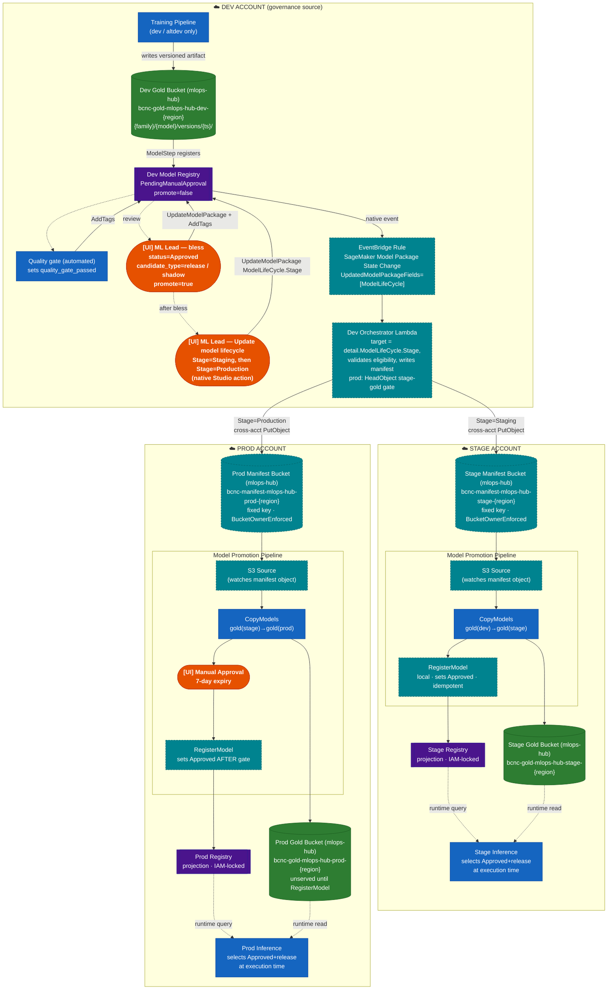
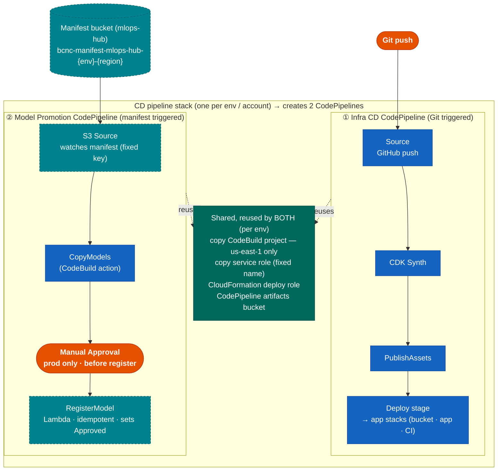

# Registry-First Model Promotion

## Overview — start here

**What this is.** Models are trained in the **dev** AWS account and have to move safely to **stage**, then **prod** — three separate, isolated AWS accounts. This document proposes how an approved model (and its artifact files) should cross those account boundaries under human control, and how inference in each account always serves the latest approved model.

**What "registry-first" means.** Today, promoting a model means editing a static catalog file and redeploying CDK. Registry-first instead makes the **SageMaker Model Registry** the source of truth: a human approves a version in dev and advances its lifecycle stage, and automation copies and re-registers it in the next account — no catalog edit, no redeploy.

**The happy path, end to end:**

1. **Train + register** — the training pipeline registers a new version in the dev registry (`PendingManualApproval`).
2. **Bless** — the ML Lead marks it `Approved` + `promote=true` in dev Studio. This makes it *eligible* but moves nothing.
3. **Advance to stage** — the ML Lead sets `ModelLifeCycle.Stage=Staging`. Automation copies the model into the stage account and registers it there; stage inference starts serving it.
4. **Advance to prod** — the ML Lead sets `Stage=Production`. Same flow, plus one human approval gate before it goes live.
5. **Serving** — each account's inference picks the latest approved model at its next scheduled run. No redeploy at any step.

> **The one rule to remember:** approval *blesses* a version but moves nothing; advancing its native **`ModelLifeCycle.Stage`** is what triggers promotion — because SageMaker emits an event when that field changes, but not when a tag changes.

## Glossary

| Term | Means |
|------|-------|
| **registry-first promotion** | Using the SageMaker Model Registry (not a static catalog file + redeploys) as the source of truth for what to serve. |
| **dev / stage / prod** | Three *separate, isolated* AWS accounts. Models flow dev → stage → prod; crossing accounts needs explicit grants. |
| **SageMaker Model Registry** | A per-account catalog of model versions, each with an approval status, a lifecycle stage, and tags. |
| **Model Package Group / version** | The container for all versions of one model (`{app}-{family}-{model}`); a *version* is one registered training run. |
| **`ModelApprovalStatus`** | Native field on a version: `Approved` / `Rejected` / `PendingManualApproval`. |
| **`ModelLifeCycle`** | Native field with a `Stage` (`Development` → `Staging` → `Production`) and `StageStatus`. Advancing the `Stage` is the promotion trigger. |
| **bless** | The ML Lead's approval (`Approved` + `promote=true`) — makes a version eligible but moves nothing. |
| **`candidate_type`** | Tag classifying a version: `release` (the served model), `shadow` (runs in parallel, never serves), `test`/`poc` (never deployed). |
| **release vs shadow** | A family serves 1 **release** model plus N **shadow** models that run for comparison only, never primary traffic. |
| **eligibility** | The orchestrator's promote condition: `Approved` + `promote=true` + valid `candidate_type` (+ quality gate for release). |
| **projection** | A read-only stage/prod registry, written only by the promotion pipeline — never hand-edited (enforced by IAM). |
| **gold bucket** | The S3 bucket holding the served model artifacts (`model.tar.gz`). One per account. |
| **manifest** | A small JSON file the orchestrator writes telling a target account which version to copy + register. |
| **orchestrator (Lambda)** | The dev-account Lambda that receives the lifecycle event, checks eligibility, and writes the manifest. |
| **promotion pipeline** | The per-account CodePipeline that copies the artifact (**CopyModels**) and registers it locally (**RegisterModel**). |
| **`mlops-hub`** | A separate shared-infrastructure stack that owns the cross-account buckets and keys; imported by name rather than created locally. |

---

> Orange = Human / UI action · Blue = Automated · Green = Storage · Purple = Registry · Teal (dashed) = Net-new component

**Core rule:** A model stays in dev until a human sets `status=Approved` + `promote=true` in the **dev registry**. The dev registry is the single governance source for all environments. Stage and prod registries are projections written only by the promotion pipeline; "read-only" means no human edits, enforced with IAM.

**Promotion is manual at every hop, driven by the model's native `ModelLifeCycle` stage in the dev registry.** Approval (`Approved` + `promote=true`) only blesses a version — it does not move anything. A human then advances the version's native **`ModelLifeCycle.Stage`** (`Staging`, then later `Production`) from Studio's *Update model lifecycle* action. That transition emits a native `SageMaker Model Package State Change` EventBridge event (`UpdatedModelPackageFields=["ModelLifeCycle"]`), which a rule routes to a single orchestrator Lambda; the orchestrator reads the target stage from the event payload and routes the artifact to the correct account. All UI happens in dev (native Studio actions — no CLI, no hand-edited tags); the two hops are symmetric; prod adds a CodePipeline approval gate. There is no automatic dev→stage promotion.

**Selection:** The inference pipeline selects the current `Approved` + `candidate_type=release` model at execution time from the local registry. A model-version change requires no CDK redeploy and no pipeline upsert — the next scheduled run picks it up.

---

## Current vs. Proposed

| Concern | Current | Proposed |
|---------|---------|--------|
| Inference selection | The inference container queries the registry at runtime but matches a `MODEL_VERSION` pinned at synth time from a static catalog. | Select latest `Approved`+`release` instead of a pinned version. A "latest Approved" query path typically already exists; stop baking `MODEL_VERSION` and filter tags in code. |
| Version source of truth | A static catalog file lists approved/pending versions per model. | Registry tags + status; the catalog holds static topology only. |
| Per-env registry authority | A registry-sync construct runs on every `cdk deploy` and rejects any registry version not listed in the catalog. | The RegisterModel step is the writer; remove the catalog enforcement (see "Reconciling the registry-sync Lambda"). |
| Artifact copy | An existing CodeBuild project (us-east-1 only) does selective per-version artifact copies. | Reused by the new Model Promotion Pipeline. |
| Shared buckets (gold/silver/ephemeral) | Gold/silver buckets are created locally today. | Owned by **`mlops-hub`** (`bcnc-{tier}-mlops-hub-{env}-{region}`, names/CMKs in SSM); imported via `from_bucket_name`. Silver eliminated; manifest bucket added in `mlops-hub`. |
| `ModelLifeCycle` stage transitions as the promotion trigger, EventBridge rule, orchestrator, manifest bucket, S3-source pipeline, RegisterModel, shadow inference branches | None exist. | All net-new (the trigger is the native `ModelLifeCycle` event — no custom Promote Control or `PutEvents`). |

A `Type: Lambda` step is expressible in the raw SageMaker pipeline (CloudFormation) JSON, so runtime selection does not require an SDK migration; the cheapest path is container-side selection plus removing the synth-time version pin.

---

## Reconciling the registry-sync Lambda (one gotcha to avoid)

**Purpose of this note:** today, a Lambda syncs the registry from a static catalog on every deploy. Reconciling it is just part of this proposal — but there's one non-obvious way to get it *partly* right that silently breaks promotion, so it's called out here.

**Today**, the registry-sync Lambda keeps the registry in step with a static catalog, and its catalog-enforcement logic **Rejects any registry version not listed in the catalog — on every `cdk deploy`**. Registry-first promotion deliberately registers versions that are *not* in the catalog. So if that Reject behavior survives your rewrite, the **next unrelated `cdk deploy` silently flips your promoted models to `Rejected`** and inference stops finding them.

**The change to make:**

| Keep | Remove |
|------|--------|
| Model Package Group creation | The catalog version-sync (catalog `approved[]`/`pending[]` → registry) |
| | The catalog-enforcement logic — the Reject-on-not-in-catalog behavior |

After this, **RegisterModel is the sole status authority**. Do **not** retain catalog status enforcement — it would reintroduce exactly this bug.

> Clean cutover (recommended): remove it outright. If instead you migrate **family-by-family**, temporarily scope the enforcement to ignore versions tagged `promoted_by=reconciler` during the transition, then remove it once all families are migrated.

---

## Metadata Contract — what's set, where it lives, by whom

All governance state lives on the **model package version** in the SageMaker Model Registry — not in a static catalog file. One Model Package Group per `{app}-{family}-{model}`; one version per training run; tags/status attach to each version.

**Three storage slots on a version:**

| Field | Storage | Set via |
|-------|---------|---------|
| `ModelApprovalStatus` (Approved / Rejected / Pending) | Native first-class field | `UpdateModelPackage`, or the Studio Model Registry "Update status" button |
| `ModelLifeCycle` (`Stage` + `StageStatus`) — the promotion **trigger** | Native first-class field (both required strings, ≤63 chars) | `UpdateModelPackage` / `CreateModelPackage`, or the Studio "Update model lifecycle" action |
| `promote`, `candidate_type`, `quality_gate_passed`, `version`, `git_sha`, `data_snapshot` — governance **eligibility** + lineage | Resource **tags** (governance flags) or `CustomerMetadataProperties` (lineage) | `AddTags` / `UpdateModelPackage` — by training automation or the ML Lead's bless |

> Tag keys are shown unprefixed for readability. If your account's registry is shared across applications, namespace them per app (e.g. `<app>:promote`) so each app's governance tags stay distinct.

**Who sets what:**

| Actor | Fields | Mechanism |
|-------|--------|-----------|
| Training pipeline (registration) | `version`, `git_sha`, `candidate_type=release` (default), `promote=false`; `ModelLifeCycle = Development / PendingApproval` | `CreateModelPackage` |
| Automation (Lambda / Clarify) | `quality_gate_passed` | `AddTags` |
| ML Lead — bless | `ModelApprovalStatus=Approved`, `candidate_type`, `promote=true` | Studio "Update status" / API |
| ML Lead — promote | `ModelLifeCycle.Stage = Staging`, then `= Production` | Studio "Update model lifecycle" (native — emits the trigger event) |

**Why `ModelLifeCycle` and not a custom tag:** SageMaker emits a native EventBridge event when `ModelLifeCycle` (or `ModelApprovalStatus`) changes, but **not** when a tag changes. Encoding the "move" signal in a custom `promote_to` tag therefore needs a bespoke control to write the tag *and* manufacture an event (the old Promote Control + `PutEvents` + CloudTrail fallback). `ModelLifeCycle` is the native, first-class field built for exactly this: a human advances the stage from the Studio UI (no CLI, no `aws sagemaker add-tags`), the change emits the trigger event for free, and access is gated natively with the `sagemaker:ModelLifeCycle:stage` / `:stageStatus` IAM condition keys (see Governance Enforcement). Keep `candidate_type` / `promote` / `quality_gate_passed` as **eligibility** flags the orchestrator reads — they no longer carry the trigger, so the tag-vs-metadata choice is purely about IAM conditioning of the bless, not the move.

---

## Diagram 1 — End-to-End Promotion Flow



The prod Manual Approval runs before RegisterModel writes `Approved`, so a scheduled run cannot serve an unapproved model. CopyModels may run before the gate; the artifact sits in prod gold unserved until the gated registration.

**Human touchpoints (UI) — all in the dev account:** (1) ML Lead governance decision (Approve / Shadow / Reject) via "Update status" in the registry; (2) Promote → stage by setting `ModelLifeCycle.Stage=Staging`; (3) Promote → prod by setting `ModelLifeCycle.Stage=Production` — both via Studio's native "Update model lifecycle" action. The only UI action outside dev is (4) the CodePipeline approval gate in the prod account. The quality gate is automated. Each lifecycle transition emits the native event that drives the orchestrator. Stage/prod registries take no human edits (IAM-locked).

> **Trigger wiring:** Promotion is driven by the model's native `ModelLifeCycle` stage, not a custom tag — precisely because SageMaker emits a native `SageMaker Model Package State Change` EventBridge event when `ModelLifeCycle` (or `ModelApprovalStatus`) changes, but **not** when a tag changes. Advancing the stage in Studio fires the event for free (`source=aws.sagemaker`, `detail-type="SageMaker Model Package State Change"`, `detail.UpdatedModelPackageFields=["ModelLifeCycle"]`, `detail.ModelLifeCycle.Stage` = the target env). No Promote Control, no `PutEvents`, and no CloudTrail fallback are needed: the trigger is first-class. The orchestrator routes on the `Stage` carried in the event payload (so it never re-reads a tag under a read-after-write race) and re-reads the version only to validate eligibility (`Approved` + `promote` + `candidate_type` + `quality_gate`).

**Manifest vs. S3 Source (both net-new — these are two different things):**

- **Promotion manifest** = a small JSON file the dev orchestrator writes to the **manifest bucket** (one per target env). It is the *instruction* for a single promotion. Shape:
  ```json
  { "family": "fraud", "model": "txn_scorer", "version": "20260416_2253",
    "candidate_type": "release", "source_gold": "s3://bcnc-gold-mlops-hub-dev-us-east-1/...",
    "target_gold": "s3://bcnc-gold-mlops-hub-stage-us-east-1/..." }
  ```
- **S3 Source** = the Model Promotion CodePipeline's **first action** (a CodePipeline source of type S3). It *watches* that one manifest object at a **fixed S3 key** and **auto-starts the pipeline** whenever the object changes.

So the bucket/JSON is the *what to promote*; the S3 Source is the *trigger that reacts to it*. This is why the new pipeline is **S3-triggered**, in contrast to the Infra CD pipeline, which is **GitHub-triggered** (`GitHub_Source`). No pipeline is S3-triggered today, so both the manifest bucket and the S3-source pipeline are net-new. (Because the source is one fixed key, the manifest content must change per promotion — e.g. include the version — or the source won't re-trigger; see Failure Modes.)

---

## Diagram 2 — Trigger Chain

```mermaid
flowchart TD
    classDef human fill:#e65100,stroke:#bf360c,color:#fff,font-weight:bold
    classDef auto  fill:#1565c0,stroke:#0d47a1,color:#fff

    subgraph DS["Dev → Stage  (lifecycle-triggered)"]
        direction LR
        T2a(["[UI] Approve\nApproved + promote=true\n(bless, no movement)"])
        T2(["[UI] Update model lifecycle\nStage=Staging"])
        A0["Native event\nModelLifeCycle changed"]
        A1["EventBridge → orchestrator"]
        A2["Orchestrator Lambda\ntarget=Staging · validate · write manifest"]
        A3["Stage CodePipeline\nS3 source"]
        A4["CopyModels → RegisterModel"]
        A6["Next inference run\nselects Approved+release"]
        T2a --> T2 --> A0 --> A1 --> A2 --> A3 --> A4 -.-> A6
    end

    subgraph SPx["Stage → Prod  (lifecycle-triggered + gate)"]
        direction LR
        T3(["[UI] Update model lifecycle\nStage=Production"])
        B0a["Native event\nModelLifeCycle changed"]
        B0["EventBridge → orchestrator"]
        B1["Orchestrator Lambda\nHeadObject stage-gold gate · write manifest"]
        B2["Prod CodePipeline\nS3 source"]
        B3["CopyModels → prod gold\n(unserved)"]
        T4(["[UI] Approve\n7-day expiry"])
        B4["RegisterModel\nsets Approved"]
        B5["Next inference run\nselects Approved+release"]
        T3 --> B0a --> B0 --> B1 --> B2 --> B3 --> T4 --> B4 -.-> B5
    end

    class T2a,T2,T3,T4 human
    class A0,A1,A2,A3,A4,A6,B0a,B0,B1,B2,B3,B4,B5 auto
```



---

## Diagram 3 — The CD stack deploys TWO sibling CodePipelines (per account)

**One CD pipeline stack per env creates two separate AWS CodePipelines as sibling constructs** — not one pipeline, and neither is deployed *by* the other. They live in the same stack so the new one can reuse the existing copy CodeBuild project, its copy service role, the CloudFormation deploy role, and the CodePipeline artifacts bucket.

- **Pipeline #1 — Infra CD CodePipeline** (existing): Git-triggered; its Deploy stage deploys the application's stacks — typically a data-bucket stack, the **application stack** (where the SageMaker pipelines and the registry-sync construct live), and a CI stack. There is no separate "model registry stack."
- **Pipeline #2 — Model Promotion CodePipeline** (new): manifest-S3-triggered; a CodePipeline that *uses* a CodeBuild action for the copy. It moves + registers model artifacts. It does **not** deploy stacks.



> **What deploys what:** deploying the CD pipeline stack creates *both* pipelines. Pipeline #1's Deploy stage then deploys the application's **app stacks** (data-bucket, app, CI). Pipeline #2 never deploys a stack — it copies the artifact and registers the model. The Model Promotion CodePipeline only exists where promotions land (dev as source, stage/prod as targets), and its copy step inherits the **us-east-1-only** constraint of the copy CodeBuild project.

---

## Diagram 4 — Model Lifecycle & Gates


---

## Diagram 5 — Governance Decision Tree


---

## Diagram 6 — Inference Execution (scaled to N shadows)

The pipeline is a single SageMaker `CfnPipeline` whose steps are **all `Type: Processing`**, wired by `DependsOn`: one `Preprocessing_{family}` step → a feature-engineering layer (a shared `FE_{family}` for shared-vocab models, plus a dedicated `FE_{model}` for any own-vocab model) → one `Inference_{model}` step per model. Scaling to N shadows means the family's model list is **1 release + N shadow entries**, so the synth loop emits **N+1 inference branches** off the shared preprocessing/FE.

**FE choice is orthogonal to release/shadow.** Whether a model gets the shared `FE_{family}` or a dedicated `FE_{model}` depends only on `has_vocab and not is_legacy` — not on `candidate_type`. A release model can be own-vocab (dedicated FE) and a shadow can be shared-vocab. In the diagram below, the release happens to draw off the own-vocab FE and the shadows off the shared FE purely to show both paths.


**How each step is built:**

| Step | Implementation |
|------|----------------|
| `Preprocessing_{family}` | One `Type: Processing` step per family; output `preprocessing_data`. |
| `FE_{family}` (shared) | One shared feature-engineering step, `DependsOn` preprocessing; feeds every shared-vocab model. |
| `FE_{model}` (own-vocab) | A dedicated FE step per model that has its own vocabulary (and isn't legacy). |
| `Inference_{model}` | One inference step per model, `DependsOn` its FE step. |
| release vs shadow **(target)** | net-new — no equivalent today. Current code routes *all* inference output to a single `scores/{family}/{model}/{version}/` path with no `candidate_type` split. Target: select on the model's `candidate_type` and route release → `results/`, shadow → `shadow-outputs/`. |
| model version | The container resolves it at runtime via `ListModelPackages` + `DescribeModelPackage`. |

| Behaviour | Detail |
|-----------|--------|
| Shared vs dedicated FE | Shared-vocab models (legacy or versioned-without-vocab) share one `FE_{family}`; own-vocab models get a dedicated `FE_{model}`. |
| Runtime version resolution | Each inference container picks its model by querying the local registry (`ListModelPackages` by status, then filter tags in code) — today against the synth-pinned `MODEL_VERSION`; target = latest `Approved`+`release` / `Approved`+`shadow`. |
| Change a model **version** | No CDK redeploy — the container resolves the new version at runtime. |
| Change the **number** of shadows (N) | Adds/removes an inference branch in the pipeline definition → re-synth + `upsert` of the `CfnPipeline` (a deploy), since branches are built at synth, not spawned at runtime. |
| Outputs | Release → `results/`; every shadow → `shadow-outputs/` for offline comparison; shadows never serve primary traffic. |

---

## Scenarios

Every model starts at 1A. Approval (`Approved` + `promote=true`) only *blesses* a version; advancing its native `ModelLifeCycle.Stage` (`Staging`, then `Production`) from Studio is what actually moves it. The stage change emits the native event that drives the orchestrator → the target account.

### Scenario 1 — Version only in Dev (never promoted)

The default state of every model; it stays here until tags explicitly enable promotion.

**1A — Just registered by training**

| Tag | Value |
|-----|-------|
| `ModelApprovalStatus` | `PendingManualApproval` |
| `promote` | `false` |
| `quality_gate_passed` | `false` |
| `candidate_type` | `release` (default) |

Not eligible: still `Stage=Development`, and even if advanced the orchestrator rejects it (not Approved, promote=false, quality_gate=false).

**1B — Quality gate passes (automated)**

| Tag | Value |
|-----|-------|
| `ModelApprovalStatus` | `PendingManualApproval` |
| `promote` | `false` |
| `quality_gate_passed` | `true` |
| `candidate_type` | `release` |

Not eligible (promote=false, status still Pending). Human review now available.

**1C — Human rejects**

| Tag | Value |
|-----|-------|
| `ModelApprovalStatus` | `Rejected` |
| `promote` | `false` |
| `quality_gate_passed` | `true` or `false` |
| `candidate_type` | `release` |

Rejected — permanently excluded from all orchestrator queries.

**1D — Test / POC (never intended for deployment)**

| Tag | Value |
|-----|-------|
| `ModelApprovalStatus` | `PendingManualApproval` |
| `promote` | `false` |
| `quality_gate_passed` | `true` or `false` |
| `candidate_type` | `test` or `poc` |

Not eligible (promote=false, candidate_type=test/poc); the orchestrator filters it out even if the stage is advanced.

### Scenario 2 — Approve, then advance to Stage

Approval blesses the version; setting `ModelLifeCycle.Stage=Staging` triggers the move.

**2A — Approve as release**

| Tag | Value |
|-----|-------|
| `ModelApprovalStatus` | `Approved`  ← key change |
| `promote` | `true`  ← key change |
| `quality_gate_passed` | `true` (required for release) |
| `candidate_type` | `release` |

Approval blesses the version (no movement). The human advances `ModelLifeCycle.Stage=Staging` in Studio → native event (`UpdatedModelPackageFields=["ModelLifeCycle"]`, `Stage=Staging`) → EventBridge → orchestrator validates the version (`Approved` + `promote=true` + `candidate_type=release` + `quality_gate=true`) → writes the stage manifest → stage pipeline runs (CopyModels → RegisterModel sets `Approved`, idempotent).

**2B — Approve as shadow**

| Tag | Value |
|-----|-------|
| `ModelApprovalStatus` | `Approved` |
| `promote` | `true` |
| `quality_gate_passed` | `true` or `false` (not required) |
| `candidate_type` | `shadow` |

Set `ModelLifeCycle.Stage=Staging`; orchestrator match: promote=true + Approved + candidate_type=shadow (quality gate not checked). Stage manifest carries `candidate_type=shadow` → stage wires it as a shadow slot (serves only `shadow-outputs/`, never primary traffic).

**State after the stage pipeline completes:**

```
Dev Registry:    Approved, promote=true, quality_gate=true, candidate_type=release
Dev Gold:        artifact present  ✓
Stage Registry:  Approved (projection — selected by inference at runtime)
Stage Gold:      artifact present  ✓
Prod Registry:   (empty for this version)
Prod Gold:       no artifact
```

Prod is blocked until a human advances `ModelLifeCycle.Stage=Production`, which triggers the orchestrator to check:

```
stage gold HeadObject → found ✓   (403/404 → flag stage first, retryable)
status=Approved       ✓
promote=true          ✓
quality_gate=true     ✓  (release)
→ write prod manifest
```

### Scenario 3 — Advance to Production, version reaches Prod

After the human sets `ModelLifeCycle.Stage=Production` and the prod pipeline clears the approval gate (RegisterModel writes `Approved` *after* the gate):

```
Dev Registry:    Approved, promote=true, quality_gate=true, candidate_type=release
Dev Gold:        artifact present  ✓
Stage Registry:  Approved (projection)
Stage Gold:      artifact present  ✓
Prod Registry:   Approved (projection)
Prod Gold:       artifact present  ✓
```

All inference pipelines select this version at runtime. The dev registry record — `ModelApprovalStatus`, the eligibility tags, and the `ModelLifeCycle` history (`Development → Staging → Production`) — is the permanent governance trail. No CDK redeploy at any point. Shadows reach prod via the same stage advance with the quality-gate check dropped.

### The single rule that controls everything

```
promote=false   OR   status≠Approved   OR   quality_gate=false (release)
    → not eligible · orchestrator rejects the transition · nothing moves

promote=true  AND  status=Approved  AND  quality_gate=true (release)  AND  Stage=Staging
    → native event → orchestrator → stage pipeline

promote=true  AND  status=Approved  AND  candidate_type=shadow  AND  Stage=Staging
    → native event → orchestrator → stage pipeline (shadow slot)

stage gold present  AND  Stage=Production
    → native event → orchestrator → prod pipeline · approval gate · register after gate
```

### Scenario 4 — Emergency Rollback (break-glass)

Never hand-edit the stage/prod registry.

| Step | Action |
|------|--------|
| 1 | In the dev registry, set `ModelApprovalStatus=Rejected` (and `ModelLifeCycle.StageStatus=Rejected`) on the bad version; this emits a native event the orchestrator's de-promote path consumes and applies the same in the target registry |
| 2 | Previous Approved version (retained in gold + registry) is selected automatically next run |
| 3 | Confirm the target registry reflects the change (orchestrator de-promote, not a hand edit) |
| 4 | Record incident + CloudTrail reference |

---

## Failure Modes & Recovery

| Failure | State | Recovery |
|---------|-------|----------|
| CopyModels fails | Artifact not fully in target gold | Re-run; copy is selective + re-runnable |
| RegisterModel fails after copy | Artifact present, no Approved entry (safe) | Re-run; idempotent |
| Pipeline re-executed | Risk of duplicate Approved versions | Idempotent RegisterModel matches by source timestamp |
| Identical manifest overwrite | S3 source may not re-trigger | Manifest content changes per promotion (include ts) |
| Approval not actioned in 7 days | Prod execution fails | Re-apply `ModelLifeCycle.Stage=Production` (re-emits the native event) to re-fire |
| Duplicate native events for one promotion (e.g. a stage re-applied) | Orchestrator may run twice | Manifest is deterministic + RegisterModel idempotent → no-op on the second run |

---

## Governance Enforcement

- Only the RegisterModel role may `CreateModelPackage` / `UpdateModelPackage` / `AddTags` on stage/prod registries; deny to humans and the legacy enforcement role via IAM/SCP.
- `candidate_type` is required on every Approved package; selection treats a missing value as non-release.
- The orchestrator role can write both stage and prod manifests; forward-only and "prod gated" are operational (driven by the target `ModelLifeCycle.Stage` + the stage-gold check + the CodePipeline approval gate), not IAM-enforced separation.
- `ModelLifeCycle.Stage` is the trigger — gate it natively: scope `sagemaker:UpdateModelPackage` / `CreateModelPackage` with the `sagemaker:ModelLifeCycle:stage` / `sagemaker:ModelLifeCycle:stageStatus` condition keys so only the ML Lead role may set `Stage=Production` (and, if desired, `Stage=Staging`). Because the trigger is a first-class field with a native event and an audit trail, no CloudTrail fallback rule is needed. Example (lead-engineer role):
  ```json
  {
    "Action": ["sagemaker:UpdateModelPackage"],
    "Resource": ["*"],
    "Condition": { "StringEquals": {
      "sagemaker:ModelLifeCycle:stage": "Production",
      "sagemaker:ModelLifeCycle:stageStatus": "PendingApproval"
    } }
  }
  ```

---

### Shared storage is owned by `mlops-hub`

The shared `gold` / `ephemeral` buckets and their CMKs are **not created locally** — they are created by **`mlops-hub`** (the shared data-lake stack), one per account/region (silver is eliminated; see Current vs. Proposed):

- **Naming:** `bcnc-{tier}-mlops-hub-{env}-{region}` — e.g. gold is `bcnc-gold-mlops-hub-{env}-{region}` (`env` ∈ dev/stage/prod, `region` ∈ us-east-1/us-east-2).
- **Discovery:** names exported to SSM (`/{project}/s3/{tier}/name`); CMK ARNs exported to SSM too. Imported via `s3.Bucket.from_bucket_name(...)` after an SSM lookup.
- **Existing trust:** `mlops-hub` bucket + KMS policies already trust roles matching `*-SageMaker-*` (training writes the versioned artifact to gold) and `*-CopyModels-*` (gold promotion).

**Consequence:** every new cross-account grant below must be added **in `mlops-hub`** (policies cannot be attached to imported `IBucket`s), and the new roles should either match an existing trusted pattern or `mlops-hub` must add the pattern. The **promotion manifest bucket** should be created the same way — a new `mlops-hub` tier (e.g. `bcnc-manifest-mlops-hub-{env}-{region}`) or a dedicated prefix on an existing shared bucket — with its name/CMK in SSM.

| # | Grant | Reason | Owner |
|---|-------|--------|-------|
| X1 | Manifest bucket policy → dev orchestrator role `s3:PutObject` (+ `PutObjectTagging`, `AbortMultipartUpload`) | Cross-account write needs a target resource policy | **`mlops-hub`** (manifest bucket) — role should match `*-CopyModels-*` or a new trusted pattern |
| X2 | Manifest object ownership = `BucketOwnerEnforced` | Otherwise target pipeline cannot read dev-written objects | **`mlops-hub`** (its S3 stack) |
| X3 | Manifest CMK policy → dev orchestrator role `GenerateDataKey`/`Encrypt` | SSE-KMS cross-account write | **`mlops-hub`** (CMK exported to SSM) |
| X4 | `bcnc-gold-mlops-hub-stage-{region}` bucket + CMK → dev orchestrator role `GetObject`/`ListBucket`/`Decrypt` | Forward-only HeadObject gate is a dev→stage read not in today's trust (gold trusts `*-CopyModels-*` for promotion, not a dev reader) | **`mlops-hub`** (stage gold bucket + CMK policy) |
| X5 | Preserve the copy service role's name (`*-CopyModels-*`) so the existing `mlops-hub` gold trust keeps working | Cross-account copy trust is keyed on the role-name pattern | CD pipeline stack |

---

## What's Essential vs Optional (build tiers)

Most of the net-new apparatus is a *choice*, not a requirement. Build it in tiers — the four-piece **Core** is a working registry-first promotion on its own; everything else is layered on for the prod gate, hands-off triggering, or features.

### Tier 1 — Core (cannot promote without these)

| Piece | Why essential |
|-------|---------------|
| **CopyModels** (artifact → target gold) | Inference reads the *local* gold bucket; the bytes must physically get there. Reuses the existing copy CodeBuild project. |
| **RegisterModel** (Approved entry in target registry) | Inference selects from the *local* registry; something must write the Approved version locally. |
| **Runtime selection** (stop baking `MODEL_VERSION`) | This *is* registry-first. Keep baking the version and you don't need any of this — just edit the catalog and redeploy (today's system). |
| **Reconcile the registry-sync construct** | Otherwise the enforcement Lambda Rejects promoted versions on the next deploy. Non-negotiable. |

**Leanest working version:** human approves in dev → trigger the promotion (manually) → CopyModels → RegisterModel; plus stop baking `MODEL_VERSION` and neuter the enforcement Lambda. That's a complete registry-first promotion.

### Tier 2 — Needed only because we use CodePipeline (to get the prod gate)

| Piece | Essential? |
|-------|-----------|
| **Manifest bucket + S3 Source** | Not fundamental to registry-first. They exist because the promotion runs as a **CodePipeline**, and a CodePipeline needs a source. The manifest does double duty — it's the **trigger** *and* the **input artifact** carrying the promotion parameters to the Copy/Register actions. |
| **Model Promotion CodePipeline** | Chosen mainly for the **native prod Manual Approval gate** (a Lambda can't block for hours). |

**Alternative:** the orchestrator drives CodeBuild directly (`StartBuild` + register, no CodePipeline) — fewer moving parts, no manifest/S3-source — but then you must **re-build the prod approval gate** yourself. Keep CodePipeline → you need the manifest + S3 Source. Drop it → you don't, but you re-invent the gate.

### Tier 3 — Convenience / governance (defer or simplify)

| Piece | Can you skip it? |
|-------|------------------|
| **`ModelLifeCycle` trigger wiring (EventBridge rule)** | The rule is one line of config and the *trigger* is native (free). You can still invoke the orchestrator by hand to start, but there is no custom Promote Control or `PutEvents` to build. |
| **Dev Orchestrator Lambda** (centralized decision) | Partly — a human could pass the version straight to the pipeline. You'd lose "dev is the single source" + the forward-only gate, but it still promotes. |
| **Shadow inference branches** | Yes, entirely — only if you actually run shadows. |
| **Quality gate** | Yes — advisory / phase-2 (it does not exist today and has no defined thresholds; do not block release on it initially). |

---

## Implementation Checklist

Tagged by tier: **[Core]** = Tier 1, **[Gate]** = Tier 2 (CodePipeline/prod gate), **[Opt]** = Tier 3.

- [ ] **[Core]** Rewrite the registry-sync Lambda: **keep** Model Package Group creation; **remove** the catalog version-sync AND the catalog-enforcement logic (the Reject-on-not-in-catalog behavior). RegisterModel becomes sole status authority — do not retain catalog status enforcement.
- [ ] **[Core]** Stop baking `MODEL_VERSION`; select latest `Approved`+`release` (tag filter in code).
- [ ] **[Core]** RegisterModel Lambda (local, idempotent, sets Approved).
- [ ] **[Core]** CopyModels — reuse the existing copy CodeBuild project (us-east-1) to copy artifact into target gold.
- [ ] **[Gate]** Model Promotion CodePipeline (S3 source → CopyModels → [prod approval] → RegisterModel).
- [ ] **[Gate]** Manifest bucket in **`mlops-hub`** (`bcnc-manifest-mlops-hub-{env}-{region}` or a shared prefix; name/CMK to SSM; fixed key, `BucketOwnerEnforced`, notifications on).
- [ ] **[Gate]** Cross-account grants X1–X5.
- [ ] **[Core]** Adopt `ModelLifeCycle` as the promotion trigger: training registers with `Stage=Development`; the ML Lead advances `Stage=Staging` / `Stage=Production` from Studio. Verify `ModelLifeCycle` is exposed by the pinned `aws-cdk-lib` / runtime boto3 (GA Nov 2024) before relying on it.
- [ ] **[Opt]** IAM-restrict `Stage=Production` (and optionally `Stage=Staging`) to the ML Lead role via the `sagemaker:ModelLifeCycle:stage` / `:stageStatus` condition keys.
- [ ] **[Opt]** EventBridge rule on `SageMaker Model Package State Change` filtered to `detail.UpdatedModelPackageFields` containing `ModelLifeCycle` → orchestrator. (No custom `PutEvents`, no CloudTrail fallback.)
- [ ] **[Opt]** Dev orchestrator Lambda: read the target from `detail.ModelLifeCycle.Stage`, validate eligibility (`Approved` + `promote` + `candidate_type` + `quality_gate`), route to the correct target account (stage: dev-gold check; prod: stage-gold gate); idempotent.
- [ ] **[Opt]** Per-model inference branches (release + N shadows) built at synth; release → `results/`, shadow → `shadow-outputs/`.
- [ ] **[Opt]** Quality gate (advisory first; define thresholds later).
- [ ] **[Core]** IAM/SCP lockdown of stage/prod registry writes.
- [ ] **[Opt]** S3 lifecycle/retention for gold + registry versions.
- [ ] **[Opt]** Break-glass de-promote mode.

---

## Key Design Rules

| Rule | Detail |
|------|--------|
| Dev registry = single governance source | All UI in dev; stage and prod promotions query the dev registry |
| Reconcile enforcement first | The registry-sync Lambda's catalog enforcement rejects non-catalog versions every deploy |
| Runtime selection, no redeploy | Selection at execution time; infra pipeline runs only for structure changes |
| Approval blesses, `ModelLifeCycle` stage moves | `Approved` + `promote=true` (+ quality gate for release) bless; advancing `ModelLifeCycle.Stage=Staging` then `=Production` is the manual trigger |
| Native lifecycle event fires the trigger | Advancing `ModelLifeCycle.Stage` in Studio emits a native `SageMaker Model Package State Change` event → EventBridge → one orchestrator Lambda routes by `detail.ModelLifeCycle.Stage`; no Promote Control, no `PutEvents`, no per-hop CLI |
| Lifecycle stage is IAM-gated | `sagemaker:ModelLifeCycle:stage` / `:stageStatus` condition keys restrict who may set `Stage=Production`; the trigger is a first-class field with an audit trail, so no CloudTrail fallback is needed |
| Orchestrator idempotent on re-fire | Duplicate native events (e.g. a stage re-applied to re-fire) → deterministic manifest + idempotent RegisterModel → no-op |
| Tag filtering in code | `ListModelPackages` filters by status only |
| Prod gate precedes the Approved write | Approval before RegisterModel writes Approved |
| RegisterModel idempotent | Match by source timestamp; update instead of duplicate |
| Registry writes IAM-locked | Only RegisterModel role may write stage/prod |
| Forward-only gate = stage-gold HeadObject | Checks artifact presence; needs grant X4; transient 403/404 retryable |
| Shared buckets owned by `mlops-hub` | gold/ephemeral + the manifest bucket are created by `mlops-hub` (`bcnc-{tier}-mlops-hub-{env}-{region}`, names/CMKs in SSM), imported via `from_bucket_name()` — so all cross-account grants (X1–X4) are added in `mlops-hub`, not locally |
| Cross-account write needs ownership + KMS | BucketOwnerEnforced + bucket policy + KMS grant (X1–X3) |
| Lambda never blocks | Writes manifest and exits; CodePipeline owns waits |
| Approval gate 7-day expiry | Un-actioned prod promotions fail |
| CD stack = two sibling CodePipelines | One stack creates both the Infra CD pipeline (Git → deploys the app stacks) and the Model Promotion pipeline (manifest → copy + register); neither deploys the other; both reuse the copy CodeBuild project / copy service role |
| Copy = CodeBuild (us-east-1 only) | Reuses the copy CodeBuild project; preserve role name (X5) |
| Shadows are synth-time inference branches | 1 release + N shadow `Inference_{model}` Processing steps off shared preprocessing/FE; changing N needs a re-synth/upsert; changing a version does not |
| Lifecycle defined | Keep last N / referenced versions per model |
| Copy step reads the version | The copy step reads which version to promote from the manifest |
