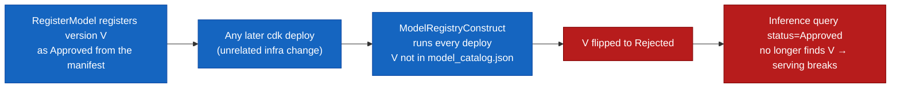
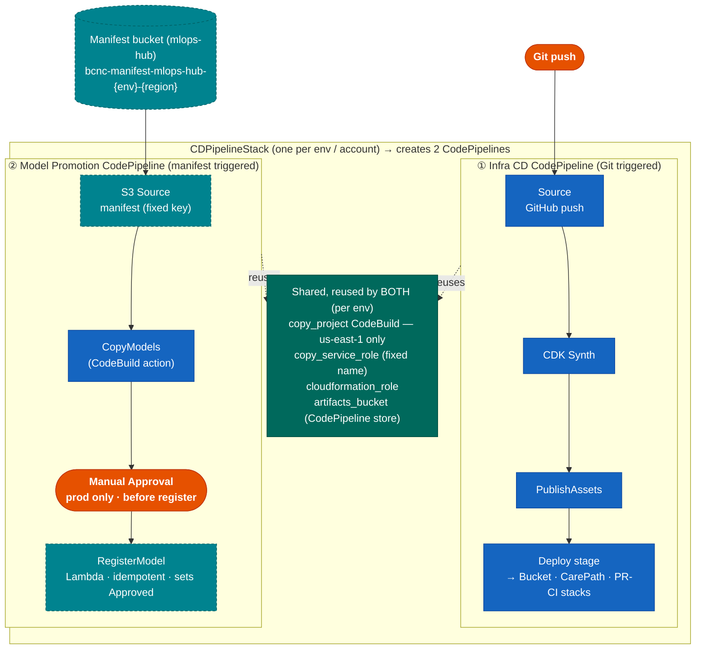
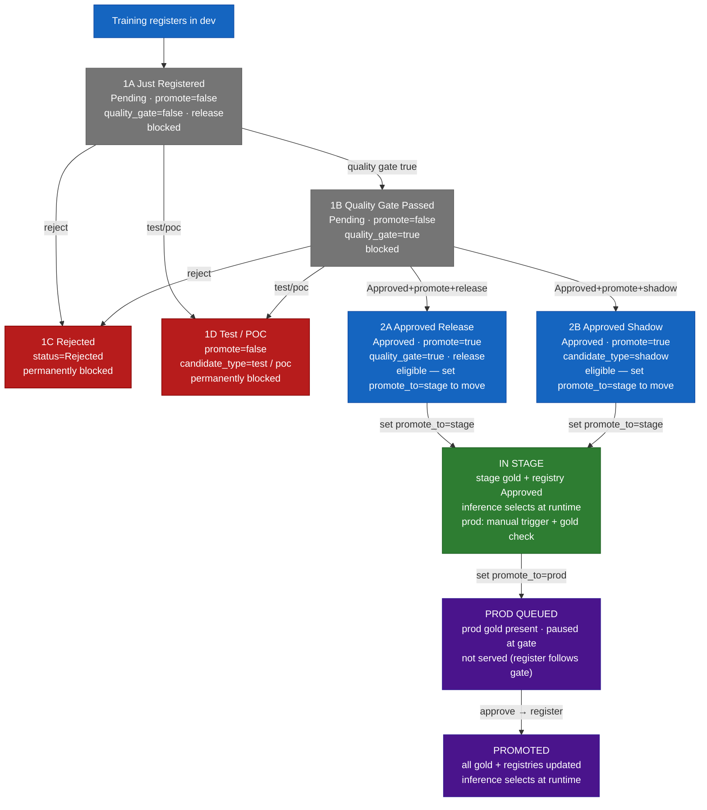
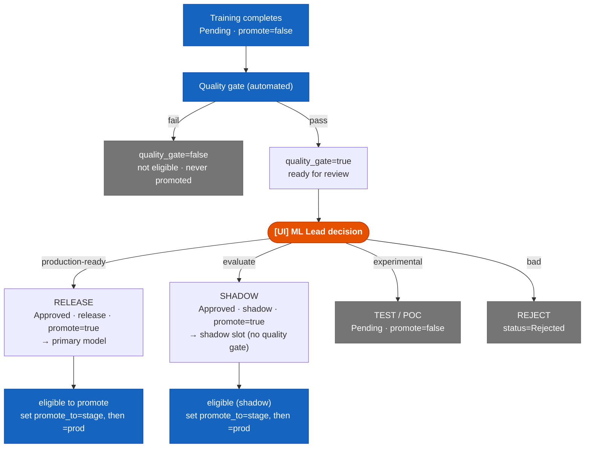
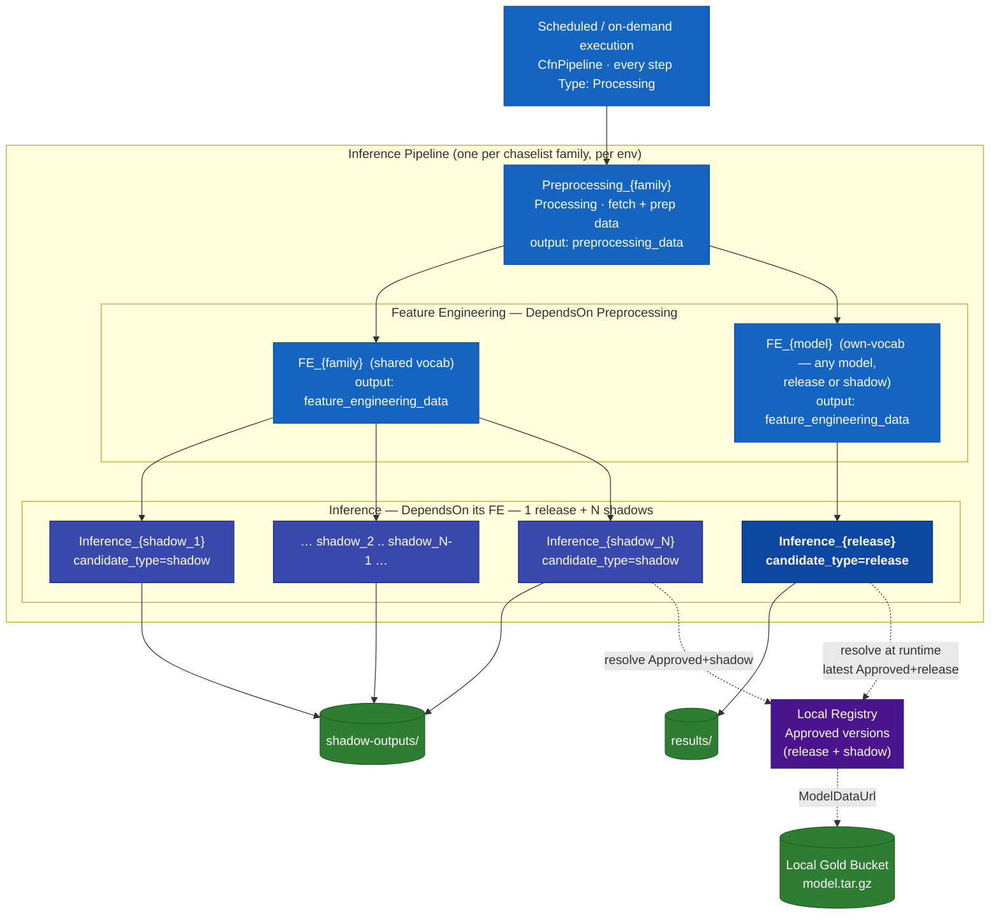

# Registry-First Model Promotion

> Orange = Human / UI action · Blue = Automated · Green = Storage · Purple = Registry · Teal (dashed) = Net-new component

**Core rule:** A model stays in dev until a human sets `status=Approved` + `promote=true` in the **dev registry**. The dev registry is the single governance source for all environments. Stage and prod registries are projections written only by the promotion pipeline; "read-only" means no human edits, enforced with IAM.

**Promotion is manual at every hop, driven by a flag in the dev registry.** Approval only blesses a version — it does not move anything. A human then sets a `promote_to` flag (`stage`, then later `prod`) on the model in the **dev** registry. That tag change drives EventBridge → a single orchestrator Lambda, which routes the artifact to the correct target account. All UI happens in dev; the two hops are symmetric; prod adds a CodePipeline approval gate. There is no automatic dev→stage promotion.

**Selection:** The inference pipeline selects the current `Approved` + `candidate_type=release` model at execution time from the local registry. A model-version change requires no CDK redeploy and no pipeline upsert — the next scheduled run picks it up.

---

## Implementation Status — Current vs. Target

| Concern | Current | Target |
|---------|---------|--------|
| Inference selection | Container queries the registry at runtime (`batch_inference_processing.py:67-99`) but matches the `MODEL_VERSION` baked at synth from `model_catalog.json` (`sagemaker_inference_pipeline.py:548-592`). | Select latest `Approved`+`release` instead of a pinned version. The `version=None` path already returns latest Approved (`batch_inference_processing.py:78-79`). Stop baking `MODEL_VERSION`; filter tags in code. |
| Version source of truth | `model_catalog.json` `model_versions.approved[]/pending[]`. | Registry tags + status; catalog holds static topology only. |
| Per-env registry authority | `ModelRegistryConstruct` runs on every `cdk deploy`; `_enforce_catalog_statuses()` rejects any version not in the catalog (`model_registry_handler.py:244-280`). | RegisterModel step is the writer; enforcement retired or scoped (see Reconciliation). |
| Artifact copy | `copy_project` CodeBuild (us-east-1 only) via `sync_models.py` selective per-version copy. | Reused by the new Model Promotion Pipeline. |
| Shared buckets (gold/silver/ephemeral) | This repo creates gold/silver in `artifact_bucket_stack.py`. | Owned by **`mlops-hub`** (`bcnc-{tier}-mlops-hub-{env}-{region}`, names/CMKs in SSM); this repo imports via `from_bucket_name`. Silver eliminated; manifest bucket added in `mlops-hub`. |
| Promote Control, EventBridge rule, orchestrator, manifest bucket, S3-source pipeline, RegisterModel, shadow inference branches | None exist. | All net-new. |

A `Type:Lambda` step is expressible in the raw `CfnPipeline` JSON, so runtime selection does not require an SDK migration; the cheapest path is container-side selection plus removing the synth-time version pin.

---

## Reconciliation with `ModelRegistryConstruct`



Registry-first promotion bypasses `model_catalog.json`, but `_enforce_catalog_statuses()` rejects any registry version not listed there on every deploy. Resolve before adoption:

| Option | Change | Trade-off |
|--------|--------|-----------|
| A (recommended) | Remove `_enforce_catalog_statuses()`; keep group creation. RegisterModel is sole status authority. | Loses catalog guardrail during migration. |
| B | Make enforcement ignore versions tagged `promoted_by=reconciler`. | Two writers coexist. |
| C | Reconciler also updates `model_catalog.json` per promotion. | Re-introduces catalog coupling. |

---

## Metadata Contract — what's set, where it lives, by whom

All governance state lives on the **model package version** in the SageMaker Model Registry — not in `model_catalog.json`. One Model Package Group per `{app}-{family}-{model}`; one version per training run; tags/status attach to each version.

**Two storage slots on a version:**

| Field | Storage | Set via |
|-------|---------|---------|
| `ModelApprovalStatus` (Approved / Rejected / Pending) | Native first-class field | `UpdateModelPackage`, or the Studio Model Registry "Update status" button |
| `carepath:promote`, `candidate_type`, `quality_gate_passed`, `promote_to`, `version`, `git_sha`, `data_snapshot` | Resource **tags** (governance flags) or `CustomerMetadataProperties` (lineage) | `AddTags` / `UpdateModelPackage` — via the Promote Control or automation |

**Who sets what:**

| Actor | Fields | Mechanism |
|-------|--------|-----------|
| Training pipeline (registration) | `version`, `git_sha`, `candidate_type=release` (default), `promote=false` | `CreateModelPackage` |
| Automation (Lambda / Clarify) | `quality_gate_passed` | `AddTags` |
| ML Lead — bless | `ModelApprovalStatus`, `candidate_type`, `promote` | Studio UI / API |
| ML Lead — promote | `promote_to=stage`, then `=prod` | **Promote Control** (writes the tag + emits the trigger event) |

**Why a Promote Control:** the Studio UI handles approval status well but is poor for hand-editing custom tags, and nobody should run `aws sagemaker add-tags` by hand to ship a model. A thin control (internal UI / CLI / Lambda) is the entry point for `promote_to` — and it is also what reliably fires the trigger (Diagram 1). Use **tags** (not `CustomerMetadataProperties`) for `promote` / `promote_to` so IAM can condition on the tag key and restrict who may promote; keep metadata for descriptive lineage.

---

## Diagram 1 — End-to-End Promotion Flow

```mermaid
flowchart TD
    classDef human fill:#e65100,stroke:#bf360c,color:#fff,font-weight:bold
    classDef auto  fill:#1565c0,stroke:#0d47a1,color:#fff
    classDef store fill:#2e7d32,stroke:#1b5e20,color:#fff
    classDef reg   fill:#4a148c,stroke:#311b92,color:#fff
    classDef new   fill:#00838f,stroke:#006064,color:#fff,stroke-dasharray: 4 3

    subgraph DEV["☁️  DEV ACCOUNT  (governance source)"]
        direction TB
        TRAIN["Training Pipeline\n(dev / altdev only)"]
        DEVGOLD[("Dev Gold Bucket (mlops-hub)\nbcnc-gold-mlops-hub-dev-{region}\n{family}/{model}/versions/{ts}/")]
        DEVREG[["Dev Model Registry\nPendingManualApproval\npromote=false"]]
        TRAIN -- "writes versioned artifact" --> DEVGOLD
        DEVGOLD -- "ModelStep registers" --> DEVREG

        QG["Quality gate (automated)\nsets quality_gate_passed"]
        DEVREG -. " " .-> QG
        QG -- "AddTags" --> DEVREG

        APPROVE(["[UI] ML Lead — bless\nstatus=Approved\ncandidate_type=release / shadow\npromote=true"])
        DEVREG -. "review" .-> APPROVE
        APPROVE -- "UpdateModelPackage + AddTags" --> DEVREG

        PROMOTE(["[UI] ML Lead\nPromote → stage, then prod"])
        PCTRL["Promote Control (NEW)\nthin UI / CLI / Lambda\n① AddTags promote_to on version\n② PutEvents custom event"]
        EB["EventBridge Rule\non custom PromoteRequested event\n(fallback: CloudTrail AddTags)"]
        ORCH["Dev Orchestrator Lambda\nreads promote_to, validates,\nwrites manifest to target account\nprod: HeadObject stage-gold gate"]

        APPROVE -. "after bless" .-> PROMOTE
        PROMOTE --> PCTRL
        PCTRL -- "AddTags promote_to" --> DEVREG
        PCTRL -- "PutEvents" --> EB
        EB --> ORCH
    end

    subgraph STAGE["☁️  STAGE ACCOUNT"]
        direction TB
        STAGEMAN[("Stage Manifest Bucket (mlops-hub)\nbcnc-manifest-mlops-hub-stage-{region}\nfixed key · BucketOwnerEnforced")]
        subgraph SP["Model Promotion Pipeline"]
            direction LR
            SS1["S3 Source"]
            SS2["CopyModels\ngold(dev)→gold(stage)"]
            SS3["RegisterModel\nlocal · sets Approved · idempotent"]
            SS1 --> SS2 --> SS3
        end
        STAGEGOLD[("Stage Gold Bucket (mlops-hub)\nbcnc-gold-mlops-hub-stage-{region}")]
        STAGEREG[["Stage Registry\nprojection · IAM-locked"]]
        STAGEINF["Stage Inference\nselects Approved+release\nat execution time"]
        STAGEMAN --> SS1
        SS2 --> STAGEGOLD
        SS3 --> STAGEREG
        STAGEREG -. "runtime query" .-> STAGEINF
        STAGEGOLD -. "runtime read" .-> STAGEINF
    end

    subgraph PROD["☁️  PROD ACCOUNT"]
        direction TB
        PRODMAN[("Prod Manifest Bucket (mlops-hub)\nbcnc-manifest-mlops-hub-prod-{region}\nfixed key · BucketOwnerEnforced")]
        subgraph PP["Model Promotion Pipeline"]
            direction LR
            PP1["S3 Source"]
            PP2["CopyModels\ngold(stage)→gold(prod)"]
            PP4(["[UI] Manual Approval\n7-day expiry"])
            PP3["RegisterModel\nsets Approved AFTER gate"]
            PP1 --> PP2 --> PP4 --> PP3
        end
        PRODGOLD[("Prod Gold Bucket (mlops-hub)\nbcnc-gold-mlops-hub-prod-{region}\nunserved until RegisterModel")]
        PRODREG[["Prod Registry\nprojection · IAM-locked"]]
        PRODINF["Prod Inference\nselects Approved+release\nat execution time"]
        PRODMAN --> PP1
        PP2 --> PRODGOLD
        PP3 --> PRODREG
        PRODREG -. "runtime query" .-> PRODINF
        PRODGOLD -. "runtime read" .-> PRODINF
    end

    ORCH -- "promote_to=stage\ncross-acct PutObject" --> STAGEMAN
    ORCH -- "promote_to=prod\ncross-acct PutObject" --> PRODMAN

    class APPROVE,PROMOTE,PP4 human
    class TRAIN,QG,SS2,PP2,STAGEINF,PRODINF auto
    class EB,ORCH,PCTRL,SS1,SS3,PP1,PP3,STAGEMAN,PRODMAN new
    class DEVGOLD,STAGEGOLD,PRODGOLD store
    class DEVREG,STAGEREG,PRODREG reg
```



The prod Manual Approval runs before RegisterModel writes `Approved`, so a scheduled run cannot serve an unapproved model. CopyModels may run before the gate; the artifact sits in prod gold unserved until the gated registration.

**Human touchpoints (UI) — all in the dev account:** (1) ML Lead governance decision (Approve / Shadow / Reject) in the registry; (2) Promote → stage via the Promote Control; (3) Promote → prod via the Promote Control. The only UI action outside dev is (4) the CodePipeline approval gate in the prod account. The quality gate is automated. The Promote Control writes `promote_to` and emits the event that drives the orchestrator. Stage/prod registries take no human edits (IAM-locked).

> **Trigger wiring:** SageMaker does not emit native EventBridge events for tag changes (only for `ModelApprovalStatus`). So promotion goes through the **Promote Control**, which writes the `promote_to` tag *and* emits a custom EventBridge event (`PutEvents`) — instant, precisely scoped, no CloudTrail dependency. A CloudTrail rule on `AddTags` / `UpdateModelPackage` is wired as a **fallback** to catch out-of-band tag edits made directly in the registry.

---

## Diagram 2 — Trigger Chain


---

## Diagram 3 — CDPipelineStack deploys TWO sibling CodePipelines (per account)

**One `CDPipelineStack` per env creates two separate AWS CodePipelines as sibling constructs** — not one pipeline, and neither is deployed *by* the other. They live in the same stack so the new one can reuse the existing `copy_project` CodeBuild project, `copy_service_role`, `cloudformation_role`, and `artifacts_bucket`.

- **Pipeline #1 — Infra CD CodePipeline** (existing): Git-triggered; its Deploy stage deploys the three app stacks (bucket, CarePath, PR-CI). The CarePath app stack is where the SageMaker pipelines and `ModelRegistryConstruct` actually live — there is no separate "model registry stack."
- **Pipeline #2 — Model Promotion CodePipeline** (new): manifest-S3-triggered; a CodePipeline that *uses* a CodeBuild action for the copy. It moves + registers model artifacts. It does **not** deploy stacks.



> **What deploys what:** `cdk deploy CDPipelineStack` creates *both* pipelines. Pipeline #1's Deploy stage then deploys the three **app stacks** (bucket, CarePath, PR-CI). Pipeline #2 never deploys a stack — it copies the artifact and registers the model. The Model Promotion CodePipeline only exists where promotions land (dev as source, stage/prod as targets), and its copy step inherits the **us-east-1-only** constraint of `copy_project`.

---

## Diagram 4 — Tag Lifecycle & Gates



---

## Diagram 5 — Governance Decision Tree



---

## Diagram 6 — Inference Execution (mirrors `sagemaker_inference_pipeline.py`, scaled to N shadows)

The pipeline is a single SageMaker `CfnPipeline` whose steps are **all `Type: Processing`**, wired by `DependsOn`: one `Preprocessing_{family}` step → a feature-engineering layer (a shared `FE_{family}` for shared-vocab models, plus a dedicated `FE_{model}` for any own-vocab model) → one `Inference_{model}` step per model. Scaling to N shadows means the family's model list is **1 release + N shadow entries**, so the synth loop emits **N+1 inference branches** off the shared preprocessing/FE.

**FE choice is orthogonal to release/shadow.** Whether a model gets the shared `FE_{family}` or a dedicated `FE_{model}` depends only on `has_vocab and not is_legacy` — not on `candidate_type`. A release model can be own-vocab (dedicated FE) and a shadow can be shared-vocab. In the diagram below, the release happens to draw off the own-vocab FE and the shadows off the shared FE purely to show both paths.



**How it maps to the code** (`sagemaker_inference_pipeline.py`):

| Diagram | Code |
|---------|------|
| `Preprocessing_{family}` | `pp_step_name = Preprocessing_{family}`, `Type: Processing`, output `preprocessing_data` |
| `FE_{family}` (shared) | `shared_fe_step_name = FE_{family}`, `DependsOn: [pp_step_name]`; feeds every shared-vocab model |
| `FE_{shadow_N}` (own-vocab) | per-model `fe_step_name` for models where `has_vocab and not is_legacy` |
| `Inference_{model}` | per-model `inference_step_name`, `DependsOn: [fe_step_name]` |
| release vs shadow **(target)** | net-new — no equivalent today. Current code routes *all* inference output to `scores/{family}/{model}/{version}/` (`sagemaker_inference_pipeline.py:962-965`) with no `candidate_type` tag and no release/shadow split. Target: select on the model's `candidate_type` tag and route release → `results/`, shadow → `shadow-outputs/`. |
| model version | container resolves it at runtime via `list_model_packages` + `describe_model_package` (`batch_inference_processing.py`) |

| Behaviour | Detail |
|-----------|--------|
| Shared vs dedicated FE | Shared-vocab models (legacy or versioned-without-vocab) share one `FE_{family}`; own-vocab models get a dedicated `FE_{model}`. |
| Runtime version resolution | Each inference container picks its model by querying the local registry (`ListModelPackages` by status, then filter tags in code) — today against the synth-pinned `MODEL_VERSION`; target = latest `Approved`+`release` / `Approved`+`shadow`. |
| Change a model **version** | No CDK redeploy — the container resolves the new version at runtime. |
| Change the **number** of shadows (N) | Adds/removes an inference branch in the pipeline definition → re-synth + `upsert` of the `CfnPipeline` (a deploy), since branches are built at synth, not spawned at runtime. |
| Outputs | Release → `results/`; every shadow → `shadow-outputs/` for offline comparison; shadows never serve primary traffic. |

---

## Scenarios

Every model starts at 1A. Approval (`Approved` + `promote=true`) only *blesses* a version; promoting it via the Promote Control (which sets `promote_to=stage`, then `=prod`) is what actually moves it. The control writes the flag and emits the event that drives the orchestrator → the target account.

### Scenario 1 — Version only in Dev (never promoted)

The default state of every model; it stays here until tags explicitly enable promotion.

**1A — Just registered by training**

| Tag | Value |
|-----|-------|
| `ModelApprovalStatus` | `PendingManualApproval` |
| `carepath:promote` | `false` |
| `carepath:quality_gate_passed` | `false` |
| `carepath:candidate_type` | `release` (default) |

Not eligible: `promote_to` unset, and even if set the orchestrator rejects it (not Approved, promote=false, quality_gate=false).

**1B — Quality gate passes (automated)**

| Tag | Value |
|-----|-------|
| `ModelApprovalStatus` | `PendingManualApproval` |
| `carepath:promote` | `false` |
| `carepath:quality_gate_passed` | `true` |
| `carepath:candidate_type` | `release` |

Not eligible (promote=false, status still Pending). Human review now available.

**1C — Human rejects**

| Tag | Value |
|-----|-------|
| `ModelApprovalStatus` | `Rejected` |
| `carepath:promote` | `false` |
| `carepath:quality_gate_passed` | `true` or `false` |
| `carepath:candidate_type` | `release` |

Rejected — permanently excluded from all orchestrator queries.

**1D — Test / POC (never intended for deployment)**

| Tag | Value |
|-----|-------|
| `ModelApprovalStatus` | `PendingManualApproval` |
| `carepath:promote` | `false` |
| `carepath:quality_gate_passed` | `true` or `false` |
| `carepath:candidate_type` | `test` or `poc` |

Not eligible (promote=false, candidate_type=test/poc); the orchestrator filters it out even if `promote_to` is set.

### Scenario 2 — Approve, then flag to Stage

Approval blesses the version; setting `promote_to=stage` triggers the move.

**2A — Approve as release**

| Tag | Value |
|-----|-------|
| `ModelApprovalStatus` | `Approved`  ← key change |
| `carepath:promote` | `true`  ← key change |
| `carepath:quality_gate_passed` | `true` (required for release) |
| `carepath:candidate_type` | `release` |

Approval blesses the version (no movement). The human promotes via the Promote Control (sets `promote_to=stage` + emits the custom event) → EventBridge → orchestrator validates (lists `Approved`, filters `promote=true` + `candidate_type=release` + `quality_gate=true` in code) → writes the stage manifest → stage pipeline runs (CopyModels → RegisterModel sets `Approved`, idempotent).

**2B — Approve as shadow**

| Tag | Value |
|-----|-------|
| `ModelApprovalStatus` | `Approved` |
| `carepath:promote` | `true` |
| `carepath:quality_gate_passed` | `true` or `false` (not required) |
| `carepath:candidate_type` | `shadow` |

Set `promote_to=stage`; orchestrator match: promote=true + Approved + candidate_type=shadow (quality gate not checked). Stage manifest carries `candidate_type=shadow` → stage wires it as a shadow slot (serves only `shadow-outputs/`, never primary traffic).

**State after the stage pipeline completes:**

```
Dev Registry:    Approved, promote=true, quality_gate=true, candidate_type=release
Dev Gold:        artifact present  ✓
Stage Registry:  Approved (projection — selected by inference at runtime)
Stage Gold:      artifact present  ✓
Prod Registry:   (empty for this version)
Prod Gold:       no artifact
```

Prod is blocked until a human promotes via the Promote Control (`promote_to=prod`), which triggers the orchestrator to check:

```
stage gold HeadObject → found ✓   (403/404 → flag stage first, retryable)
status=Approved       ✓
promote=true          ✓
quality_gate=true     ✓  (release)
→ write prod manifest
```

### Scenario 3 — Flag to prod, version reaches Prod

After the human sets `promote_to=prod` and the prod pipeline clears the approval gate (RegisterModel writes `Approved` *after* the gate):

```
Dev Registry:    Approved, promote=true, quality_gate=true, candidate_type=release
Dev Gold:        artifact present  ✓
Stage Registry:  Approved (projection)
Stage Gold:      artifact present  ✓
Prod Registry:   Approved (projection)
Prod Gold:       artifact present  ✓
```

All inference pipelines select this version at runtime. The dev registry tags (including `promote_to=prod`) are the permanent governance record. No CDK redeploy at any point. Shadows reach prod via the same flag with the quality-gate check dropped.

### The single rule that controls everything

```
promote=false   OR   status≠Approved   OR   quality_gate=false (release)
    → not eligible · orchestrator rejects the flag · nothing moves

promote=true  AND  status=Approved  AND  quality_gate=true (release)  AND  promote_to=stage
    → EventBridge → orchestrator → stage pipeline

promote=true  AND  status=Approved  AND  candidate_type=shadow  AND  promote_to=stage
    → EventBridge → orchestrator → stage pipeline (shadow slot)

stage gold present  AND  promote_to=prod
    → EventBridge → orchestrator → prod pipeline · approval gate · register after gate
```

### Scenario 4 — Emergency Rollback (break-glass)

Never hand-edit the stage/prod registry.

| Step | Action |
|------|--------|
| 1 | In the dev registry, clear `promote_to` and set `promote=false` / `Rejected` on the bad version; the orchestrator's de-promote path sets the same in the target registry |
| 2 | Previous Approved version (retained in gold + registry) is selected automatically next run |
| 3 | Confirm the target registry reflects the change (orchestrator de-promote, not a hand edit) |
| 4 | Record incident + CloudTrail reference |

---

## Failure Modes & Recovery

| Failure | State | Recovery |
|---------|-------|----------|
| CopyModels fails | Artifact not fully in target gold | Re-run; copy is selective + re-runnable |
| RegisterModel fails after copy | Artifact present, no Approved entry (safe) | Re-run; idempotent |
| Pipeline re-executed | Risk of duplicate Approved versions | Idempotent RegisterModel matches by source timestamp |
| Identical manifest overwrite | S3 source may not re-trigger | Manifest content changes per promotion (include ts) |
| Approval not actioned in 7 days | Prod execution fails | Re-set `promote_to=prod` to re-fire |
| Duplicate trigger events for one promotion (custom event re-delivered, or the CloudTrail fallback also fires) | Orchestrator may run twice | Manifest is deterministic + RegisterModel idempotent → no-op on the second run |

---

## Governance Enforcement

- Only the RegisterModel role may `CreateModelPackage` / `UpdateModelPackage` / `AddTags` on stage/prod registries; deny to humans and the legacy enforcement role via IAM/SCP.
- `candidate_type` is required on every Approved package; selection treats a missing value as non-release.
- The orchestrator role can write both stage and prod manifests; forward-only and "prod gated" are operational (driven by `promote_to` + the stage-gold check + the CodePipeline approval gate), not IAM-enforced separation.
- `promote_to` is the trigger flag — restrict `AddTags`/`UpdateModelPackage` on the model group to the Promote Control role so promotion intent is auditable; the CloudTrail fallback rule catches any direct edits that bypass the control.

---

### Shared storage is owned by `mlops-hub`

The shared `gold` / `ephemeral` buckets and their CMKs are **not created by this repo** — they are created by **`mlops-hub`** (the shared data-lake stack, `stacks/s3_stack.py`), one per account/region (silver is eliminated; see Implementation Status):

- **Naming:** `bcnc-{tier}-mlops-hub-{env}-{region}` — e.g. gold is `bcnc-gold-mlops-hub-{env}-{region}` (`env` ∈ dev/stage/prod, `region` ∈ us-east-1/us-east-2).
- **Discovery:** names exported to SSM (`/{project}/s3/{tier}/name`); CMK ARNs exported to SSM too. This repo imports them via `s3.Bucket.from_bucket_name(...)` after an SSM lookup.
- **Existing trust:** `mlops-hub` bucket + KMS policies already trust roles matching `*-SageMaker-*` (training writes the versioned artifact to gold) and `*-CopyModels-*` (gold promotion).

**Consequence:** every new cross-account grant below must be added **in `mlops-hub`** (this repo cannot attach policies to imported `IBucket`s), and the new roles should either match an existing trusted pattern or `mlops-hub` must add the pattern. The **promotion manifest bucket** should be created the same way — a new `mlops-hub` tier (e.g. `bcnc-manifest-mlops-hub-{env}-{region}`) or a dedicated prefix on an existing shared bucket — with its name/CMK in SSM.

| # | Grant | Reason | Owner |
|---|-------|--------|-------|
| X1 | Manifest bucket policy → dev orchestrator role `s3:PutObject` (+ `PutObjectTagging`, `AbortMultipartUpload`) | Cross-account write needs a target resource policy | **`mlops-hub`** (manifest bucket) — role should match `*-CopyModels-*` or a new trusted pattern |
| X2 | Manifest object ownership = `BucketOwnerEnforced` | Otherwise target pipeline cannot read dev-written objects | **`mlops-hub`** (`s3_stack.py`) |
| X3 | Manifest CMK policy → dev orchestrator role `GenerateDataKey`/`Encrypt` | SSE-KMS cross-account write | **`mlops-hub`** (CMK exported to SSM) |
| X4 | `bcnc-gold-mlops-hub-stage-{region}` bucket + CMK → dev orchestrator role `GetObject`/`ListBucket`/`Decrypt` | Forward-only HeadObject gate is a dev→stage read not in today's trust (gold trusts `*-CopyModels-*` for promotion, not a dev reader) | **`mlops-hub`** (stage gold bucket + CMK policy) |
| X5 | Preserve `copy_service_role` name (`*-CopyModels-*`) so the existing `mlops-hub` gold trust keeps working | Cross-account copy trust is keyed on the role-name pattern | This repo (`cd_pipeline_stack.py`) |

---

## Implementation Checklist

- [ ] Reconcile `ModelRegistryConstruct` (retire/scope `_enforce_catalog_statuses`).
- [ ] Stop baking `MODEL_VERSION`; select latest `Approved`+`release` (tag filter in code).
- [ ] Per-model inference branches (release + N shadows) built at synth from the family's model list; release → `results/`, shadow → `shadow-outputs/`.
- [ ] `promote_to` flag in the tag contract; IAM-restrict who can set it (Promote Control role only).
- [ ] Promote Control (thin UI/CLI/Lambda): writes `promote_to` tag + `PutEvents` custom event.
- [ ] EventBridge rule on the custom `PromoteRequested` event (primary); CloudTrail `AddTags`/`UpdateModelPackage` rule as fallback.
- [ ] Dev orchestrator Lambda: read `promote_to`, validate, route to the correct target account (stage: dev-gold check; prod: stage-gold gate); idempotent.
- [ ] Manifest bucket created in **`mlops-hub`** (`bcnc-manifest-mlops-hub-{env}-{region}` or a shared prefix; name/CMK to SSM; fixed key, `BucketOwnerEnforced`, notifications on).
- [ ] Model Promotion Pipeline (S3 source → CopyModels → [prod approval] → RegisterModel).
- [ ] RegisterModel Lambda (local, idempotent, sets Approved).
- [ ] Cross-account grants X1–X5.
- [ ] IAM/SCP lockdown of stage/prod registry writes.
- [ ] S3 lifecycle/retention for gold + registry versions.
- [ ] Break-glass de-promote mode.

---

## Key Design Rules

| Rule | Detail |
|------|--------|
| Dev registry = single governance source | All UI in dev; stage and prod promotions query the dev registry |
| Reconcile enforcement first | `_enforce_catalog_statuses()` rejects non-catalog versions every deploy |
| Runtime selection, no redeploy | Selection at execution time; infra pipeline runs only for structure changes |
| Approval blesses, `promote_to` flag moves | `Approved` + `promote=true` (+ quality gate for release) bless; setting `promote_to=stage` then `=prod` is the manual trigger |
| Promote Control fires the trigger | The control writes `promote_to` and `PutEvents` a custom event → EventBridge → one orchestrator Lambda routes by flag; no per-hop CLI invoke |
| CloudTrail is the fallback trigger | Tag changes aren't native events; a CloudTrail `AddTags`/`UpdateModelPackage` rule catches out-of-band edits made directly in the registry |
| Orchestrator idempotent on re-fire | Duplicate trigger events (custom-event re-delivery, or custom primary + CloudTrail fallback both firing) → deterministic manifest + idempotent RegisterModel → no-op |
| Tag filtering in code | `ListModelPackages` filters by status only |
| Prod gate precedes the Approved write | Approval before RegisterModel writes Approved |
| RegisterModel idempotent | Match by source timestamp; update instead of duplicate |
| Registry writes IAM-locked | Only RegisterModel role may write stage/prod |
| Forward-only gate = stage-gold HeadObject | Checks artifact presence; needs grant X4; transient 403/404 retryable |
| Shared buckets owned by `mlops-hub` | gold/ephemeral + the manifest bucket are created by `mlops-hub` (`bcnc-{tier}-mlops-hub-{env}-{region}`, names/CMKs in SSM), imported here via `from_bucket_name()` — so all cross-account grants (X1–X4) are added in `mlops-hub`, not this repo |
| Cross-account write needs ownership + KMS | BucketOwnerEnforced + bucket policy + KMS grant (X1–X3) |
| Lambda never blocks | Writes manifest and exits; CodePipeline owns waits |
| Approval gate 7-day expiry | Un-actioned prod promotions fail |
| `CDPipelineStack` = two sibling CodePipelines | One stack creates both the Infra CD pipeline (Git → deploys bucket/CarePath/PR-CI stacks) and the Model Promotion pipeline (manifest → copy + register); neither deploys the other; both reuse `copy_project`/`copy_service_role` |
| Copy = CodeBuild (us-east-1 only) | Reuses `copy_project`; preserve role name (X5) |
| Shadows are synth-time inference branches | 1 release + N shadow `Inference_{model}` Processing steps off shared preprocessing/FE; changing N needs a re-synth/upsert; changing a version does not |
| Lifecycle defined | Keep last N / referenced versions per model |
| Change `sync_models.py` | Read the version from the manifest |
