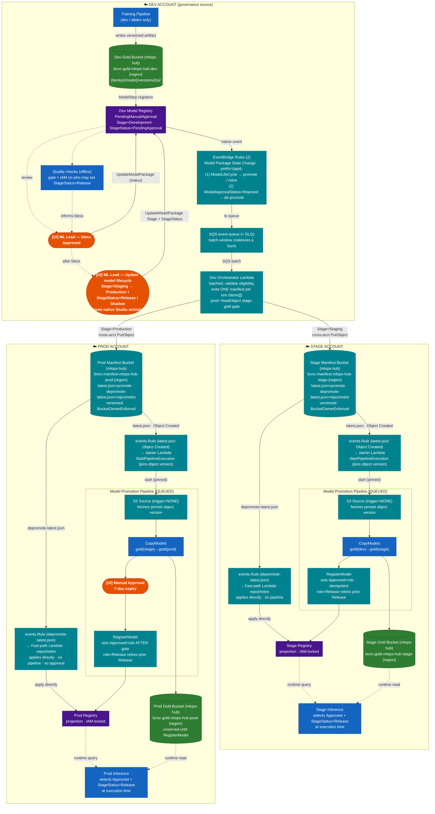
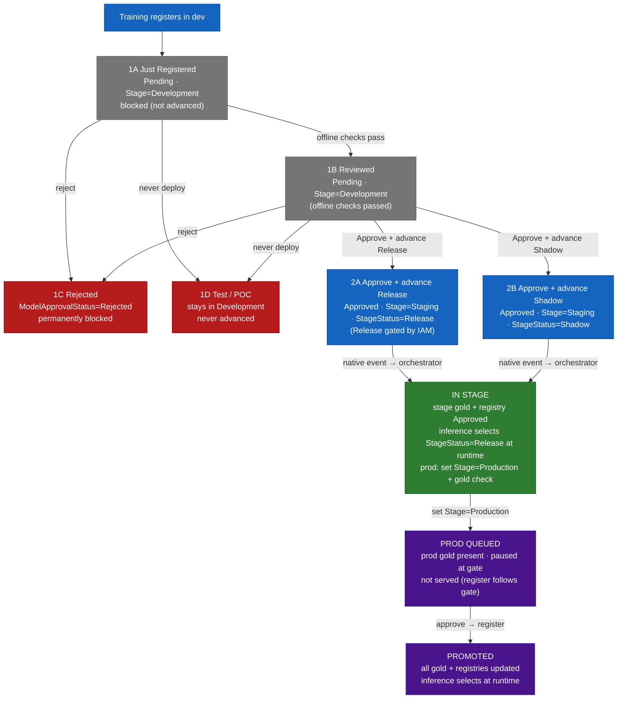
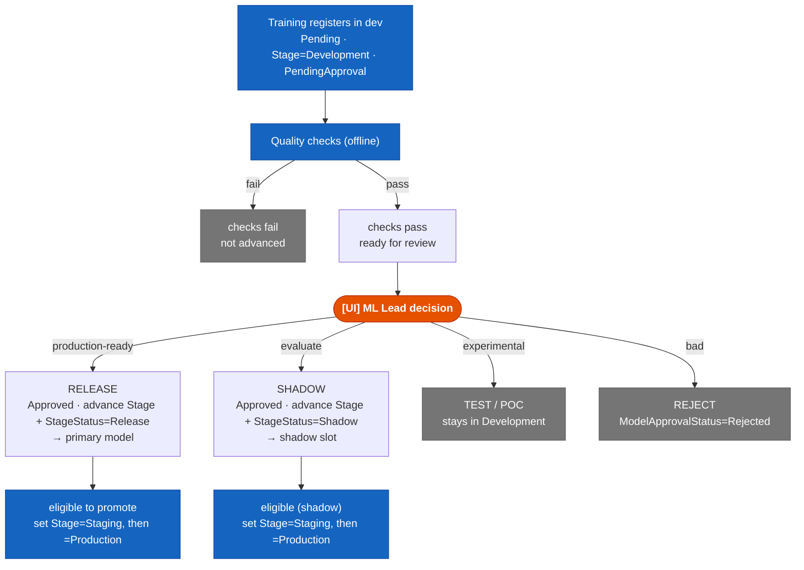
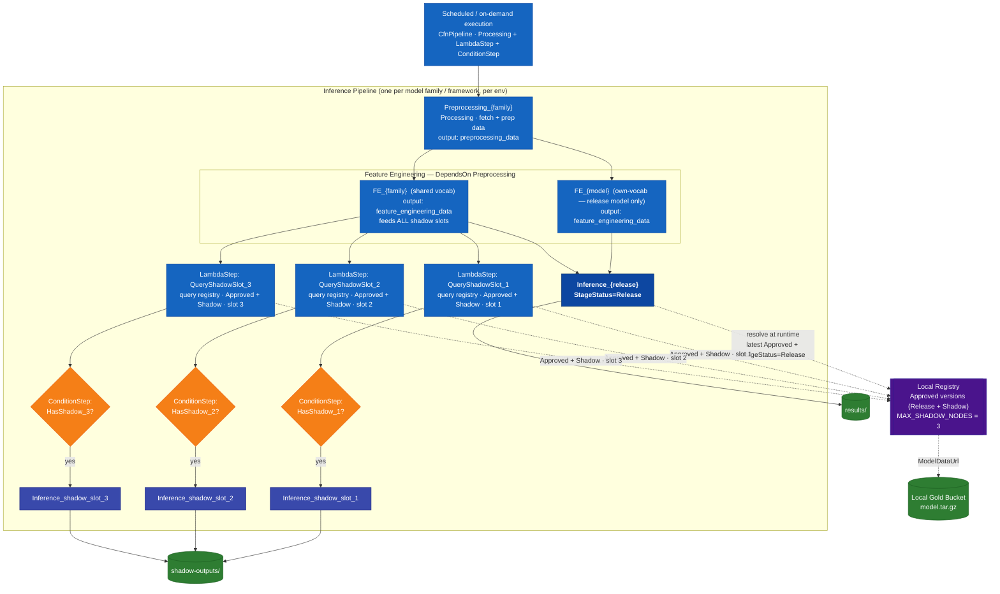

# Registry-First Model Promotion

> **Status:** Proposal  
> **Version:** 2.3  
> **Date Created:** 2026-06-25  
> **Last Updated:** 2026-07-07  
> **Authors:** Satvik Shetty, Randolph Schilke

---

## Executive Summary

**What this is:** Models are (solely) trained in the **dev** AWS account and have to move safely to **stage**, then **prod** - three separate, isolated AWS accounts. 
This document proposes how an approved model (and its artifact files) should cross those account boundaries under human control, and how inference in each account always serves the latest approved model (and shadow models, where applicable).

**What "registry-first" means:** Today (specifically in Carepath, the only real production deployment), promoting a model means editing a static catalog file and redeploying CDK. Registry-first instead makes the **SageMaker Model Registry** the source of truth: a human approves a version in dev and advances its lifecycle stage, and automation copies and re-registers it in the next account — no catalog edit, no redeploy.

**The happy path, end to end:**


1. **Train + register** — the training pipeline registers a new version in the dev registry (`ModelApprovalStatus=PendingManualApproval`, `ModelLifeCycle.Stage=Development / ModelLifeCycle.StageStatus=PendingApproval`).
2. **Approve for Release** — the DS/MLE verifies the model performance either manually or via automated quality checks and sets `ModelApprovalStatus=Approved` and `ModelLifeCycle.StageStatus=Release` (or `Shadow`) in dev Studio. This makes it *eligible* but moves nothing.
3. **Advance to stage** — the MLE or ML Lead sets `ModelLifeCycle.Stage=Staging`. Automation copies the model into the stage account and registers it there; stage inference starts serving it.
4. **Advance to prod** — the ML Lead sets `ModelLifeCycle.Stage=Production`. Same flow, plus one human approval gate before it goes live.
5. **Serving** — each account's inference picks the latest approved/shadow model at its next scheduled run. No redeploy at any step.

> **Note 1:** approval *blesses* a version but moves nothing; advancing its native **`ModelLifeCycle.Stage`** is what triggers promotion — because SageMaker emits an event when that field changes, but not when a tag changes.

> **Note 2:** the dev registry is the single source of truth; stage and prod registries are projections written only by the promotion pipeline, never hand-edited.

## Glossary

| Term | Means |
|------|-------|
| **registry-first promotion** | Using the SageMaker Model Registry (not a static catalog file + redeploys) as the source of truth for what to serve. |
| **dev / stage / prod** | Three *separate, isolated* AWS accounts. Models flow dev → stage → prod; crossing accounts needs explicit grants. |
| **SageMaker Model Registry** | A per-account catalog of model versions, each with an approval status and a lifecycle stage. |
| **Model Package Group / version** | The container for all versions of one model (`{app}-{family}-{model}`); a *version* is one registered training run. |
| **`ModelApprovalStatus`** | Native field on a version: `Approved` / `Rejected` / `PendingManualApproval`. Global safety gate — `Rejected` excludes the version everywhere. |
| **`ModelLifeCycle`** | Native field with `Stage`, `StageStatus`, and `StageDescription`. Advancing `Stage` is the promotion trigger; `StageStatus` encodes deployment intent (Release, Shadow, etc.). Both are IAM-conditionable and emit native EventBridge events. |
| **`Stage`** | Where the model is heading: `Development` → `Staging` → `Production`. The orchestrator routes on this value from the event payload. |
| **`StageStatus`** | The deployment **role** once a version is advanced (replaces the old `candidate_type` / `promote` / `quality_gate_passed` tags). Values: `PendingApproval` (in Development, a placeholder), `Release` (primary, served), `Shadow` (offline comparison, never served), `Retired` (superseded `Release` or de-shadowed, kept `Approved`). The quality gate is IAM (who may set `Release`), not a status. |
| **bless** | Setting `ModelApprovalStatus=Approved` + `StageStatus=Release` (or `Shadow`) — makes a version eligible but moves nothing. |
| **release vs shadow** | A family serves 1 **release** model (`StageStatus=Release`) plus N **shadow** models (`StageStatus=Shadow`) that run for comparison only, never primary traffic. |
| **eligibility** | The orchestrator's promote condition: `Approved` + `StageStatus ∈ {Release, Shadow}` + `Stage ∈ {Staging, Production}`. No tag reads needed — the event payload carries everything. |
| **projection** | A read-only stage/prod registry, written only by the promotion pipeline — never hand-edited (enforced by IAM). |
| **gold bucket** | The S3 bucket holding the served model artifacts (`model.tar.gz`). One per account. |
| **manifest** | A small JSON file the orchestrator writes telling a target account which version to copy + register. |
| **orchestrator (Lambda)** | The dev-account Lambda that receives lifecycle and approval events, checks eligibility, and writes the manifest (promote) or propagates rejection (de-promote). |
| **promotion pipeline** | The per-account CodePipeline that copies the artifact (**CopyModels**) and registers it locally (**RegisterModel**). |
| **de-promotion** | Propagating a rejection or supersession from dev to stage/prod registries. Driven by the same EventBridge rule as promotion — the orchestrator handles both directions. |
| **`mlops-hub`** | A separate shared-infrastructure stack that owns the cross-account buckets and keys; imported by name rather than created locally. |
| **DS / MLE / ML Lead** | Data Scientist (Development-only), ML Engineer (Dev + Staging), ML Lead / Principal CloudOps (full lifecycle including Production). See Role-Based Permissions. |

---

> Orange = Human / UI action · Blue = Automated · Green = Storage · Purple = Registry · Teal (dashed) = Net-new component

**Core rule:** A model stays in dev until a human sets `ModelApprovalStatus=Approved` and advances `ModelLifeCycle.Stage` beyond `Development` in the **dev registry**. The dev registry is the single governance source for all environments. Stage and prod registries are projections written only by the promotion pipeline; "read-only" means no human edits, enforced with IAM.

**Promotion is manual at every hop, driven by the model's native `ModelLifeCycle` stage in the dev registry.** Setting `ModelApprovalStatus=Approved` + `StageStatus=Release` (or `Shadow`) blesses a version — it does not move anything. A human then advances the version's native **`ModelLifeCycle.Stage`** (`Staging`, then later `Production`) from Studio's *Update model lifecycle* action. That transition emits a native `SageMaker Model Package State Change` EventBridge event (`UpdatedModelPackageFields=["ModelLifeCycle"]`), which a rule routes to a single orchestrator Lambda; the orchestrator reads `Stage` and `StageStatus` from the event payload and routes the artifact to the correct account. All UI happens in dev (native Studio actions — no CLI, no hand-edited tags); the two hops are symmetric; prod adds a CodePipeline approval gate. There is no automatic dev→stage promotion.

**De-promotion works the same way.** Setting `ModelApprovalStatus=Rejected` on a dev version emits a native event the orchestrator's de-promote path consumes, propagating the rejection to stage/prod registries automatically. See "Rejection & De-promotion" for details.

**Selection:** The inference pipeline selects the current `Approved` model with `StageStatus=Release` at execution time from the local registry. A model-version change requires no CDK redeploy and no pipeline upsert — the next scheduled run picks it up.

---

## Current vs. Proposed

| Concern | Current | Proposed |
|---------|---------|--------|
| Inference selection | The inference container queries the registry at runtime but matches a `MODEL_VERSION` pinned at synth time from a static catalog. | Select latest `Approved` + `StageStatus=Release` from the local registry instead of a pinned version. No tags needed — filter on native `ModelLifeCycle` fields. |
| Version source of truth | A static catalog file lists approved/pending versions per model. | `ModelApprovalStatus` + `ModelLifeCycle` (native fields); the catalog holds static topology only. No governance tags. |
| Per-env registry authority | A registry-sync construct runs on every `cdk deploy` and rejects any registry version not listed in the catalog. | The RegisterModel step is the writer; remove the catalog enforcement (see "Reconciling the registry-sync Lambda"). |
| Artifact copy | An existing CodeBuild project (us-east-1 only) does selective per-version artifact copies. | Reused by the new Model Promotion Pipeline. |
| Shared buckets (gold/silver/ephemeral) | Gold/silver buckets are created locally today. | Owned by **`mlops-hub`** (`bcnc-{tier}-mlops-hub-{env}-{region}`, names/CMKs in SSM); imported via `from_bucket_name`. Silver eliminated — **all registered models go to gold irrespective of later rejection or archival status.** Manifest bucket also created in `mlops-hub` (see Tier 2). Lifecycle rules and/or a clean-up Lambda will be added at a later point to archive/expire unused artifacts and keep the gold bucket lean. |
| `ModelLifeCycle` stage transitions as the promotion trigger, EventBridge rule, orchestrator, approval gate (CodePipeline or SSM Automation), RegisterModel, shadow inference branches | None exist. | All net-new (the trigger is the native `ModelLifeCycle` event — no custom Promote Control or `PutEvents`). |

A `Type: Lambda` step is expressible in the raw SageMaker pipeline (CloudFormation) JSON, so runtime selection does not require an SDK migration; the cheapest path is container-side selection plus removing the synth-time version pin.

---

## Reconciling the registry-sync Lambda (one gotcha to avoid)

**Purpose of this note:** today, a Lambda syncs the registry from a static catalog on every deploy. Reconciling it is just part of this proposal — but there's one non-obvious way to get it *partly* right that silently breaks promotion, so it's called out here.

**Today**, the registry-sync Lambda keeps the registry in step with a static catalog, and its catalog-enforcement logic **Rejects any registry version not listed in the catalog — on every `cdk deploy`**. Registry-first promotion deliberately registers versions that are *not* in the catalog. So if that Reject behavior survives your rewrite, the **next unrelated `cdk deploy` silently flips your promoted models to `Rejected`** and inference stops finding them.

**The change to make:**

| Keep | Remove |
|------|--------|
| Model Package Group creation | The catalog version-sync (catalog `approved[]`/`pending[]` → registry) |
| | The catalog-enforcement logic — the Reject-on-not-in-catalog behavior |

After this, **RegisterModel is the sole status authority**. Do **not** retain catalog status enforcement — it would reintroduce exactly this bug.

> Clean cutover (recommended): remove it outright. If instead you migrate **family-by-family**, temporarily scope the enforcement to ignore versions tagged `promoted_by=reconciler` during the transition, then remove it once all families are migrated.

---

## Lifecycle Contract — what's set, where it lives, by whom

All governance state lives on the **model package version** in the SageMaker Model Registry — not in a static catalog file, and not in custom tags. One Model Package Group per `{family}-{model}`; one version per training run.

### Governance fields (two native fields — no custom governance tags)

| Field | Purpose | IAM-conditionable? | Emits event? | Set via |
|-------|---------|-------------------|-------------|---------|
| `ModelApprovalStatus` | Global safety gate (`Approved` / `Rejected` / `PendingManualApproval`) | Yes (`sagemaker:ModelApprovalStatus`) | Yes (native) | `UpdateModelPackage` or Studio "Update status" |
| `ModelLifeCycle.Stage` | **Where** the model is heading — the promotion trigger | Yes (`sagemaker:ModelLifeCycle:stage`) | Yes (on any `ModelLifeCycle` change) | `UpdateModelPackage` or Studio "Update model lifecycle" |
| `ModelLifeCycle.StageStatus` | **What kind** of deployment + current state within that stage | Yes (`sagemaker:ModelLifeCycle:stageStatus`) | Yes (same event) | Same |
| `ModelLifeCycle.StageDescription` | Free-text audit notes (e.g., "promoted by J.Smith, ticket MLO-1234") | No | Yes (same event) | Same |

### Accepted `Stage` values

| Value | Meaning | Who can set |
|-------|---------|------------|
| `Development` | In dev only; not yet promoted anywhere | Training pipeline (auto), DS, MLE, ML Lead |
| `Staging` | Promoted (or being promoted) to the stage account | MLE, ML Lead |
| `Production` | Promoted (or being promoted) to the prod account | ML Lead only |

### Accepted `StageStatus` values

`StageStatus` carries the deployment **role** once a version is advanced. The quality gate is **not** a
status — it is enforced by IAM (who may set `StageStatus=Release`).

| Value | Meaning | Valid with `Stage=` | Who sets |
|-------|---------|---------------------|----------|
| `PendingApproval` | Just registered; not yet advanced (a placeholder status, not a role) | `Development` | registry-sync registration (auto) |
| `Release` | The **primary** serving model (the role) | `Staging`, `Production` | ML Lead advance (IAM-gated — this *is* the quality gate) |
| `Shadow` | Scored offline for comparison; never serves primary traffic | `Staging`, `Production` | ML Lead advance |
| `Retired` | Retired `Release` or de-shadowed; kept `Approved` (rollback-able), dropped from `Release`/`Shadow` selection | `Staging`, `Production` | RegisterModel (retires the prior `Release`) / the reject-retire fast path |

> **Note:** `StageStatus` is a free-form string (SageMaker enforces no enum). The orchestrator validates it — eligibility requires `StageStatus ∈ {Release, Shadow}`; `Retired` routes to the de-projection fast path; anything else is dropped.

### State machine (valid transitions)

```
Registered (registry-sync, dev):
  → Development / PendingApproval        (ModelApprovalStatus=PendingManualApproval)

Human bless (dev):
  → Approved  (eligible to advance)  |  Rejected

Advance to stage (requires Approved + StageStatus in {Release, Shadow}):
  → Staging / Release                   (native event → orchestrator routes)
  → Staging / Shadow

Advance to prod (requires Approved + role + stage-gold present):
  → Production / Release
  → Production / Shadow

One Release per group, per Stage — a new Release retires the prior one:
  → Staging|Production / Retired         (kept Approved, rollback-able; a Shadow is never retired)

De-projection (fast path — no pipeline, no approval):
  → ModelApprovalStatus=Rejected        (break-glass reject; propagates to targets, immediate)
  → StageStatus=Retired                 (retire / de-shadow, keeps Approved)
```

### Lineage metadata (kept as `CustomerMetadataProperties`)

| Key          | Purpose                                    | Set by |
|--------------|--------------------------------------------|--------|
| `version`    | `YYYYMMDD_HHMM` timestamp matching S3 path | Training pipeline |
| `git_repo`   | Git repo for traceability                  | Training pipeline |
| `git_sha`    | Commit hash for reproducibility            | Training pipeline |
| `family`     | Model family (e.g., `h2h_commercial`)      | Training pipeline |
| `model_key`  | Model identifier (e.g., `ccm_readm`)       | Training pipeline |
| `trained_by` | User identifier (e.g. `u225883`, `auto`)   | Training pipeline |

These are write-once lineage metadata. They play no role in orchestrator decisions or IAM gating.

---

## Diagram 1 — End-to-End Promotion Flow



The prod Manual Approval runs before RegisterModel writes `Approved`, so a scheduled run cannot serve an unapproved model. CopyModels may run before the gate; the artifact sits in prod gold unserved until the gated registration.

**Human touchpoints (UI) — all in the dev account:** (1) ML Lead governance decision (Approve / Reject) via "Update status" in the registry; (2) Promote → stage by setting `ModelLifeCycle.Stage=Staging` with `StageStatus=Release` (or `Shadow`); (3) Promote → prod by setting `Stage=Production` (again with the role) — both via Studio's native "Update model lifecycle" action. The only UI action outside dev is (4) the CodePipeline approval gate in the prod account. The quality gate is **operational — IAM restricts who may set `StageStatus=Release`**. Each lifecycle transition emits the native event that drives the orchestrator. Stage/prod registries take no human edits (IAM-locked).

> **Trigger wiring:** Promotion is driven by the model's native `ModelLifeCycle` stage, not a custom tag — precisely because SageMaker emits a native `SageMaker Model Package State Change` EventBridge event when `ModelLifeCycle` (or `ModelApprovalStatus`) changes, but **not** when a tag changes. Advancing the stage in Studio fires the event for free (`source=aws.sagemaker`, `detail-type="SageMaker Model Package State Change"`, `detail.UpdatedModelPackageFields=["ModelLifeCycle"]`, `detail.ModelLifeCycle.Stage` = the target env). No Promote Control, no `PutEvents`, and no CloudTrail fallback are needed: the trigger is first-class. The orchestrator routes on `Stage` + `StageStatus` carried in the event payload — no tag reads, no read-after-write race. Eligibility = `Approved` + `StageStatus ∈ {Release, Shadow}`.

**Approval gate — CodePipeline with auto-generated manifest (chosen approach):**

The prod approval gate is implemented via a **Model Promotion CodePipeline** triggered by a manifest S3 object (see Tier 2 for full details). The orchestrator writes a **promotion manifest** JSON per target env to a per-app key (`manifests/{app}/latest.json`) — auto-generated, never manually edited. `schema_version: "2"` carries an `items[]` list, so a **batch** of UI clicks becomes **one manifest → one pipeline execution**. The bucket is **versioned** and emits an `Object Created` event → an `events.Rule` → a **starter Lambda** that calls `StartPipelineExecution` pinned to that exact object version; the pipeline runs CopyModels → Manual Approval → RegisterModel. Shape:
  ```json
  { "schema_version": "2", "action": "promote", "source_env": "dev",
    "target_env": "stage", "target_stage": "Staging",
    "items": [
      { "family": "fraud", "model": "txn_scorer", "version": "20260416_2253", "role": "Release",
        "source_gold": "s3://bcnc-gold-mlops-hub-dev-us-east-1/...",
        "target_gold": "s3://bcnc-gold-mlops-hub-stage-us-east-1/...",
        "promotion_id": "stage-fraud-txn_scorer-20260416_2253" }
    ] }
  ```
  **Reject / retire** don't run the pipeline: the orchestrator writes them to a **separate key** (`manifests/{app}/depromote-latest.json`, `action:"deproject"`, per-item `kind: reject|retire`) which triggers a **fast-path Lambda directly — no CopyModels, no approval** — so a break-glass reject applies immediately.

> **Note on SSM Automation:** SSM Automation Documents are a potential future candidate for approval gates and reacting to model status/lifecycle changes. However, they have not yet been approved for use in the shared services account. CodePipeline with a manifest file is the chosen path to make progress; SSM Automation can be revisited once approved.

---

## Diagram 2 — Trigger Chain

```mermaid
flowchart TD
    classDef human fill:#e65100,stroke:#bf360c,color:#fff,font-weight:bold
    classDef auto  fill:#1565c0,stroke:#0d47a1,color:#fff

    subgraph DS["Dev → Stage  (lifecycle-triggered)"]
        direction LR
        T2a(["[UI] Bless\nApproved\n(no movement)"])
        T2(["[UI] Update model lifecycle\nStage=Staging, StageStatus=Release"])
        A0["Native event\nModelLifeCycle changed"]
        A1["EventBridge → SQS → orchestrator\n(batched)"]
        A2["Orchestrator Lambda\nvalidate · write ONE stage manifest (items[])"]
        A3["Stage CodePipeline\nS3 source"]
        A4["CopyModels → RegisterModel"]
        A6["Next inference run\nselects Approved + StageStatus=Release"]
        T2a --> T2 --> A0 --> A1 --> A2 --> A3 --> A4 -.-> A6
    end

    subgraph SPx["Stage → Prod  (lifecycle-triggered + gate)"]
        direction LR
        T3(["[UI] Update model lifecycle\nStage=Production + StageStatus=Release"])
        B0a["Native event\nModelLifeCycle changed"]
        B0["EventBridge → SQS → orchestrator\n(batched)"]
        B1["Orchestrator Lambda\nHeadObject stage-gold gate · write ONE prod manifest (items[])"]
        B2["Prod CodePipeline\nS3 source"]
        B3["CopyModels → prod gold\n(unserved)"]
        T4(["[UI] Approve\n7-day expiry"])
        B4["RegisterModel\nsets Approved"]
        B5["Next inference run\nselects Approved + StageStatus=Release"]
        T3 --> B0a --> B0 --> B1 --> B2 --> B3 --> T4 --> B4 -.-> B5
    end

    class T2a,T2,T3,T4 human
    class A0,A1,A2,A3,A4,A6,B0a,B0,B1,B2,B3,B4,B5 auto
```



---

## Diagram 3 — The CD stack deploys TWO sibling CodePipelines (per account)

**One CD pipeline stack per env creates two separate AWS CodePipelines as sibling constructs** — not one pipeline, and neither is deployed *by* the other. They live in the same stack so the new one can reuse the existing copy CodeBuild project, its copy service role, the CloudFormation deploy role, and the CodePipeline artifacts bucket.

- **Pipeline #1 — Infra CD CodePipeline** (existing): Git-triggered; its Deploy stage deploys the application's stacks — typically a data-bucket stack, the **application stack** (where the SageMaker pipelines and the registry-sync construct live), and a CI stack. There is no separate "model registry stack."
- **Pipeline #2 — Model Promotion CodePipeline** (new): manifest-S3-triggered; a CodePipeline that *uses* a CodeBuild action for the copy. It moves + registers model artifacts. It does **not** deploy stacks.


> **What deploys what:** deploying the CD pipeline stack creates *both* pipelines. Pipeline #1's Deploy stage then deploys the application's **app stacks** (data-bucket, app, CI). Pipeline #2 never deploys a stack — it copies the artifact and registers the model. The Model Promotion CodePipeline only exists where promotions land (dev as source, stage/prod as targets), and its copy step inherits the **us-east-1-only** constraint of the copy CodeBuild project.

---

## Diagram 4 — Model Lifecycle & Gates



---

## Diagram 5 — Governance Decision Tree



---

## Diagram 6 — Inference Execution (scaled to N shadows)

The pipeline is a single SageMaker `CfnPipeline` whose steps include **`Type: Processing`** steps plus `LambdaStep`/`ConditionStep` pairs for shadow gating, wired by `DependsOn`: one `Preprocessing_{family}` step → a feature-engineering layer → one `Inference_{release}` step + up to **`MAX_SHADOW_NODES = 3`** pre-baked shadow slots. Each shadow slot has a `LambdaStep` that queries the registry and a `ConditionStep` that skips the inference branch if no shadow is registered for that slot — so **no CDK redeploy is needed to add or remove shadows within the cap**.

**FE applies to the release model; all shadow slots share the family FE.** Whether the release model gets the shared `FE_{family}` or a dedicated `FE_{model}` depends on `has_vocab and not is_legacy`. All shadow slots always use the family's shared `FE_{family}` — per-shadow preprocessing/feature-engineering variations are out of scope for now (highly framework-specific; not coded). A new ML framework requires its own SageMaker pipeline(s).



**How each step is built:**

| Step | Implementation |
|------|----------------|
| `Preprocessing_{family}` | One `Type: Processing` step per family; output `preprocessing_data`. |
| `FE_{family}` (shared) | One shared feature-engineering step, `DependsOn` preprocessing; feeds every shared-vocab model and **all shadow slots**. |
| `FE_{model}` (own-vocab) | A dedicated FE step for the release model if it has its own vocabulary (and isn't legacy). Not used for shadow slots. |
| `Inference_{release}` | One inference step for the release model, `DependsOn` its FE step. |
| `LambdaStep: QueryShadowSlot_N` (N = 1..3) | One Lambda step per shadow slot; queries the registry for an `Approved + StageStatus=Shadow` model assigned to slot N. Returns the model ARN or empty. |
| `ConditionStep: HasShadow_N` | Evaluates whether slot N has a shadow registered; runs `Inference_shadow_slot_N` if true, otherwise skips the branch entirely. |
| `Inference_shadow_slot_N` | Conditional inference step per shadow slot; only executes when `HasShadow_N` is true. |
| release vs shadow **(target)** | net-new — no equivalent today. Current code routes *all* inference output to a single `scores/{family}/{model}/{version}/` path with no `StageStatus` split. Target: select on the model's `StageStatus` and route release → `results/`, shadow → `shadow-outputs/`. |
| model version | The container resolves it at runtime via `ListModelPackages` + `DescribeModelPackage`. |

| Behaviour | Detail |
|-----------|--------|
| Shared vs dedicated FE | Shared-vocab models (legacy or versioned-without-vocab) share one `FE_{family}`; own-vocab models get a dedicated `FE_{model}`. |
| Runtime version resolution | Each inference container picks its model by querying the local registry (`ListModelPackages` by status, then filter `StageStatus` via `DescribeModelPackage`) — today against the synth-pinned `MODEL_VERSION`; target = latest `Approved` + `StageStatus=Release` / `Approved` + `StageStatus=Shadow`. |
| Change a model **version** | No CDK redeploy — the container resolves the new version at runtime. |
| Change the **number** of shadows | Up to `MAX_SHADOW_NODES = 3`: no redeploy — each slot is gated by `LambdaStep` + `ConditionStep`; unused slots are skipped at runtime. Raising the cap beyond 3 requires a CDK deploy to add more slot pairs to the pipeline definition. |
| Outputs | Release → `results/`; every shadow → `shadow-outputs/` for offline comparison; shadows never serve primary traffic. |

### Design Decision — Shadow execution model (resolved: Option A)

The pipeline bakes a fixed maximum of **`MAX_SHADOW_NODES = 3`** shadow slots into the `CfnPipeline` at synth time. Each slot is controlled at runtime by a `LambdaStep` + `ConditionStep` pair, meaning no CDK redeploy is required to activate or deactivate a shadow within the cap. Two alternatives were considered:

#### Option A — Static maximum slots with runtime conditions (chosen) ✅

Pre-bake a fixed maximum number of shadow slots (3) into the pipeline. Each slot has a `LambdaStep` that queries the registry for a shadow model in that slot position. If no shadow is registered for that slot, the step short-circuits and the inference branch for that slot is skipped via a `ConditionStep`.

```
LambdaStep: QueryShadowSlot_1 → ConditionStep: HasShadow_1 → Inference_shadow_slot_1
LambdaStep: QueryShadowSlot_2 → ConditionStep: HasShadow_2 → Inference_shadow_slot_2
LambdaStep: QueryShadowSlot_3 → ConditionStep: HasShadow_3 → Inference_shadow_slot_3
```

| | |
|-|-|
| ✅ | No CDK redeploy to add/remove shadows within the max |
| ✅ | Single `CfnPipeline`, no cross-pipeline coordination |
| ⚠️ | Max shadow count is fixed at synth time; exceeding it requires a deploy |
| ⚠️ | Slot assignment logic needed (which shadow fills slot 1 vs slot 2) |

#### Option B — Primary pipeline + dynamic child pipelines (not chosen)

The primary pipeline handles the release model only. A `LambdaStep` at the end queries the registry for all `Approved + StageStatus=Shadow` versions and fires one child pipeline execution per shadow. Each child pipeline is a static single-model template deployed once, parameterized by model ARN and a shared S3 path pointing to the primary pipeline's preprocessing output.

```
Primary pipeline:
  Preprocess → FE → Inference_release → LambdaStep (fan-out)
                                              ↓
                              StartPipelineExecution(shadow_pipeline,
                                params: { ModelArn: X, PreprocessS3: s3://... })
                              StartPipelineExecution(shadow_pipeline,
                                params: { ModelArn: Y, PreprocessS3: s3://... })

Shadow pipeline (single template, deployed once):
  Inference_shadow (reads preprocessing output from primary via S3 path param)
```

| | |
|-|-|
| ✅ | Shadow count is fully dynamic — adding/removing shadows = registry change only, zero redeploy |
| ✅ | The shadow pipeline template is deployed once and reused |
| ⚠️ | Cross-pipeline S3 path coordination (primary must expose its preprocessing output path) |
| ⚠️ | Child executions are independent — correlating shadow results to a primary run requires tagging or naming conventions |

**Decision: Option A** — `MAX_SHADOW_NODES = 3` with `LambdaStep` + `ConditionStep` per slot (low complexity, sufficient for the near-term use case).

**Notes:**

- **No per-shadow preprocessing/FE variations.** While there is a case for shadow models trained with different preprocessing or feature engineering, this is not coded for — at least not now. It is highly framework-specific and adds significant complexity. All shadow slots share the family's `FE_{family}`.
- **New framework = new pipeline(s).** This `CfnPipeline` template covers one framework. A new ML framework that requires different preprocessing or FE requires its own separate SageMaker pipeline(s).
- **Option B remains viable** if shadow evaluation becomes a first-class operational concern and the 3-slot cap proves insufficient.

---

## Scenarios

Every model starts at 1A. Setting `ModelApprovalStatus=Approved` + `StageStatus=Release` (or `Shadow`) blesses a version; advancing `ModelLifeCycle.Stage` (`Staging`, then `Production`) from Studio is what actually moves it. The stage change emits the native event that drives the orchestrator → the target account.

### Scenario 1 — Version only in Dev (never promoted)

The default state of every model; it stays here until lifecycle fields explicitly enable promotion.

**1A — Just registered by training**

| Field | Value |
|-------|-------|
| `ModelApprovalStatus` | `PendingManualApproval` |
| `ModelLifeCycle.Stage` | `Development` |
| `ModelLifeCycle.StageStatus` | `PendingApproval` |

Not eligible: still `Stage=Development` with `StageStatus=PendingApproval`, not Approved.

**1B — Quality gate passes (automated)**

| Field | Value |
|-------|-------|
| `ModelApprovalStatus` | `PendingManualApproval` |
| `ModelLifeCycle.Stage` | `Development` |
| `ModelLifeCycle.StageStatus` | `PendingApproval` |

Not eligible (not Approved, Stage still Development). Human review now available.

**1C — Human rejects**

| Field | Value |
|-------|-------|
| `ModelApprovalStatus` | `Rejected` |
| `ModelLifeCycle.Stage` | `Development` |
| `ModelLifeCycle.StageStatus` | (unchanged) |

Rejected — permanently excluded from all orchestrator queries. `ModelApprovalStatus=Rejected` is a global kill switch.

**1D — Test / POC (never intended for deployment)**

| Field | Value |
|-------|-------|
| `ModelApprovalStatus` | `PendingManualApproval` |
| `ModelLifeCycle.Stage` | `Development` |
| `ModelLifeCycle.StageStatus` | `PendingApproval` |

Not eligible — a test/POC version simply **stays in `Development`** and is never advanced. Even if the stage were advanced, `StageStatus` would not be `Release`/`Shadow`, so the orchestrator drops it.

### Scenario 2 — Approve, then advance to Stage

Approval blesses the version; setting `ModelLifeCycle.Stage=Staging` triggers the move.

**2A — Approve as release**

| Field | Value |
|-------|-------|
| `ModelApprovalStatus` | `Approved` ← key change |
| `ModelLifeCycle.Stage` | `Development` |
| `ModelLifeCycle.StageStatus` | `Release` ← key change |

Approval blesses the version (no movement). The human advances `Stage=Staging` + `StageStatus=Release` in Studio → native event → EventBridge → orchestrator validates (`Approved` + `StageStatus=Release`) → writes the stage manifest → stage pipeline runs (CopyModels → RegisterModel sets `Approved` + `StageStatus=Release`, idempotent).

**2B — Approve as shadow**

| Field | Value |
|-------|-------|
| `ModelApprovalStatus` | `Approved` |
| `ModelLifeCycle.Stage` | `Development` |
| `ModelLifeCycle.StageStatus` | `Shadow` |

Set `Stage=Staging` + `StageStatus=Shadow`; orchestrator match: `Approved` + `StageStatus=Shadow`. The stage manifest item carries `role=Shadow` → stage registers it as a `Shadow` (scored offline into `shadow-outputs/`, never primary traffic; it coexists with the `Release`).

**State after the stage pipeline completes:**

```
Dev Registry:    Approved, Stage=Staging, StageStatus=Release
Dev Gold:        artifact present  ✓
Stage Registry:  Approved, StageStatus=Release (projection)
Stage Gold:      artifact present  ✓
Prod Registry:   (empty for this version)
Prod Gold:       no artifact
```

Prod is blocked until a human advances `Stage=Production`, which triggers the orchestrator to check:

```
stage gold HeadObject → found ✓   (404 → promote to stage first, retryable;
                                    403/other → hard perms error, fails loudly)
ModelApprovalStatus=Approved  ✓
StageStatus=Release           ✓
→ write prod manifest
```

### Scenario 3 — Advance to Production, version reaches Prod

After the human sets `Stage=Production` and the prod pipeline clears the approval gate (RegisterModel writes `Approved` + `StageStatus=Release` *after* the gate):

```
Dev Registry:    Approved, Stage=Production, StageStatus=Release
Dev Gold:        artifact present  ✓
Stage Registry:  Approved, StageStatus=Release (projection)
Stage Gold:      artifact present  ✓
Prod Registry:   Approved, StageStatus=Release (projection)
Prod Gold:       artifact present  ✓
```

All inference pipelines select this version at runtime. The dev registry record — `ModelApprovalStatus`, `ModelLifeCycle` history (`Development → Staging → Production`), and `StageDescription` — is the permanent governance trail. No CDK redeploy at any point. Shadows reach prod via the same flow.

### The single rule that controls everything

```
status≠Approved   OR   StageStatus ∉ {Release, Shadow}
    → not eligible · orchestrator rejects the transition · nothing moves

Approved  AND  StageStatus=Release  AND  Stage=Staging
    → native event → orchestrator → stage pipeline (release)

Approved  AND  StageStatus=Shadow  AND  Stage=Staging
    → native event → orchestrator → stage pipeline (shadow slot)

Approved  AND  StageStatus ∈ {Release, Shadow}  AND  Stage=Production  AND  stage gold present
    → native event → orchestrator → prod pipeline · approval gate · register after gate
```

### Scenario 4 — Rejection, Retire & De-promotion (break-glass, fast path)

Never hand-edit the stage/prod registry. All de-projection actions happen on the **dev registry only**; the orchestrator propagates them to the target accounts via the **approval-free fast path** — a break-glass reject must not wait behind the prod pipeline's 7-day gate.

**`ModelApprovalStatus=Rejected` — break-glass kill (model is bad everywhere)**

| Step | Action |
|------|--------|
| 1 | In the dev registry, set `ModelApprovalStatus=Rejected`. Rule 2 fires → the orchestrator writes a de-projection manifest (`action:"deproject"`, `kind:"reject"`) to `depromote-latest.json` for **stage AND prod**. |
| 2 | Each target's **fast-path Lambda** (S3-triggered, **no pipeline, no approval**) sets that version `Rejected` **immediately**. If the version wasn't projected there, it's a safe no-op. |
| 3 | If the rejected version was the active `Release`, the fast-path un-retires the most-recent `Retired` predecessor back to `Release`, so a valid Release remains and is selected next run. |
| 4 | Record incident + CloudTrail reference. |

**`StageStatus=Retired` — de-shadow / step a Release aside (without condemning it)**

Use to stop a `Shadow` (or retire a `Release`) *without* marking it bad — e.g. it served its purpose, or a newer Release supersedes it.

| Step | Action |
|------|--------|
| 1 | In the dev registry, set `StageStatus=Retired` (keeping `Stage=Staging`/`Production`). Rule 1 fires. |
| 2 | The orchestrator writes a `kind:"retire"` de-projection → the target **fast-path Lambda** sets `StageStatus=Retired` there (kept `Approved`, artifact retained, rollback-able). |

**In practice, most rollbacks need neither.** Simply promote the previous good version forward — RegisterModel auto-retires the old `Release` (one Release per group).

**Orchestrator classification (promote vs de-project):**

```python
# Per SQS record (the record body is the EventBridge event):
fields = detail.get("UpdatedModelPackageFields") or []

# Break-glass reject → fast-path de-projection to stage + prod
if "ModelApprovalStatus" in fields and detail.get("ModelApprovalStatus") == "Rejected":
    di = _deproject_item(arn)                      # raises if unresolvable -> retry (not silent)
    for env in ("stage", "prod"):
        deproject_items.setdefault(env, []).append(_deproject_env_item(di, env, "reject"))
    continue

lifecycle = detail.get("ModelLifeCycle") or {}
target_env = STAGE_TO_ENV.get(lifecycle.get("Stage", ""))    # Staging->stage, Production->prod
role = lifecycle.get("StageStatus", "")

# Retire / de-shadow → fast-path de-projection to that env
if role in RETIRE_STATUSES:                        # {"Retired"}
    di = _deproject_item(arn)
    deproject_items.setdefault(target_env, []).append(_deproject_env_item(di, target_env, "retire"))
    continue

# Promotion → validate + write ONE items[] manifest per env
info = _describe_and_validate(arn, role)           # Approved + StageStatus in {Release, Shadow}
if target_env == "prod":
    _gate_stage_gold(info["gold_key"])             # HeadObject stage gold (404 -> retry)
promote_items.setdefault(target_env, []).append(_manifest_item(info, target_env))
# ...promote -> latest.json (pipeline); deproject -> depromote-latest.json (fast-path Lambda)
```

**When to use which:**

| | `ModelApprovalStatus=Rejected` | `StageStatus=Retired` |
|---|---|---|
| **Meaning** | The model is **bad** — condemn it | Done / superseded — **step it aside**, keep it Approved |
| **Scope** | Propagates to stage + prod | Propagates to the env it's set at |
| **Path** | Fast-path Lambda (immediate, no approval) | Fast-path Lambda (immediate, no approval) |
| **Rollback** | Un-retires a successor; or re-advance later | Re-graduate (`StageStatus=Release`) any time |
| **Reversible?** | Technically yes, but semantically "this version is bad" | Yes — re-approve and re-promote later |

---

## Failure Modes & Recovery

| Failure | State | Recovery |
|---------|-------|----------|
| CopyModels fails | Artifact not fully in target gold | Re-run; copy is selective + re-runnable |
| RegisterModel fails after copy | Artifact present, no Approved entry (safe) | Re-run; idempotent |
| Duplicate promotion events (e.g. stage re-applied) | Orchestrator may run twice | Deterministic manifest + idempotent RegisterModel → no-op on the second run |
| Bulk / concurrent promotions to one env | Could fire N pipeline executions (or clobber a key) | The orchestrator **batches** SQS events → **one manifest per env → one execution** for the whole burst. Across separate batches, the bucket is **versioned**, the starter Lambda pins each execution's object version (`sourceRevisions`), and the pipeline runs **QUEUED** → no promotion is clobbered |
| Break-glass reject / retire must be immediate | Can't wait on the prod approval | Reject/retire ride the **fast-path Lambda** (separate `depromote-latest.json` key) — no pipeline, no approval; applied at once |
| Gate failure (skip-stage 404, 403 perms, unresolvable reject) | Record retried, then dead-lettered | Preserved in the **DLQ** (14-day retention) for inspection — not silently lost |
| Approval not actioned within 7-day timeout | Prod CodePipeline execution fails; artifact in prod gold but unregistered | Re-apply `ModelLifeCycle.Stage=Production` (re-emits the native event) to trigger a fresh CodePipeline run; RegisterModel is idempotent |

---

## Rapid Lifecycle Edits — Bursts Are Coalesced

Each `UpdateModelPackage` emits a native `SageMaker Model Package State Change` event. A burst — correcting a `StageStatus` right after setting `Stage`, or advancing many versions at once — would naively fire many events and many pipeline runs. The design handles this **built-in**:

1. **SQS batch window (built-in, not future).** Both EventBridge rules deliver to an **SQS queue**; the orchestrator consumes it in **batches** (a ~60s window). A burst becomes **one batched invocation → one manifest per env (`items[]`) → one CodePipeline execution**, not N. (This is the SQS queue in Diagram 1.)
2. **Set `Stage` + `StageStatus` in one call.** The normal promotion path sets both together — one combined event, not two.
3. **Version-pinned + QUEUED across batches.** For promotions in *separate* batches, the manifest bucket is **versioned** and the starter Lambda pins each execution to the exact object version (`sourceRevisions`); the pipeline runs **QUEUED** → no run clobbers another.
4. **Idempotent RegisterModel.** Matches by source timestamp → a duplicate or re-fired event is a no-op.

**Operational guidance:** Treat each advancement as a deliberate step; the ~60s batch window absorbs a burst automatically (the trade is up to ~60s of debounce latency before a promotion starts). Failing records retry independently (SQS partial-batch failure) and poison messages land in the DLQ.

---

## Governance Enforcement & Role-Based Permissions

### Roles

| Role | Persona | Can do |
|------|---------|--------|
| **Data Scientist (DS)** | Builds & experiments with models | Set `Development` stage; may set `StageStatus=Shadow` / `Retired` (not `Release`) |
| **ML Engineer (MLE)** | Operates pipelines, blesses models for stage | Everything DS can do + `Approved` + `StageStatus=Release` + advance to `Staging` |
| **ML Lead / Principal CloudOps** | Production gatekeeper | Everything MLE can do + advance to `Production` |
| **Automation (registry-sync)** | Deploy-time service role | Register versions with `PendingApproval` + ensure Model Package Groups only |
| **RegisterModel / fast-path (target-account Lambda)** | Projection writer | Set `Release` / `Shadow` / `Retired` / `Rejected` in the target registry only |

### Permission matrix

| Action | DS | MLE | ML Lead | Automation | RegisterModel |
|--------|:--:|:---:|:-------:|:----------:|:-------------:|
| Register (`CreateModelPackage`) | — | — | — | ✅ | ✅ (target) |
| Set `Stage=Development` | ✅ | ✅ | ✅ | ✅ | — |
| Set `StageStatus=PendingApproval` | — | — | — | ✅ | — |
| Set `StageStatus=Shadow` | ✅ | ✅ | ✅ | — | — |
| Set `StageStatus=Release` (**the quality gate**) | ❌ | ✅ | ✅ | — | — |
| Set `StageStatus=Retired` (de-shadow) | ✅ | ✅ | ✅ | — | — |
| Set `ModelApprovalStatus=Approved` | ❌ | ✅ | ✅ | — | ✅ (target) |
| Set `ModelApprovalStatus=Rejected` | ❌ | ✅ | ✅ | — | — |
| Set `Stage=Staging` | ❌ | ✅ | ✅ | — | — |
| Set `Stage=Production` | ❌ | ❌ | ✅ | — | — |
| Set `StageStatus=Release/Retired` (target) | — | — | — | — | ✅ |
| Write to stage/prod registry | ❌ | ❌ | ❌ | — | ✅ |

### IAM enforcement

Gate lifecycle transitions natively via `sagemaker:ModelLifeCycle:stage` / `:stageStatus` condition keys on `sagemaker:UpdateModelPackage`.

**DS — Development stage only:**
```json
{
  "Sid": "DSModelLifeCycleDevelopmentOnly",
  "Effect": "Allow",
  "Action": ["sagemaker:UpdateModelPackage"],
  "Resource": "arn:aws:sagemaker:*:*:model-package/*",
  "Condition": {
    "StringEquals": { "sagemaker:ModelLifeCycle:stage": "Development" },
    "StringEqualsIfExists": {
      "sagemaker:ModelLifeCycle:stageStatus": ["PendingApproval", "Shadow", "Retired"]
    }
  }
}
```

**MLE — Development + Staging:**
```json
{
  "Sid": "MLEModelLifeCycleDevAndStaging",
  "Effect": "Allow",
  "Action": ["sagemaker:UpdateModelPackage"],
  "Resource": "arn:aws:sagemaker:*:*:model-package/*",
  "Condition": {
    "StringEquals": { "sagemaker:ModelLifeCycle:stage": ["Development", "Staging"] }
  }
}
```

**ML Lead — full lifecycle authority (no conditions).**

**Deny Production for non-Leads (attach to DS + MLE roles):**
```json
{
  "Sid": "DenyProductionStageForNonLeads",
  "Effect": "Deny",
  "Action": ["sagemaker:UpdateModelPackage"],
  "Resource": "arn:aws:sagemaker:*:*:model-package/*",
  "Condition": {
    "StringEquals": { "sagemaker:ModelLifeCycle:stage": "Production" }
  }
}
```

**Stage/Prod registry lockdown (SCP or resource policy):**
```json
{
  "Sid": "DenyHumanRegistryWritesInTargetEnv",
  "Effect": "Deny",
  "Action": ["sagemaker:CreateModelPackage", "sagemaker:UpdateModelPackage", "sagemaker:DeleteModelPackage"],
  "Resource": "arn:aws:sagemaker:*:*:model-package/*",
  "Condition": {
    "StringNotLike": {
      "aws:PrincipalArn": ["arn:aws:iam::*:role/*-RegisterModel-*", "arn:aws:iam::*:role/*-CopyModels-*"]
    }
  }
}
```

### Additional enforcement rules

- The orchestrator role can write both stage and prod manifests; forward-only and "prod gated" are operational (driven by the target `ModelLifeCycle.Stage` + the stage-gold check + the approval gate), not IAM-enforced separation.
- The EventBridge rule captures both `ModelLifeCycle` and `ModelApprovalStatus` changes — the orchestrator handles promotion AND de-promotion from a single entry point.

---

### Shared storage is owned by `mlops-hub`

The shared `gold` / `ephemeral` buckets and their CMKs are **not created locally** — they are created by **`mlops-hub`** (the shared data-lake stack), one per account/region (silver is eliminated; see Current vs. Proposed):

- **Naming:** `bcnc-{tier}-mlops-hub-{env}-{region}` — e.g. gold is `bcnc-gold-mlops-hub-{env}-{region}` (`env` ∈ dev/stage/prod, `region` ∈ us-east-1/us-east-2).
- **Discovery:** names exported to SSM (`/{project}/s3/{tier}/name`); CMK ARNs exported to SSM too. Imported via `s3.Bucket.from_bucket_name(...)` after an SSM lookup.
- **Existing trust:** `mlops-hub` bucket + KMS policies already trust roles matching `*-SageMaker-*` (training writes the versioned artifact to gold) and `*-CopyModels-*` (gold promotion).

**Consequence:** every new cross-account grant below must be added **in `mlops-hub`** (policies cannot be attached to imported `IBucket`s), and the new roles should either match an existing trusted pattern or `mlops-hub` must add the pattern. The **promotion manifest bucket** is created in `mlops-hub` (e.g. `bcnc-manifest-mlops-hub-{env}-{region}`) with its name/CMK in SSM — all grants X1–X5 below apply (CodePipeline is the chosen approval gate path).

> **Gold bucket as universal artifact store:** All registered model artifacts are copied to the gold bucket irrespective of whether a model version is later rejected or archived. This keeps gold as the single source of truth for all promoted artifacts. Lifecycle rules and/or a clean-up Lambda will be added at a later point to archive or expire artifacts for model versions that have been superseded, rejected, or unused for an extended period.

| # | Grant | Reason |
|---|-------|--------|
| X1 | Manifest bucket policy → dev orchestrator role `s3:PutObject` (+ `PutObjectTagging`, `AbortMultipartUpload`) | Cross-account write needs a target resource policy |
| X2 | Manifest object ownership = `BucketOwnerEnforced` | Otherwise target pipeline cannot read dev-written objects |
| X3 | Manifest CMK policy → dev orchestrator role `GenerateDataKey`/`Encrypt` | SSE-KMS cross-account write |
| X4 | `bcnc-gold-mlops-hub-stage-{region}` bucket + CMK → dev orchestrator role `GetObject`/`ListBucket`/`Decrypt` | Forward-only HeadObject gate is a dev→stage read not in today's trust (gold trusts `*-CopyModels-*` for promotion, not a dev reader) |
| X5 | Preserve the copy service role's name (`*-CopyModels-*`) so the existing `mlops-hub` gold trust keeps working | Cross-account copy trust is keyed on the role-name pattern |

---

## What's Essential vs Optional (build tiers)

Most of the net-new apparatus is a *choice*, not a requirement. Build it in tiers — the four-piece **Core** is a working registry-first promotion on its own; everything else is layered on for the prod gate, hands-off triggering, or features.

### Tier 1 — Core (cannot promote without these)

| Piece | Why essential |
|-------|---------------|
| **CopyModels** (artifact → target gold) | Inference reads the *local* gold bucket; the bytes must physically get there. Reuses the existing copy CodeBuild project. |
| **RegisterModel** (Approved entry in target registry) | Inference selects from the *local* registry; something must write the Approved version locally. |
| **Runtime selection** (stop baking `MODEL_VERSION`) | This *is* registry-first. Keep baking the version and you don't need any of this — just edit the catalog and redeploy (today's system). |
| **Reconcile the registry-sync construct** | Otherwise the enforcement Lambda Rejects promoted versions on the next deploy. Non-negotiable. |

**Leanest working version:** human approves in dev → trigger the promotion (manually) → CopyModels → RegisterModel; plus stop baking `MODEL_VERSION` and neuter the enforcement Lambda. That's a complete registry-first promotion.

### Tier 2 — The prod approval gate: CodePipeline (chosen) vs SSM Automation (deferred)

The core requirement is a **human approval gate** that blocks `RegisterModel` from writing `Approved + StageStatus=Release` to the prod registry until an ML Lead explicitly approves. Two viable implementations were considered; **Option A (CodePipeline) is the chosen approach** — SSM Automation Documents have not yet been approved in the shared services account:

#### Option A — Model Promotion CodePipeline (manifest-triggered)

The currently designed approach. A CodePipeline per target account watches a manifest S3 object and runs CopyModels → Manual Approval → RegisterModel.

| Piece | Why it exists |
|-------|--------------|
| **Manifest bucket** | CodePipeline requires an S3 source artifact to trigger and to pass parameters (version, gold paths) to downstream actions. |
| **Model Promotion CodePipeline** | Provides the native `ManualApprovalAction` that blocks execution for up to 7 days. |

**What the manifest is:** a machine-generated JSON file written by the orchestrator Lambda — not manually edited. Shape:
```json
{ "action": "promote", "family": "fraud", "model": "txn_scorer", "version": "20260416_2253",
  "role": "Release", "source_gold": "s3://bcnc-gold-mlops-hub-dev-us-east-1/...",
  "target_gold": "s3://bcnc-gold-mlops-hub-stage-us-east-1/..." }
```

**The coupling:** the manifest exists *only* because CodePipeline needs a source. Drop CodePipeline and you don't need the manifest — parameters flow directly as execution inputs.

#### Option B — SSM Automation (manifest-free)

Replace CodePipeline with an SSM Automation document. The orchestrator Lambda calls `StartAutomationExecution` directly, passing promotion parameters. No manifest file, no S3 bucket, no S3 source trigger.

```
EventBridge → Orchestrator Lambda
  → StartAutomationExecution(
        DocumentName: "PromoteModel",
        Parameters: { ModelPackageArn, Version, SourceGold, TargetGold,
                      StageStatus, Environment }
    )
  → SSM Automation step 1: CopyArtifact  (aws:executeScript → StartBuild)
  → SSM Automation step 2: WaitForApproval  (aws:approve — prod only, conditioned)
  → SSM Automation step 3: RegisterModel  (aws:invokeLambdaFunction)
```

The `aws:approve` action sends an SNS notification with an approve/deny link. The approver (ML Lead role with `ssm:SendAutomationSignal`) clicks the link in email or Slack. SSM waits (configurable timeout). On approval, RegisterModel runs; on denial or timeout, the automation fails and nothing is registered.

```yaml
# SSM Automation document sketch
mainSteps:
  - name: CopyArtifact
    action: aws:executeScript          # calls CodeBuild StartBuild with env vars
  - name: WaitForApproval              # skipped for stage via isEnd condition
    action: aws:approve
    inputs:
      NotificationArn: "arn:aws:sns:..."
      Message: "Approve promotion of {{Version}} to prod"
      MinRequiredApprovals: 1
      Approvers: ["arn:aws:iam::PROD_ACCOUNT:role/MLLeadRole"]
    timeoutSeconds: 86400
  - name: RegisterModel
    action: aws:invokeLambdaFunction
    inputs:
      FunctionName: "arn:aws:lambda:...:RegisterModelFunction"
      Payload: '{"model_package_arn": "{{ModelPackageArn}}", "role": "{{StageStatus}}"}'
```

#### Comparison

| Concern | Option A: CodePipeline | Option B: SSM Automation |
|---------|----------------------|------------------------|
| Needs manifest / S3 bucket | ✅ Yes — S3 source is required | ❌ No — parameters passed directly |
| Human approval gate | ✅ Native `ManualApprovalAction` | ✅ Native `aws:approve` action |
| One document for both stage + prod | ❌ Separate pipeline per account | ✅ Single document, `Environment` param controls gate |
| Cross-account execution | ⚠️ Separate pipeline per account | ✅ Assume-role per step |
| Audit trail | ✅ Execution history | ✅ Execution history + CloudTrail |
| Reuse existing copy CodeBuild | ✅ Yes | ✅ Yes — `aws:executeScript` calls `StartBuild` |
| CDK construct complexity | Higher — 2 sibling pipelines per account | Lower — one `CfnDocument` |
| Console visibility | Visual stage graph | Step-by-step execution detail |

**Decision: Option A — Model Promotion CodePipeline (chosen approach).** SSM Automation Documents are a potential future candidate for approval gates and reacting to model status/lifecycle changes, but have not yet been approved for use in the shared services account. To make progress, CodePipeline with an auto-generated manifest file is the chosen path. Cross-account grants X1–X5 all apply. Option B (SSM Automation) remains a viable future migration once it gains approval in the shared services account — at that point, grants X1–X3 (manifest bucket) could be retired.

### Tier 3 — Convenience / governance (defer or simplify)

| Piece | Can you skip it? |
|-------|------------------|
| **`ModelLifeCycle` trigger wiring (EventBridge rule)** | The rule is one line of config and the *trigger* is native (free). You can still invoke the orchestrator by hand to start, but there is no custom Promote Control or `PutEvents` to build. |
| **Dev Orchestrator Lambda** (centralized decision) | Partly — a human could pass the version straight to the pipeline. You'd lose "dev is the single source" + the forward-only gate, but it still promotes. |
| **Shadow inference branches** | Yes, entirely — only if you actually run shadows. |
| **Quality gate** | Yes — advisory / phase-2 (it does not exist today and has no defined thresholds; do not block release on it initially). |

---

## Implementation Checklist

Tagged by tier: **[Core]** = Tier 1, **[Gate]** = Tier 2 (CodePipeline/prod gate), **[Opt]** = Tier 3.

- [ ] **[Core]** Rewrite the registry-sync Lambda: **keep** Model Package Group creation; **remove** the catalog version-sync AND the catalog-enforcement logic (the Reject-on-not-in-catalog behavior). RegisterModel becomes sole status authority — do not retain catalog status enforcement.
- [ ] **[Core]** Stop baking `MODEL_VERSION`; select latest `Approved` + `StageStatus=Release` via `DescribeModelPackage` → `ModelLifeCycle`.
- [ ] **[Core]** RegisterModel Lambda (local, idempotent, sets `Approved` + `StageStatus=Release`; marks previous version `Retired`).
- [ ] **[Core]** CopyModels — reuse the existing copy CodeBuild project (us-east-1) to copy artifact into target gold.
- [ ] **[Gate]** Prod approval gate: **Model Promotion CodePipeline** (chosen approach) — per account (S3 source → CopyModels → Manual Approval → RegisterModel) + manifest bucket in `mlops-hub` + cross-account grants X1–X5. (SSM Automation Documents are a potential future path but not yet approved in the shared services account.)
- [ ] **[Core]** Adopt `ModelLifeCycle` as the sole governance mechanism: training registers with `Development / PendingApproval`; human bless sets `Approved` + `StageStatus=Release` (or `Shadow`); advancing `Stage=Staging` / `Stage=Production` triggers promotion. Verify `ModelLifeCycle` is exposed by the pinned `aws-cdk-lib` / runtime boto3 (GA Nov 2024) before relying on it.
- [ ] **[Core]** IAM-restrict `Stage=Production` to the ML Lead role; `Stage=Staging` to MLE + ML Lead; `StageStatus=Release` to MLE + ML Lead. Use `sagemaker:ModelLifeCycle:stage` / `:stageStatus` condition keys + explicit Deny on DS/MLE for Production.
- [ ] **[Opt]** EventBridge rule on `SageMaker Model Package State Change` filtered to `detail.UpdatedModelPackageFields` containing `ModelLifeCycle` or `ModelApprovalStatus` → orchestrator. Handles both promote and de-promote. (No custom `PutEvents`, no CloudTrail fallback.)
- [ ] **[Opt]** Dev orchestrator Lambda: read `Stage` + `StageStatus` from the event payload, validate eligibility (`Approved` + `StageStatus ∈ {Release, Shadow}` for promote; `Rejected` for de-promote), route to the correct target account; idempotent.
- [ ] **[Opt]** Shadow inference model: **Option A — `MAX_SHADOW_NODES = 3` (chosen approach).** Pre-bake 3 shadow slots into the `CfnPipeline`; each slot has a `LambdaStep` + `ConditionStep` that queries the registry at runtime. No redeploy to add/remove shadows within the cap. All shadow slots use the shared `FE_{family}` — no per-shadow preprocessing/FE variations (out of scope). A new framework requires its own pipeline(s). (Option B / child pipelines remains a future option if a fully dynamic shadow count becomes necessary.)
- [ ] **[Opt]** Quality gate automation (advisory first; define thresholds later; currently all checks are skipped by default in `pipeline_train.py`).
- [ ] **[Core]** IAM/SCP lockdown of stage/prod registry writes (only RegisterModel role may write).
- [ ] **[Opt]** S3 lifecycle/retention for gold + registry versions.
- [ ] **[Opt]** Break-glass de-promote mode (orchestrator propagates `ModelApprovalStatus=Rejected` or `StageStatus=Rejected` to target registries).

---

## Key Design Rules

| Rule | Detail |
|------|--------|
| Dev registry = single governance source | All UI in dev; stage and prod registries are projections written only by RegisterModel |
| No custom governance tags | `promote`, `candidate_type`, `quality_gate_passed` are replaced by `ModelLifeCycle.StageStatus`. Only lineage metadata (`version`, `git_sha`, etc.) stays as `CustomerMetadataProperties`. |
| Reconcile enforcement first | The registry-sync Lambda's catalog enforcement rejects non-catalog versions every deploy — remove it before anything else |
| Runtime selection, no redeploy | Selection at execution time via `StageStatus=Release`; infra pipeline runs only for structure changes |
| Approval blesses, `ModelLifeCycle.Stage` moves | `Approved` + `StageStatus=Release` (or `Shadow`) blesses; advancing `Stage=Staging` then `=Production` is the manual trigger |
| Native lifecycle event fires the trigger | Advancing `Stage` in Studio emits a native event → EventBridge → orchestrator routes by `Stage` + `StageStatus` from the event payload |
| Orchestrator handles promote AND de-promote | Same EventBridge rule; `Rejected` status/StageStatus triggers de-promote manifests to target accounts |
| `ModelApprovalStatus=Rejected` = global kill | Propagates to all envs. `StageStatus=Rejected` = per-env removal. Most rollbacks = promote previous version (auto-supersedes). |
| Lifecycle stage is IAM-gated | DS: Development only. MLE: Dev + Staging. ML Lead: full including Production. Explicit Deny blocks Production for non-Leads. |
| Orchestrator idempotent on re-fire | Duplicate native events → deterministic manifest + idempotent RegisterModel → no-op |
| Prod gate precedes the Approved write | RegisterModel writes `Approved` + `StageStatus=Release` only after the CodePipeline manual approval gate |
| RegisterModel idempotent | Match by source timestamp; update instead of duplicate; mark previous version `Retired` |
| Registry writes IAM-locked | Only RegisterModel role may write stage/prod (enforced by SCP / resource policy) |
| Forward-only gate = stage-gold HeadObject | Checks artifact presence before prod promotion; needs grant X4; transient 403/404 retryable |
| Shared buckets owned by `mlops-hub` | gold/ephemeral + manifest bucket created by `mlops-hub`, imported via `from_bucket_name()` — cross-account grants (X1–X4) added in `mlops-hub`, not locally |
| Cross-account write needs ownership + KMS | BucketOwnerEnforced + bucket policy + KMS grant (X1–X3) |
| Lambda never blocks | Writes manifest and exits; CodePipeline owns the wait (CopyModels → Manual Approval → RegisterModel) |
| Approval gate 7-day expiry | Un-actioned prod promotions fail; re-apply `Stage=Production` to re-fire |
| Prod approval gate | **CodePipeline** with auto-generated manifest (chosen approach). SSM Automation Documents are a potential future path but have not been approved in the shared services account yet. |
| Manifest is auto-generated | The manifest JSON is written by the orchestrator Lambda — never manually edited. It serves as both the CodePipeline S3 source trigger and the parameter carrier (version, gold paths, stage status). |
| Shadow model: `MAX_SHADOW_NODES = 3` | Three pre-baked shadow slots in the `CfnPipeline`, each gated by `LambdaStep` + `ConditionStep`. No redeploy to add/remove shadows within the cap; raising the cap requires a deploy. All shadow slots use the shared `FE_{family}` — no per-shadow preprocessing/FE variations. A new framework requires its own pipeline(s). |
| Gold bucket is universal | All registered model artifacts go to gold irrespective of later rejection or archival status. Lifecycle rules / clean-up Lambda to be added later to keep the bucket lean. |
| Batch lifecycle edits | Rapid successive `UpdateModelPackage` calls produce multiple EventBridge events and can trigger multiple CodePipeline runs. Batch Stage + StageStatus changes into a single API call where possible; configure CodePipeline `executionMode=QUEUED`. |
| Copy step reads the version | The copy step reads which version to promote from the manifest |
